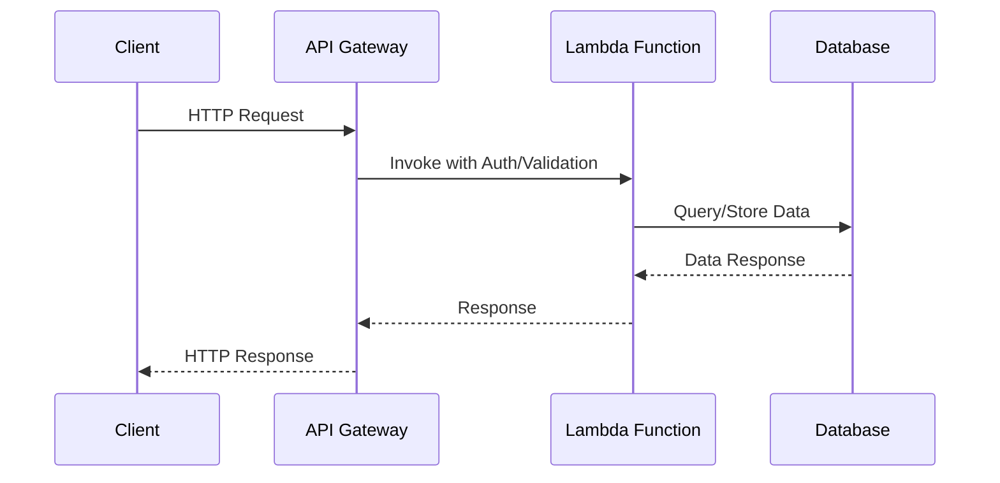

Serverless computing offers a wide array of benefits, such as reduced operational overhead, cost savings, and automatic scaling. However, the security of serverless applications is as critical as any other application hosted in the cloud. This article provides a comprehensive guide to the security best practices to help protect your serverless applications from potential threats.

## Architectural Approaches and Design Patterns

### Principle of Least Privilege (PoLP)

The principle of least privilege involves providing only the permissions necessary for users and systems to perform their required tasks. In serverless computing, this means:

- Assigning minimal IAM roles to functions.
- Restricting network access with Virtual Private Clouds (VPC) or equivalent.
- Using environment variables for configuration without hardcoding sensitive data.

### Securing Storage and Data

Serverless functions often interact with various data stores. Best practices include:

- Encrypting data at rest and in transit using protocols like SSL/TLS.
- Implementing strict access controls using cloud provider-specific IAM.

```java
// Example of accessing a database with SSL in Node.js
const db = new Client({
  user: process.env.DB_USER,
  host: process.env.DB_HOST,
  database: process.env.DB_DATABASE,
  password: process.env.DB_PASSWORD,
  port: 5432,
  ssl: {
    rejectUnauthorized: false,
  }
});
```

### Use of API Gateways

API Gateways provide a centralized entry point to your serverless applications, allowing:

- Request validation and transformation.
- Throttling to prevent abuse and overloading.
- Authentication and authorization (using OAuth or equivalent).

### Incorporating Security Testing

Security testing should be a continual process during the software development lifecycle:

- Automated testing for known vulnerabilities, such as SQL injection or cross-site scripting (XSS).
- Regular security audits and penetration testing.

## Related Patterns

- **Microservices Security Patterns**: Applying security measures to microservices which may also pertain to serverless functions.
- **Zero Trust Architecture**: Verifying access controls continuously rather than assuming a trusted inside network.
- **Secure API Design**: Ensuring APIs have security measures like rate limiting and authentication.

## Diagrams

Below is an example of how to implement a serverless security best practice using an API Gateway:



## Additional Resources

- [AWS Security Best Practices](https://aws.amazon.com/architecture/security-best-practices/)
- [Azure Security Documentation](https://docs.microsoft.com/en-us/azure/security/)
- [Google Cloud Security Best Practices](https://cloud.google.com/security/best-practices)

## Summary

Ensuring the security of your serverless applications involves a combination of stringent architectural design, vigilant process management, and regular testing. By incorporating these best practices, organizations can significantly reduce security risks and protect their data and applications in the cloud-native environments serverless computing offers. Adopting a proactive security posture that embraces principles like least privilege, API gateway usage, and robust encryption is essential for safeguarding serverless operations against evolving threats.
