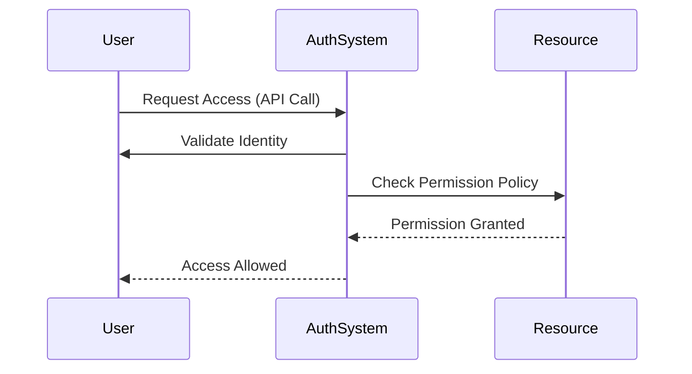

## Introduction

In cloud computing, especially within serverless environments, managing and securing access to resources is crucial. The **Resource Access Permissions** design pattern focuses on utilizing identity and access management (IAM) and related concepts to enforce secure resource access. By adopting this pattern, organizations can implement fine-grained, scalable permission management in their serverless architectures.

## Design Pattern Overview

The Resource Access Permissions pattern suggests using existing IAM frameworks and access control mechanisms provided by cloud service providers to secure resources. It ensures that only authorized entities (users or services) can access specific cloud resources, minimizing the risk of unauthorized data access or manipulation.

### Key Components

1. **Identity Management (IM):** The process of managing user identities, determining authentication methods, and enforcing identity policies.
   
2. **Access Control:** Mechanisms that allow organizations to specify who can access certain resources, perform specific actions, and the context under which those permissions are granted or denied.

3. **Roles and Policies:** Abstract the complexity by grouping permissions and assigning them to roles, which are then linked to entities.

## Architectural Approaches

1. **Role-Based Access Control (RBAC):**
   - Assign permissions to roles and map roles to entities.
   - Suitable for environments with clearly defined roles and responsibilities.

2. **Attribute-Based Access Control (ABAC):**
   - Access decisions are based on attributes (user attributes, resource attributes, and environmental attributes).
   - Provides more granular control and can be dynamically adjusted based on context.

3. **Lambda Authorizers (API Gateway Authorizers):**
   - Custom authorizers for API access, invoked before invoking the backend service.
   - Useful for implementing complex authorization logic beyond the capabilities of basic IAM roles.

## Best Practices

- **Principle of Least Privilege:** Grant only the permissions necessary for a role to perform its duties.
- **Policy Versioning and Auditing:** Regularly update and review policies to ensure they align with organizational security requirements.
- **Use Managed Policies:** Leverage predefined policies to ensure consistency and ease management.
- **Continuous Monitoring & Logging:** Implement monitoring to detect unauthorized access attempts or anomalies.

## Example Code

Here is a simple illustration of an AWS IAM policy for granting read-only access to an S3 bucket:

```json
{
    "Version": "2012-10-17",
    "Statement": [
        {
            "Effect": "Allow",
            "Action": "s3:GetObject",
            "Resource": "arn:aws:s3:::example-bucket/*"
        }
    ]
}
```

## Diagrams

### UML Sequence Diagram for Resource Access Flow



## Related Patterns

- **Identity Federation:** To manage identities across multiple cloud environments, often used in conjunction with resource access permissions.
  
- **Service Mesh for API Security:** For secured service communication alongside access controls within a cloud-native microservices architecture.

## Additional Resources

- [AWS IAM Documentation](https://aws.amazon.com/iam/)
- [Azure Identity and Access Management](https://docs.microsoft.com/en-us/azure/active-directory/)
- [Google Cloud IAM Documentation](https://cloud.google.com/iam/docs)

## Summary

The Resource Access Permissions pattern addresses the need for secure and controlled access to resources in serverless environments. By leveraging IAM frameworks and customizing them to fit enterprise needs through roles, policies, and custom authorizations, organizations can effectively secure their cloud resources. Following best practices such as least privilege, regular auditing, and using managed policies further strengthens security postures in dynamic cloud infrastructures.
