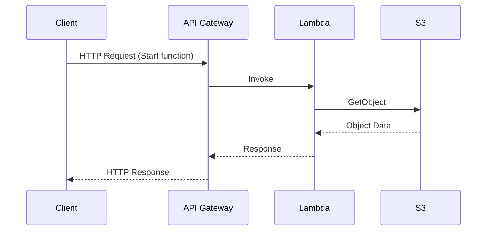

## Stateless Function Design

In the realm of serverless computing, the **Stateless Function Design** pattern is instrumental in ensuring that computing resources are both scalable and resilient. As organizations increasingly rely on cloud platforms to deliver applications, the ability to efficiently use compute resources without managing the underlying infrastructure is critical. Stateless Functions, a core component of serverless architecture, help achieve this by focusing on transient execution and manipulation of data, devoid of any persistent state concerns.

### Design Pattern Explanation

#### Key Characteristics

1. **Ephemeral State**: The function's state lasts only for the duration of a single execution. This leads to significant benefits in scalability since there is no need to manage state persistence across executions.
   
2. **Idempotency**: Functions should be designed to produce the same result given the same input, irrespective of invocation count, ensuring consistent behavior in distributed systems.

3. **Event-driven Initiation**: Functions are typically triggered by events (HTTP requests, message queue triggers, etc.), enabling a reactive computation model.

4. **Isolation**: Each function invocation runs in isolation, providing inherent security and reliability since execution failures are contained to individual function instances.

### Architectural Approaches

- **Function Composition**: Use well-defined interfaces to compose stateless functions into larger workflows, potentially managed by orchestration tools like AWS Step Functions or Azure Durable Functions.
  
- **External State Management**: Any needed state must be stored outside the function itself, typically in databases like Amazon DynamoDB, Google Cloud Firestore, or state stores like Redis or Memcached.

- **Logging and Monitoring**: Essential for debugging and operational insights, cloud-native logging solutions like AWS CloudWatch or Azure Monitor should be employed to track function executions.

### Best Practices

1. **Minimal Execution Time**: Keep functions short and focused on single responsibility to reduce execution time and costs.
   
2. **Security**: Utilize least privilege access controls and apply network security best practices to secure sensitive data interactions.

3. **Optimized Cold Start**: Minimize cold start latency by managing dependencies and package sizes efficiently.

### Example Code

Below is an example of a simple stateless Lambda function using AWS SDK for JavaScript:

```javascript
const AWS = require('aws-sdk');
const s3 = new AWS.S3();

exports.handler = async (event) => {
    const bucketName = 'your-bucket-name';
    const fileName = event.fileName;
    
    try {
        const data = await s3.getObject({ Bucket: bucketName, Key: fileName }).promise();
        // Process the data
        console.log('File processed successfully:', data);
    } catch (error) {
        console.error('Error processing file:', error);
    }
};
```

### Diagrams

#### Sequence Diagram

Below is a simple illustration using Mermaid for a stateless function interacting with an S3 bucket:



### Related Patterns

- **Event Sourcing**: Captures temporal state changes as a sequence of events, useful for auditing and rebuilding state.
  
- **Command Query Responsibility Segregation (CQRS)**: Separating write and read operations to optimize performance and scalability in distributed systems.

- **Function as a Service (FaaS)**: A computing paradigm where backend applications use stateless functions to perform CRUD operations and business logic.

### Additional Resources

- AWS Serverless Application Model (SAM)
- Google Cloud Functions Documentation
- Azure Functions Documentation
- "Designing Distributed Systems" by Brendan Burns

### Final Summary

The Stateless Function Design pattern is pivotal in simplifying and optimizing serverless applications by focusing on transient, isolated executions. Its emphasis on idempotency, event-driven nature, and external state management ensures applications can efficiently scale and remain resilient in the face of failure. By leveraging the cloud-native tools and best practices outlined here, developers can architect robust, cost-effective solutions that fully exploit the benefits of a stateless paradigm.
