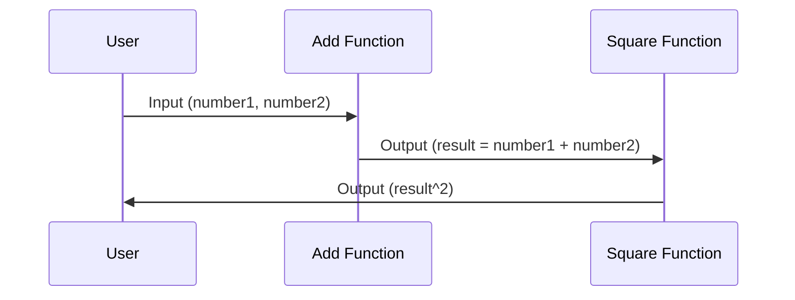

## Introduction

Function Composition is a fundamental concept in functional programming that finds significant application in serverless computing environments. This pattern involves the assembly of smaller functions into more complex operations, enabling developers to build scalable, maintainable, and reusable serverless solutions. 

In cloud computing, function composition allows serverless functions to chain together, creating workflows and processes that are efficient and manageable. It leverages the cloud's capabilities to execute functions in response to events, leading to architectures that are decoupled from specific infrastructure concerns.

## Detailed Explanation

### Core Concepts

- **Modularity**: Function composition promotes breaking down complex problems into smaller, manageable units. Each function focuses on a single task, making code easier to understand and maintain.
  
- **Reusability**: Reusable components can be combined in different ways to achieve various functionalities. This reduces redundancy and makes systems easier to iterate upon.

- **Scalability**: Composed functions can be executed independently and scaled elastically depending on load, optimizing resource utilization and cost.

- **Loose Coupling**: Each function acts independently, communicating with other functions through well-defined interfaces and messages, typically using event-driven architectures or APIs.

### Architectural Approach

In a serverless environment, function composition is used to:

- Chain functions using cloud-native tools like AWS Step Functions, Azure Durable Functions, or Google Cloud Workflows.
- Utilize event-driven paradigms where functions are triggered by events such as message queue updates, file uploads, or HTTP requests.
- Leverage asynchronous processing to improve responsiveness and manage long-running processes.

### Best Practices

1. **Define Clear Interfaces**: Ensure functions have clear input/output contracts to facilitate integration.
   
2. **Statelessness**: Design functions to be stateless so they can be recomposed without side effects.

3. **Idempotency**: Ensure functions can be safely invoked multiple times without unwanted effects.

4. **Error Handling**: Implement robust error handling and compensation strategies, particularly for failure-prone functions.

5. **Monitoring and Logging**: Employ detailed logging and monitoring to gain insights into function performance and issues.

## Example Code

Below is a simple illustration of function composition using AWS Lambda with Node.js:

```javascript
// Function A: Basic Addition
exports.add = async (event) => {
  const { number1, number2 } = event;
  return { result: number1 + number2 };
};

// Function B: Square
exports.square = async (event) => {
  const { result } = event;
  return { result: result * result };
};

// Step Functions Workflow
{
  "StartAt": "Add",
  "States": {
    "Add": {
      "Type": "Task",
      "Resource": "arn:aws:lambda:us-east-1:123456789012:function:Add",
      "Next": "Square"
    },
    "Square": {
      "Type": "Task",
      "Resource": "arn:aws:lambda:us-east-1:123456789012:function:Square",
      "End": true
    }
  }
}
```

## Diagrams

Here is a simplified sequence diagram illustrating function composition:



## Related Patterns

- **Microservices**: Breaking large applications into smaller services aligns with the philosophy of function decomposition and composition.
- **Event-Driven Architecture**: Compliments function composition by using events to manage function triggers and execution order.
- **Reactive Streams**: Useful for managing data flow and backpressure in composed functions.

## Additional Resources

- [AWS Lambda Documentation](https://docs.aws.amazon.com/lambda/)
- [Azure Functions Overview](https://learn.microsoft.com/en-us/azure/azure-functions/)
- [Google Cloud Functions](https://cloud.google.com/functions)

## Summary

Function Composition in serverless computing is a powerful practice that enhances modularity, reusability, and scalability of cloud-based applications. By leveraging clear, stateless, and independent functions, developers can build robust and efficient workflows that capitalize on the strengths of cloud platforms. This pattern fosters agile development environments, enabling quick adaptation to changing business requirements and technology advancements.
