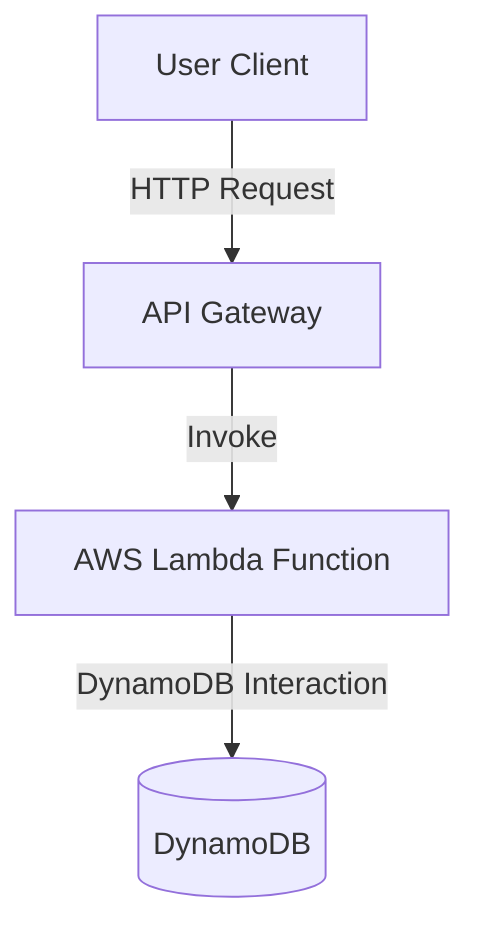

### Introduction

The **Serverless Microservices** pattern combines the principles of serverless computing and microservices architecture to build scalable, flexible, and cost-efficient cloud applications. By leveraging the power of Function as a Service (FaaS) platforms, developers can focus on writing business logic without worrying about underlying infrastructure management. This pattern is ideal for creating high-performing applications with varying workloads and complex service interactions.

### Design Pattern Explanation

#### Key Concepts
- **Serverless Computing:** A cloud computing model where the cloud provider dynamically manages the provisioning and operation of servers. Popular platforms include AWS Lambda, Google Cloud Functions, and Azure Functions.
- **Microservices Architecture:** An architectural style that structures an application as a collection of services, each focused on a specific business capability, that can be independently deployed and managed.

#### Architectural Approach
In a serverless microservices architecture, the application is divided into small, independent services that are executed by serverless functions. Each service focuses on a single capability and communicates with other services through well-defined APIs, typically RESTful or event-driven paradigms.

- **Decoupling:** Services are independent and loosely coupled, allowing for agile development and deployment cycles.
- **Scalability:** Services automatically scale based on demand, ensuring optimal resource utilization and cost-effectiveness.
- **Resilience:** The distributed nature of microservices coupled with managed serverless platforms enhances fault tolerance.

#### Best Practices
- **Function Granularity:** Design services that perform a single action and are small enough for optimal performance while avoiding excessive fragmentation.
- **Efficient Communication:** Use asynchronous communication and event-driven patterns to improve responsiveness and resource usage.
- **Statelessness:** Ensure functions are stateless or manage state externally using technologies like databases or caches.
- **Observability:** Implement monitoring, logging, and tracing to efficiently track and debug distributed service interactions.

### Example Code

Here's a simple example of a serverless microservice using AWS Lambda for a user registration service:

```javascript
// index.js
const AWS = require('aws-sdk');
const dynamoDB = new AWS.DynamoDB.DocumentClient();

exports.handler = async (event) => {
  const { email, name } = JSON.parse(event.body);

  const params = {
    TableName: 'Users',
    Item: {
      email,
      name,
      createdAt: new Date().toISOString(),
    },
  };

  try {
    await dynamoDB.put(params).promise();
    return {
      statusCode: 200,
      body: JSON.stringify({ message: 'User registered successfully!' }),
    };
  } catch (error) {
    return {
      statusCode: 500,
      body: JSON.stringify({ message: 'Error registering user', error }),
    };
  }
};
```

### Diagram



### Related Patterns

- **Event Sourcing:** This pattern enhances microservices by storing event histories, enabling powerful state reconstructions and responses to past events.
- **CQRS (Command Query Responsibility Segregation):** Separates read and write operations, optimizing data retrieval and command processing for microservices.
- **API Gateway:** Acts as a single entry point for microservices interactions, providing routing, security, and load balancing capabilities.

### Additional Resources
- [AWS Lambda Documentation](https://docs.aws.amazon.com/lambda/)
- [Google Cloud Functions Documentation](https://cloud.google.com/functions/docs)
- [Azure Functions Documentation](https://docs.microsoft.com/en-us/azure/azure-functions/)

### Summary

The Serverless Microservices pattern is a powerful approach to designing cloud-native applications. By leveraging serverless platforms to implement microservices, organizations can achieve remarkable scalability, flexibility, and cost savings while empowering developers to deliver new features rapidly. This pattern is especially beneficial for applications with highly variable workloads or those requiring quick time-to-market deployment strategies.
