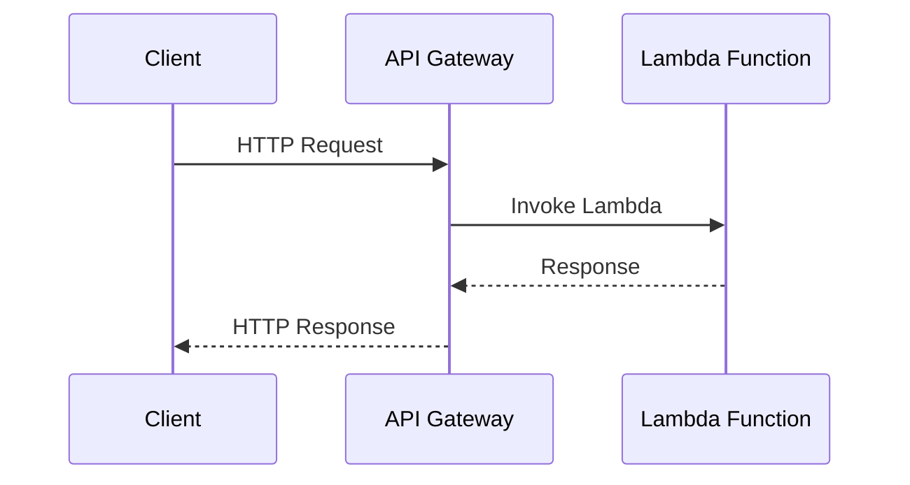

## Introduction

The API Gateway Integration pattern is critical in serverless architectures, facilitating seamless interaction between end-users and backend microservices or functions, often hosted in a cloud environment. By acting as a single entry point, an API Gateway abstracts the complexities of integrating various services, allowing teams to focus on the application logic.

## Design Pattern Description

The core idea of the API Gateway Integration pattern is to provide a unified interface to manage, monitor, and secure APIs that interact with backend services. This pattern simplifies client access, enabling service discovery, request routing, transformation, and protocol translation, all while offering enhanced security and performance optimization features.

### Key Components

- **API Gateway**: Acts as a bridge between clients and microservices, offering functionalities like load balancing, SSL termination, and traffic management.
  
- **Backend Services**: Can range from microservices hosted on serverless platforms to traditional server-based applications.

- **Client Applications**: Various types, including web, mobile, or IoT devices, interact with the API Gateway to access backend services.

### Architectural Approach

1. **Single Entry Point**: All client requests first go through the API Gateway.
   
2. **Request Routing**: The API Gateway routes requests to the appropriate service or function based on predefined rules.

3. **Request Transformation and Aggregation**: Supports transformation of incoming requests and aggregation of results, reducing the need for client-side complexities.

4. **Security Management**: Handles authentication, authorization, and protection against common vulnerabilities.

5. **Monitoring and Logging**: Provides insights into usage patterns, consumer behavior, and potential issues for operational intelligence.

### Best Practices

- **Optimize for Latency**: Configure the gateway for minimal latency by using local caches or CDN networks.
  
- **Security First**: Always implement SSL and monitor API activity for unauthorized access attempts.

- **Version Management**: Version APIs to ensure backward compatibility and smooth transitions for clients when updating services.

- **Documentation and Guidelines**: Maintain comprehensive documentation for external developers and internal teams.

## Example Code

Below is a basic AWS example of setting up an API Gateway to trigger a Lambda function:

```javascript
// Create a Lambda function to handle incoming API requests
exports.handler = async (event) => {
  const response = {
    statusCode: 200,
    body: JSON.stringify('Hello from Lambda!'),
  };
  return response;
};
```

In AWS, this Lambda function can be linked to an API Gateway, which will trigger the Lambda function on specified API calls.

## Diagrams

### UML Sequence Diagram



## Related Patterns

- **Microservices Architecture**: An API Gateway is often employed in microservices to handle client requests across multiple services.
- **Backend for Frontend (BFF)**: Tailoring specific gateways for each client type (e.g., mobile, web) can enhance performance and security.

## Additional Resources

- Explore AWS API Gateway documentation for a sophisticated understanding.
- Check out Google Cloud Endpoints for similar capabilities in GCP.

## Summary

Implementing the API Gateway Integration pattern in serverless environments simplifies service management, enhances security, and improves scalability. This pattern is vital for architectures looking to leverage cloud-native capabilities effectively while maintaining control over API interactions. It not only enhances operational efficiency but also ensures stronger, securer, and more reliable client interactions with backend services.
