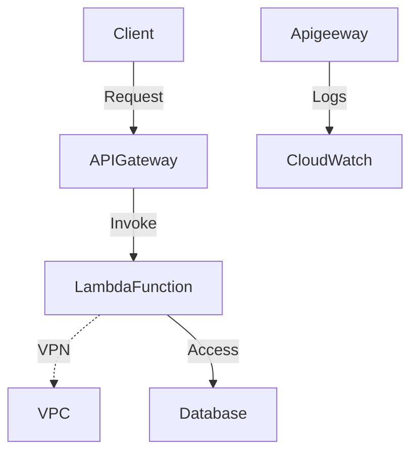

## Introduction

Serverless computing has revolutionized the way we build and deploy applications by abstracting the underlying infrastructure and enabling auto-scaling, which can significantly cut down costs and improve efficiency. However, with these benefits come unique security challenges. This article will provide a comprehensive overview of security best practices and patterns that are essential for maintaining robust security in serverless environments.

## Key Security Challenges in Serverless Computing

### 1. Function-Level Access Control

Serverless architectures often consist of multiple small functions that work together to form an application. Ensuring that each function can only access the resources it needs prevents unwanted exposure. Implement fine-grained access control to limit resource permissions to what's strictly necessary (Principle of Least Privilege).

### 2. Data Protection and Privacy

Encryption of data in transit and at rest is crucial. Serverless applications often handle sensitive data, which necessitates compliance with privacy regulations like GDPR and CCPA. Utilize customer-managed keys (CMK) for encryption where possible.

### 3. Secure Code Practices

Keep serverless function runtimes and dependencies up to date to mitigate vulnerabilities. Implement static code analysis and use tools specific to serverless environments such as AWS Lambda's Layers and Azure Functions' Durable Functions for modularizing and securing code patterns.

### 4. Monitoring and Logging

Comprehensive monitoring and logging are essential to identify suspicious activities. Leverage built-in monitoring tools like AWS CloudWatch, Azure Monitor, or Google's Cloud Logging to keep a keen eye on usage patterns and set up alerts for anomalies.

## Architectural Approaches

### A. Using VPCs and Subnets

Design serverless functions to operate within Virtual Private Clouds (VPCs) to control communications and prevent unauthorized access.

### B. API Gateway and Identity Management

Utilize services like AWS API Gateway with AWS IAM or Cognito for user authentication and authorization, ensuring that only validated users and services can trigger serverless functions.

### C. Network Security Controls

Deploy network security configurations such as Security Groups and Network ACLs to define the allowed access points into your serverless applications.

## Example Code

Here's a simple example of AWS IAM policy for a Lambda function to access DynamoDB securely:

```json
{
  "Version": "2012-10-17",
  "Statement": [
    {
      "Effect": "Allow",
      "Action": "dynamodb:GetItem",
      "Resource": "arn:aws:dynamodb:us-east-1:123456789012:table/MyTable"
    }
  ]
}
```

## Diagrams

### Serverless Security Architecture Diagram



## Related Patterns

- **API Gateway Pattern**: Acts as a single entry point for serverless functions, providing abstractions like rate limiting and security features like authentication and authorization.
- **Event-Driven Architecture**: Serverless relies heavily on events to trigger functions; secure these events using encryption and validation.
- **Identity Federation**: Manages and secures user identities across multiple domains.

## Additional Resources

- [NIST Cloud Computing Security](https://csrc.nist.gov/publications/detail/sp/800-210/sp-800-210-draft/final)
- [OWASP Serverless Top 10 Security Risks](https://owasp.org/www-project-serverless-top-10/)

## Summary

Ensuring robust security in serverless architectures requires a thorough understanding of cloud vendor services and their security offerings. By adhering to best practices like function-level access control, data protection, network security, secure code, logging, and monitoring, you can significantly mitigate security risks. Employing these strategies ensures that businesses can leverage serverless computing with confidence in their security posture.
