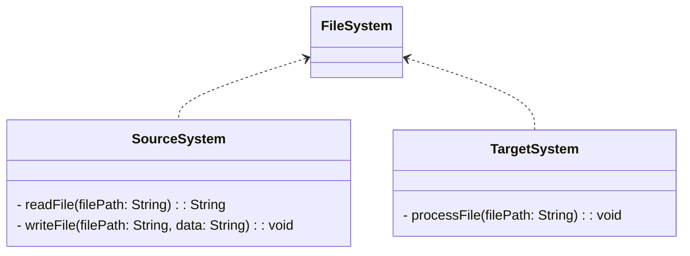
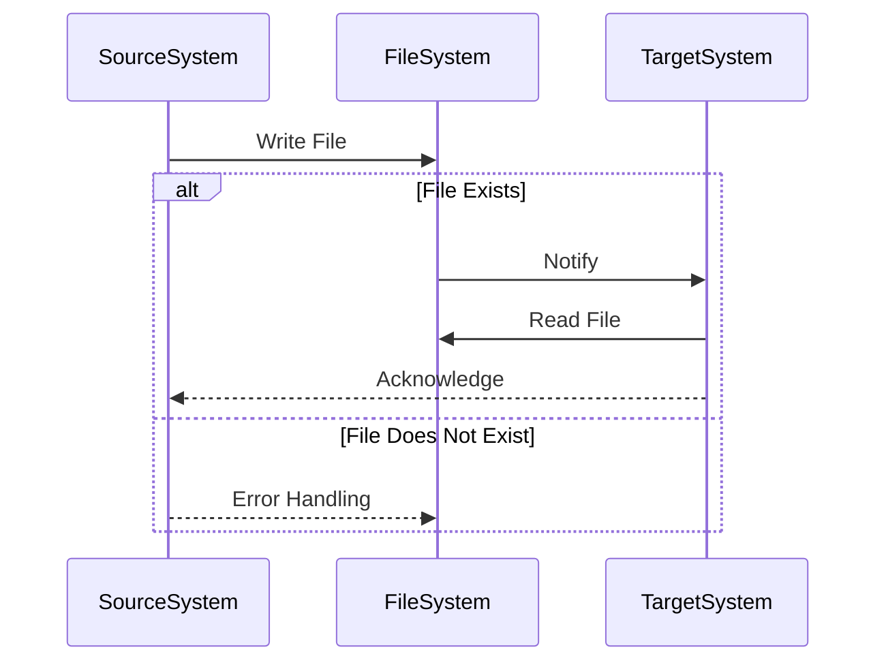

The **File Transfer** pattern facilitates the integration of multiple applications by exchanging files in a standardized format. This method allows unrelated systems to communicate and share data effectively.

## Intent
To enable distributed applications to exchange information by reading and writing to shared files in a common file system.

## Also Known As
- Data File Exchange
- File-Based Integration

## Detailed Definitions and Explanations

### Key Features
- **Decoupling**: Systems interact via file systems, which reduces direct dependencies.
- **Asynchronous Transfer**: Data exchange occurs in a non-blocking manner.
- **Data Transformation**: Facilitates transformation of data into standardized formats.

### Diagrams

#### Class Diagram


#### Sequence Diagram


## Code Examples

### Java Example using Apache Camel
```java
import org.apache.camel.CamelContext;
import org.apache.camel.builder.RouteBuilder;
import org.apache.camel.impl.DefaultCamelContext;

public class FileTransferExample {
    public static void main(String[] args) throws Exception {
        CamelContext camelContext = new DefaultCamelContext();

        camelContext.addRoutes(new RouteBuilder() {
            @Override
            public void configure() {
                from("file:source_folder?noop=true")
                    .to("file:destination_folder");
            }
        });

        camelContext.start();
        Thread.sleep(5000);
        camelContext.stop();
    }
}
```

### Scala Example using Akka
```scala
import akka.actor.ActorSystem
import akka.stream.scaladsl.{FileIO, Sink, Source}
import java.nio.file.Paths

object FileTransferExample extends App {
  implicit val system: ActorSystem = ActorSystem("FileTransfer")

  val sourceFilePath = Paths.get("source_folder/source_file.txt")
  val targetFilePath = Paths.get("destination_folder/destination_file.txt")

  FileIO.fromPath(sourceFilePath)
    .runWith(FileIO.toPath(targetFilePath))
    .onComplete { _ =>
      system.terminate()
    }
}
```

## Benefits
- **Simplicity**: Easy to implement with basic read/write file operations.
- **Decoupling**: Low dependency between integrated systems as they only need access to a common file system.

## Trade-offs
- **Latency**: Filesystems may introduce delays due to file write and read operations.
- **Error Handling**: Requires robust handling of file system errors and potential race conditions.

## When to Use
- When integrating legacy systems that primarily rely on file-based data exchange.
- Batch processing tasks where near-real-time is not critical.

## Example Use Cases
- **ETL Processes**: Extract, Transform, and Load operations frequently use file-based integration.
- **Data Migration**: Transferring bulk data between systems.

## When Not to Use and Anti-Patterns
- **Real-Time Systems**: Not suitable for real-time data exchange due to inherent latency.
- **Large Files**: Managing very large files can be inefficient and prone to errors.

## Related Design Patterns
- **Message Queueing**: For real-time data exchange.
- **Shared Database**: An alternative for file-based integration but requires more-tight coupling.

## References and Credits
- **Books**: [Enterprise Integration Patterns: Designing, Building, and Deploying Messaging Solutions](https://amzn.to/3XXncn8) by Gregor Hohpe and Bobby Woolf.
- **Open Source Frameworks**: Apache Camel, Apache Kafka, MuleSoft.
- **Cloud Computing**: AWS S3 for file storage and transfer, Google Cloud Storage.
- **Third-Party Tools**: rsync for file synchronization.

With this pattern, solving integration problems where systems need to exchange files becomes efficient and manageable.

