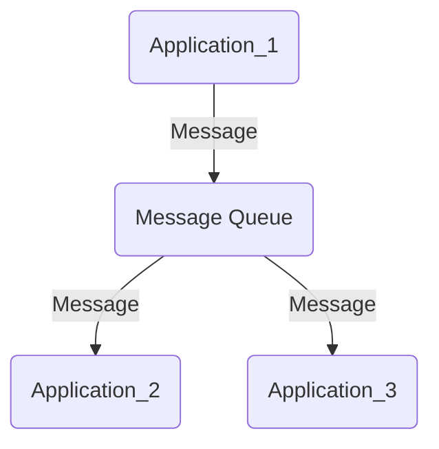
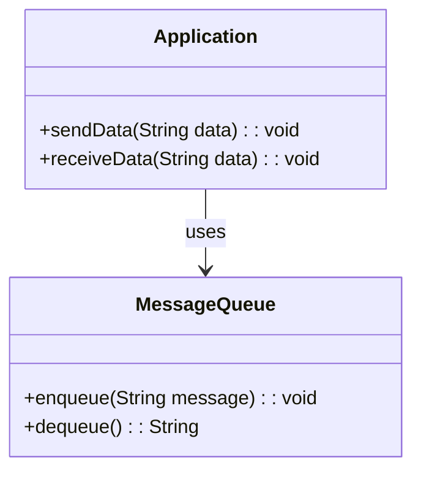
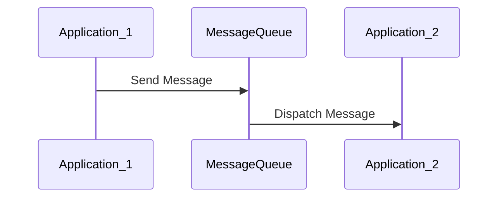
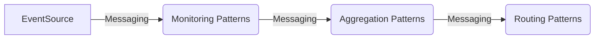

## Definition
**Messaging** is an architectural design pattern for integrating multiple applications to work cohesively and exchange information seamlessly using messages. This pattern ensures that the connected systems communicate asynchronously, facilitating loose coupling among services and higher system resilience.

## Intent
To integrate multiple systems or applications by enabling them to exchange information asynchronously through a reliable and scalable messaging infrastructure.

## Also Known As
- Message-Oriented Middleware (MOM)
- Asynchronous Messaging

## Detailed Definitions and Explanations

**Key Features:**
- **Asynchronous Communication:** Systems communicate by sending messages rather than invoking services directly.
- **Loose Coupling:** Systems don't need to be aware of each other's location or implementation details.
- **Scalability:** Distribution of messages can be managed efficiently across multiple systems.
- **Resilience:** Due to asynchronous nature, systems don't fail if the receiving application is temporarily unavailable.

### Messaging Architecture Diagram



### Example in Java with Apache Kafka

Consider a scenario where two services, OrderService and InventoryService, need to exchange information.

```java
import org.apache.kafka.clients.producer.KafkaProducer;
import org.apache.kafka.clients.producer.ProducerRecord;

import java.util.Properties;

public class KafkaMessagingExample {
    public static void main(String[] args) {
        Properties props = new Properties();
        props.put("bootstrap.servers", "localhost:9092");
        props.put("key.serializer", "org.apache.kafka.common.serialization.StringSerializer");
        props.put("value.serializer", "org.apache.kafka.common.serialization.StringSerializer");

        KafkaProducer<String, String> producer = new KafkaProducer<>(props);
        ProducerRecord<String, String> record = new ProducerRecord<>("OrderTopic", "order-key", "Order Details");
        
        producer.send(record);
        producer.close();
    }
}
```

### Example in Scala with Akka

```scala
import akka.actor.{Actor, ActorSystem, Props}
import akka.kafka.ProducerSettings
import org.apache.kafka.clients.producer.ProducerRecord
import org.apache.kafka.common.serialization.StringSerializer

object KafkaMessagingApp extends App {
  implicit val system: ActorSystem = ActorSystem("KafkaMessagingSystem")
  
  class OrderProducerActor extends Actor {
    val config = system.settings.config.getConfig("akka.kafka.producer")
    val producerSettings = ProducerSettings(config, new StringSerializer, new StringSerializer)

    override def receive: Receive = {
      case msg: String =>
        val record = new ProducerRecord[String, String]("OrderTopic", "order-key", msg)
        producerSettings.createKafkaProducer().send(record)
    }
  }

  val orderProducerActor = system.actorOf(Props[OrderProducerActor], "OrderProducerActor")
  orderProducerActor ! "Order Details"
}
```

### Example Class Diagram



### Example Sequence Diagram



## Benefits
- **Decouples** systems, making changes to one system without affecting others.
- **Enhances Scalability** by allowing distributed communication.
- **Improves Fault Tolerance** by retaining messages during temporary outages.
- **Enables Asynchronous Processing**, improving responsiveness and throughput.

## Trade-offs
- **Complexity** in managing message queues and guaranteeing message delivery.
- **Latency** introduced by asynchronous communication.
- **Increased Debugging Difficulty** due to decoupled systems.

## When to Use
- **Integration of Heterogeneous Systems:** When connecting different technology stacks.
- **Microservices Architecture:** Enabling communication among microservices.
- **Event-Driven Systems:** Where systems need to respond to events.

## Example Use Cases
- **E-commerce Applications:** Handling order processing and inventory updates.
- **Financial Systems:** Integrating transaction processing systems.
- **Telemetry Systems:** Collecting and distributing sensor data.

## When Not to Use and Anti-Patterns
- **Real-Time Systems:** Where low latency is critical.
- **Tightly Coupled Systems:** Where synchronous communication is necessary.
- Using messaging purely to avoid direct API integrations.

## Related Design Patterns
- **Publisher-Subscriber Pattern:** Allows multiple services to subscribe to the events or messages from a publisher.
- **Event Sourcing:** Derives application state from a sequence of events, particularly useful in microservices architectures.
- **Command Query Responsibility Segregation (CQRS):** Separates the read and write operations for better performance and scalability in distributed systems.

## References and Credits
- [Enterprise Integration Patterns: Designing, Building, and Deploying Messaging Solutions](https://amzn.to/3XXncn8) by Gregor Hohpe and Bobby Woolf
- Apache Kafka [Official Documentation](https://kafka.apache.org/documentation/)
- Akka [Official Documentation](https://doc.akka.io/docs/akka/current/)

## Open Source Frameworks
- **Apache Camel:** Provides connectors for routing and mediation rules.
- **Apache Kafka:** Distributed streaming platform for building real-time data pipelines.
- **Spring Boot:** Provides Spring-based applications with production-ready capabilities.

## Third-Party Tools
- **MuleSoft:** An integration platform for connecting applications.
- **RabbitMQ:** Open-source message broker software.

## Cloud Computing, SAAS, DAAS, PAAS
- **Amazon Simple Queue Service (SQS):** Fully managed message queuing service by AWS.
- **Google Cloud Pub/Sub:** Real-time messaging service that allows you to send and receive messages between independent applications.

## Books for Further Studies
- [Enterprise Integration Patterns: Designing, Building, and Deploying Messaging Solutions](https://amzn.to/3XXncn8) by Gregor Hohpe and Bobby Woolf.
- [Designing Data-Intensive Applications](https://amzn.to/4cuX2Na) by Martin Kleppmann.



### Description of Related Patterns
1. **Event Source Pattern:** Captures events as a source of truth for application state.
2. **Aggregation Patterns:** Combines data from different sources into a unified format.
3. **Routing Patterns:** Directs messages to appropriate handlers based on their content.

## Solving Problems Effectively
To solve the integration problem effectively using messaging patterns:
1. **Identify the Communication Needs:** Understand what information needs to be exchanged and how often.
2. **Choose the Right Messaging Platform:** Evaluate requirements like reliability, scalability, and throughput.
3. **Design Your Message Format:** Standardize message formats to ensure compatibility.
4. **Implement Message Routing and Processing:** Use a combination of related patterns like event sourcing, aggregation, and routing to handle messages.

Applying and combining these patterns judiciously can create a robust, scalable, and maintainable integration solution.
