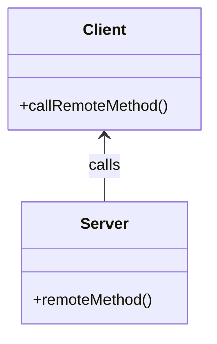
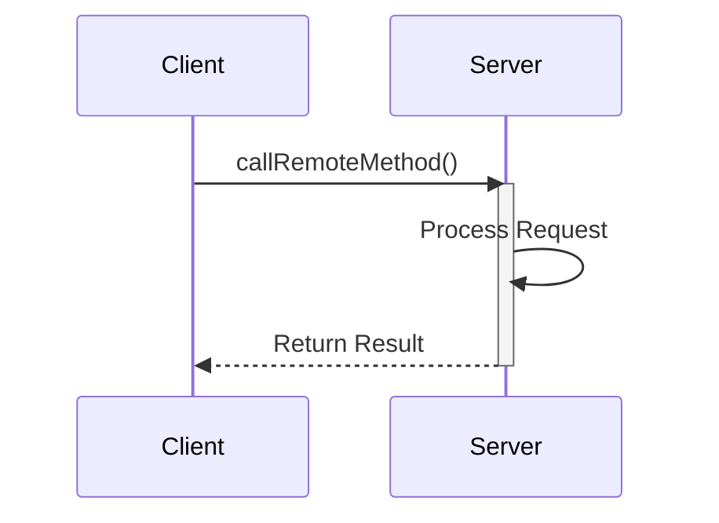

### Definition

**Remote Procedure Invocation (RPI)**, also known as **Remote Procedure Call (RPC)**, is a communication paradigm that allows a program to trigger the execution of procedures or methods in another address space (commonly on a different machine). This facilitates the integration of multiple applications by enabling them to interact and exchange information seamlessly.

### Intent

The intent of RPI is to abstract the complexities of network communication, allowing developers to call remote functions/methods as if they were local, thereby enabling tight integration across different systems or services.

### Also Known As

- Remote Procedure Call (RPC)
- Remote Method Invocation (RMI)
- Distributed Function Call

### Detailed Explanation

RPC abstracts the complexities involved in executing code across network boundaries, presenting them as local method calls. This reduces the development overhead associated with setting up and managing network communications manually.

#### Key Features
- **Abstraction of Network Communication:** RPC hides the details of the low-level network transactions.
- **Interoperability:** Facilitates communication among heterogeneous systems.
- **Synchrony:** Generally synchronous, meaning the caller waits for the response before proceeding.

### Diagrams

#### Class Diagram

**Explanation:** The client calls a remote method on the server as if it were a local method.

#### Sequence Diagram

**Explanation:** The client sends a method call to the server, which processes the request and returns the result to the client.

### Code Examples

#### Java Example with Apache Camel
```java
// Sample Java code demonstrating RPI using Apache Camel

import org.apache.camel.CamelContext;
import org.apache.camel.builder.RouteBuilder;
import org.apache.camel.impl.DefaultCamelContext;

public class RemoteProcedureInvocationExample {

    public static void main(String[] args) throws Exception {
        CamelContext context = new DefaultCamelContext();

        // Define the route
        context.addRoutes(new RouteBuilder() {
            public void configure() {
                from("direct:start")
                    .to("http4://example-server.com/service/method");
            }
        });

        context.start();
        // Trigger the route
        context.createProducerTemplate().sendBody("direct:start", "RequestBody");
        context.stop();
    }
}
```

#### Scala Example with Akka
```scala
// Sample Scala code demonstrating RPI using Akka

import akka.actor.{Actor, ActorRef, ActorSystem, Props}
import akka.pattern.ask
import akka.util.Timeout

import scala.concurrent.Await
import scala.concurrent.duration._

case object CallRemoteMethod

class RemoteActor extends Actor {
  def receive = {
    case CallRemoteMethod =>
      sender() ! "Result from remote method"
  }
}

object RemoteProcedureInvocationExample extends App {
  val system = ActorSystem("RemoteProcedureInvocation")
  val remoteActor = system.actorOf(Props[RemoteActor], "remoteActor")
  
  implicit val timeout: Timeout = Timeout(5 seconds)
  val future = remoteActor ? CallRemoteMethod
  val result = Await.result(future, timeout.duration)
  
  println(result)
  system.terminate()
}
```

### Benefits

- Simplifies the development of distributed systems.
- Encapsulates complex network communication.
- Encourages modularizing application logic.

### Trade-offs

- Tight Coupling: RPC leads to tighter coupling between client and server.
- Synchronous Calls: Clients often block while waiting for a response, possibly leading to performance bottlenecks.
- Error Handling: Requires robust error handling to manage network failures.

### When to Use

- When you need real-time communication between distributed components.
- When you need to execute a remote service with a predictable, small response payload.

### Example Use Cases

- Inter-systems communication in microservices architectures.
- Distributed computations.
- Interacting with external APIs or services.

### When Not to Use and Anti-patterns

- For fire-and-forget or asynchronous processing, prefer messaging patterns like Pub-Sub.
- Avoid tight coupling in loosely coupled architectures.

### Related Design Patterns

- **Messaging:** For asynchronous communication.
- **Service-Oriented Architecture (SOA):** Higher-level architecture that may employ RPC.
- **Event-Driven Architecture (EDA):** Leverages events for communication over method calls.

### References, Credits and Tools

#### Open Source Frameworks

- **Apache Camel:** Integrate and configure various protocols and services.
- **Akka:** Building concurrent, distributed, and resilient message-driven applications.
- **Spring Boot:** Use Spring Remoting to configure remotes.
- **Apache Flink:** For more advanced streaming and state processing.

#### Third-Party Tools

- **gRPC:** Modern RPC framework by Google.
- **Apache Thrift:** High-performance modular RPC framework.

#### Cloud Computing (PaaS, SaaS, IaaS)

- **Google Cloud Functions:** Serverless compute to run small code snippets (functions) in the Cloud.
- **AWS Lambda:** Run code without provisioning or managing servers.

### Suggested Books

- *[Enterprise Integration Patterns: Designing, Building, and Deploying Messaging Solutions](https://amzn.to/3XXncn8)* by Gregor Hohpe and Bobby Woolf
- *[Building Microservices: Designing Fine-Grained Systems](https://amzn.to/3RYRz96)* by Sam Newman

Combining the Remote Procedure Invocation pattern with other integration and messaging patterns effectively addresses various distributed systems' needs, enabling robust and scalable architectures.
