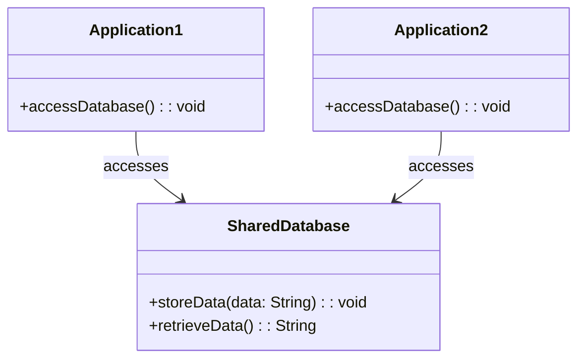
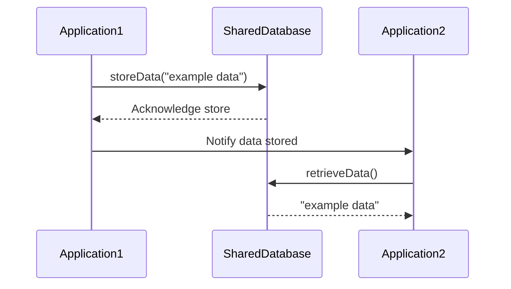
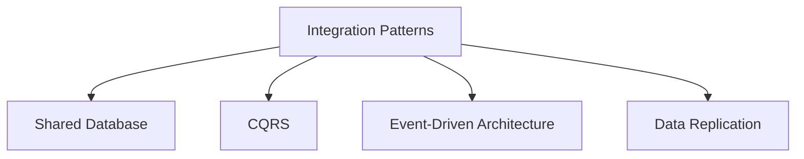

## Definition
The Shared Database pattern involves multiple applications accessing the same database to integrate their functionalities and seamlessly exchange information. This pattern is commonly used to ensure that all applications maintain a consistent view of the data.

## Intent
To enable multiple applications to work together in a coherent manner by providing them with a shared data storage system.

## Also Known As
- Common Database

## Detailed Definitions and Explanations
The Shared Database pattern centralizes data storage in a single database, which is concurrently accessed by multiple applications. This setup facilitates data consistency and reduces data redundancy across applications.

### Key Features
- Centralized Data Management
- Immediate Data Consistency
- Simplified Data Sharing
- Reduced Data Redundancy

### Example: Java (using Spring Boot)

```java
import org.springframework.beans.factory.annotation.Autowired;
import org.springframework.web.bind.annotation.GetMapping;
import org.springframework.web.bind.annotation.RestController;
import org.springframework.jdbc.core.JdbcTemplate;

@RestController
public class DataController {

    @Autowired
    private JdbcTemplate jdbcTemplate;

    @GetMapping("/getData")
    public String getData() {
        String sql = "SELECT data FROM shared_table WHERE id = 1";
        return jdbcTemplate.queryForObject(sql, String.class);
    }
}
```

### Example: Scala (using Akka)

```scala
import akka.http.scaladsl.server.Directives._
import slick.jdbc.H2Profile.api._

import scala.concurrent.ExecutionContext.Implicits.global
import scala.concurrent.Future

object DataService {

  val db = Database.forConfig("h2mem1")
  
  def getData(id: Int): Future[String] = {
    val query = sql"SELECT data FROM shared_table WHERE id = $id".as[String].head
    db.run(query)
  }

  val route = path("getData" / IntNumber) { id =>
    get {
      onComplete(getData(id)) {
        case Success(data) => complete(data)
        case Failure(ex) => complete(s"Failed: $ex")
      }
    }
  }
}
```

### Example Class Diagram

**Explanation**: `Application1` and `Application2` both access the `SharedDatabase` to store and retrieve data.

### Example Sequence Diagram

**Explanation**: `Application1` stores data in the `SharedDatabase`. `Application2` retrieves the same data.

## Benefits
- **Data Consistency**: Immediate propagation of changes across all applications.
- **Centralized Management**: Simplifies the oversight of data storage.
- **Ease of Access**: Simplifies data access for all integrated applications.

## Trade-offs
- **Scalability Issues**: Potential bottleneck due to single database access.
- **Coupling**: High dependency between applications and the shared database design.
- **Concurrency**: Complications in handling concurrent access and modifications.

## When to Use
- When all involved applications need real-time access to the same data.
- When consistency and reduced data redundancy are paramount.

## Example Use Cases
- Multi-application enterprise systems performing interrelated tasks.
- Integrated customer relationship management (CRM) solutions.
- E-commerce platforms with multiple applications sharing inventory and order data.

## When Not to Use and Anti-patterns
- Avoid when applications have vastly different data requirements.
- Do not use if high availability and fault tolerance are critical, as a single database could become a single point of failure.

## Related Design Patterns
- **CQRS (Command Query Responsibility Segregation)**: Separates read and write operations to improve scalability.
- **Data Replication**: Distributes data across multiple databases to enhance availability and fault tolerance.
- **Event-Driven Architecture**: Uses events to integrate services instead of shared data, promoting loose coupling.

## Related Patterns Group


### Effective Problem Solving
For a centralized data integration scenario, consider using the Shared Database pattern for immediate consistency. For problems related to scalability, look into CQRS or Data Replication. Event-Driven Architecture is ideal for achieving loose coupling.

## References and Credits
- [Enterprise Integration Patterns](https://www.enterpriseintegrationpatterns.com/)
- [Spring Boot Reference Documentation](https://docs.spring.io/spring-boot/docs/current/reference/htmlsingle/)
- [Akka Documentation](https://doc.akka.io/docs/akka/current/)
- [Apache's GitHub Repositories](https://github.com/apache)

## Open Source Frameworks
- Apache Camel
- MuleSoft
- Spring Boot
- Akka

## Cloud Computing, SAAS, DAAS, PAAS
- **SaaS**: Salesforce (CRM)
- **PaaS**: AWS Elastic Beanstalk
- **DaaS**: Google BigQuery

## Suggested Books for Further Studies
- [Enterprise Integration Patterns: Designing, Building, and Deploying Messaging Solutions](https://amzn.to/3XXncn8) by Gregor Hohpe and Bobby Woolf
- [Building Microservices: Designing Fine-Grained Systems](https://amzn.to/3RYRz96) by Sam Newman
- [Designing Data-Intensive Applications](https://amzn.to/4cuX2Na) by Martin Kleppmann

