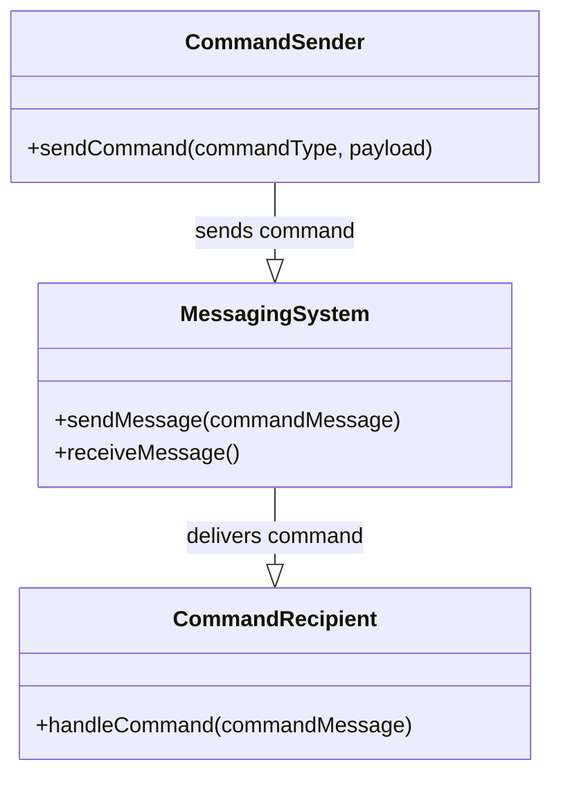
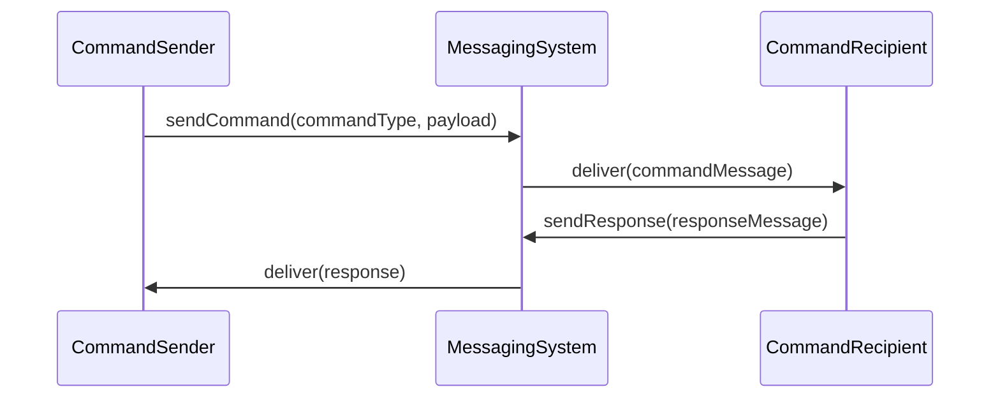

## Command Message

### Definition
The Command Message pattern allows an application to use messaging to invoke a procedure or service in another application. By wrapping a specified command within a message, systems ensure the decoupling of different subsystems while enabling synchronous and asynchronous execution of commands.

### Intent
To invoke a procedure or a remote operation in another system using a message rather than direct method calls, ensuring loose coupling and promoting reliable communication.

### Also Known As
- Remote Procedure Call (RPC) over Messaging
- Asynchronous Invocation
- Command Invocation Pattern

### Detailed Definition and Explanation

By definition, Command Message involves embedding details of a command request within the message envelope and dispatching it to a receiving application for execution. The response, if required, can be sent back via a reply message.

### Key Features
- **Decoupling:** Separation of the command sender from the command executor.
- **Reliability:** Commands can be ensured to reach the recipient through reliable messaging systems.
- **Scalability:** Supports load balancing and asynchronous processing, improving system scalability.
- **Flexibility:** Different commands can be encapsulated within messages, allowing for broad and flexible system interfaces.

### Example Class Diagram

In this diagram, the `CommandSender` creates a command and sends it via the `MessagingSystem`. The `CommandRecipient` listens for commands, processes them upon receipt.

### Example Sequence Diagram

This sequence diagram shows how the `CommandSender` sends a command via the `MessagingSystem`, which then delivers it to the `CommandRecipient`, and optionally sends back a response.

### Code Examples
#### Java with Apache Camel
```java
import org.apache.camel.CamelContext;
import org.apache.camel.builder.RouteBuilder;
import org.apache.camel.impl.DefaultCamelContext;

public class CommandMessageExample {
    public static void main(String[] args) throws Exception {
        CamelContext context = new DefaultCamelContext();
        
        context.addRoutes(new RouteBuilder() {
            public void configure() {
                from("direct:command")
                    .to("jms:queue:CommandQueue");

                from("jms:queue:CommandQueue")
                    .process(exchange -> {
                        String command = exchange.getIn().getBody(String.class);
                        // Process the command
                        System.out.println("Processing command: " + command);
                        exchange.getMessage().setBody("Command executed successfully");
                    })
                    .to("direct:response");
            }
        });
        
        context.start();
        Thread.sleep(10000);
        context.stop();
    }
}
```

### Benefits
- **Consistency:** Decouples producers and consumers.
- **Scalability:** Asynchronous processing enables handling of high load.
- **Extensibility:** Easily add new command types without changing the client code.

### Trade-offs
- **Complexity:** Requires proper management and monitoring.
- **Latency:** Possible delays due to messaging overhead.
- **Fault Tolerance:** Requires robust error handling mechanisms.

### When to Use
- When applications need to communicate without being tightly coupled.
- When a reliable messaging system is required to guarantee delivery.
- For complex workflows where intermediate states need to be managed between invocations.

### Example Use Cases
- Microservices communicating via messaging queues.
- Event-driven architecture where commands trigger state changes.
- Distributed systems processing tasks asynchronously.

### When Not to Use
- For simple local method invocations within the same application.
- Where real-time responses are critical and messaging latency can't be tolerated.

### Anti-patterns
- **Pollution of Service Interfaces:** By embedding too many varied commands that belong to multiple contexts.
- **Command Overloading:** Sending too many parameters which leads to handling overhead and complexity.

### Related Design Patterns
- **Event-Driven Consumer:** To handle events using a message-driven approach.
- **Request-Reply:** To handle synchronous calls within the messaging framework.
- **Saga:** For managing distributed transactions.

### References & Suggested Books
- *Enterprise Integration Patterns* by Gregor Hohpe and Bobby Woolf.
- [Designing Data-Intensive Applications](https://amzn.to/4cuX2Na) by Martin Kleppmann.

### Open Source Frameworks
- **Apache Camel**: Used to define routing and mediation rules.
- **Spring Boot**: Integrates well with messaging patterns and supports command messages.
- **Akka**: For building powerful and resilient distributed systems.
- **Apache Kafka**: For reliable, high-throughput, low-latency messaging.

### Cloud Computing & Services
- **AWS SQS/SNS**
- **Google Cloud Pub/Sub**
- **Azure Service Bus**

### Conclusion
The Command Message pattern enables decoupled and reliable inter-process communication via messaging. It is widely used in building scalable, maintainable, and resilient enterprise systems.


