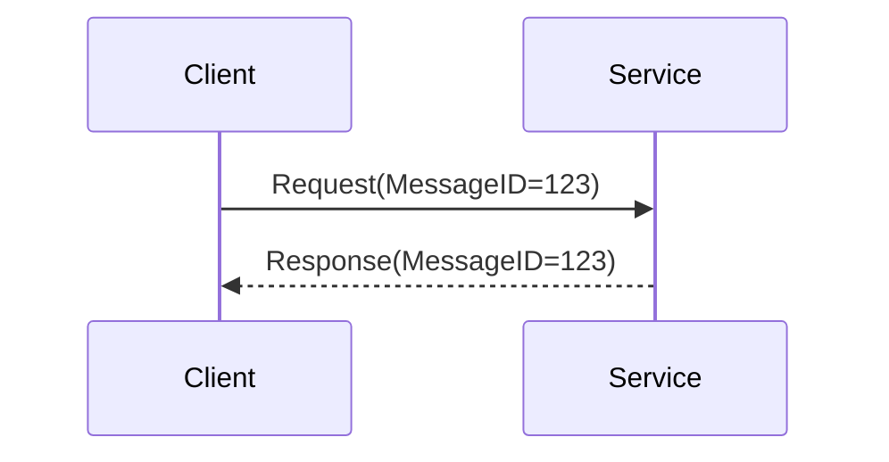
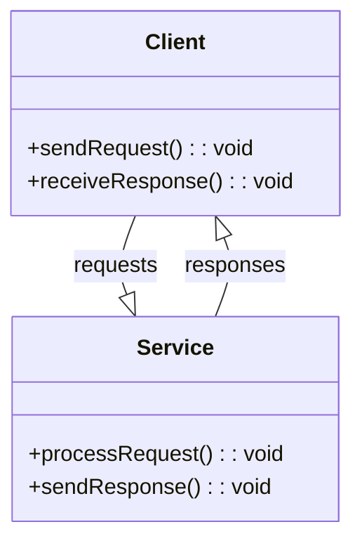

## Definition

The **Correlation Identifier** is a pattern used in message-oriented middleware systems, allowing requesters to know which request a received reply corresponds to, by embedding a unique identifier within each message.

## Intent

To ensure that requests and their corresponding replies can be tracked and matched in distributed systems where multiple messages are in transit simultaneously.

## Also Known As

- Message Correlation
- Request-Response Correlation

## Detailed Explanation

In distributed systems, a service may issue multiple requests to other services and later receive multiple responses. The **Correlation Identifier** pattern ensures that these responses can be linked back to their original requests by including a unique identifier in both the request and response messages.

### Diagram



## Key Features

- **Unique Identifiers**: Ensures each outgoing message includes a unique identifier.
- **Consistent Tracking**: Embeds the identifier in response messages for consistent tracking.
- **Middleware Support**: Supported by various messaging middleware tools.

## Code Examples

### Java using Apache Camel

```java
from("direct:start")
    .setHeader("CorrelationId", simple("${id}"))
    .to("seda:queue")
    .log("Request sent with CorrelationId: ${header.CorrelationId}");

from("seda:queue")
    .log("Processing request with CorrelationId: ${header.CorrelationId}")
    .setBody(simple("Response"))
    .setHeader("CorrelationId", header("CorrelationId"))
    .to("direct:reply");

from("direct:reply")
    .log("Response received with CorrelationId: ${header.CorrelationId}");
```

### Scala using Akka

```scala
import akka.actor.{Actor, ActorRef, Props}
import akka.pattern.ask
import akka.util.Timeout

import scala.concurrent.duration._
import scala.language.postfixOps

case class Request(messageId: String, payload: String)
case class Response(messageId: String, payload: String)

class ServiceActor extends Actor {
  def receive: PartialFunction[Any, Unit] = {
    case Request(messageId, payload) =>
      // Processing logic
      sender() ! Response(messageId, payload)
  }
}

object CorrelationExample extends App {
  implicit val timeout: Timeout = Timeout(5 seconds)
  val system = akka.actor.ActorSystem("System")
  val serviceActor: ActorRef = system.actorOf(Props[ServiceActor], "serviceActor")

  val correlationId = java.util.UUID.randomUUID().toString
  val futureResponse = serviceActor ? Request(correlationId, "Hello")

  futureResponse.map {
    case Response(`correlationId`, payload) =>
      println(s"Received Response with CorrelationId: $correlationId and payload: $payload")
  }
}
```

## Class Diagram



`sendRequest` and `receiveResponse` methods handle the correlation IDs within the `Client` class to ensure that matching is consistent with what the `Service` processes via `processRequest` and `sendResponse`.

## Sequence Diagram


## Benefits

- **Traceability**: Simplifies tracking messages through complex systems.
- **Reliability**: Ensures correct message correlation without ambiguity.

## Trade-offs

- **Overhead**: Adds additional metadata to each message.
- **Implementation Complexity**: Requires consistent handling of correlation IDs across systems.

## When to Use

- **Asynchronous Communication**: In systems where multiple asynchronous message exchanges occur.
- **Microservices**: When services communicate in a large, distributed environment.

## Example Use Cases

- **Order Processing Systems**: Tracking orders and responses in e-commerce.
- **Customer Service Platforms**: Handling queries and responses.

## When Not to Use

- **Simple Synchronous Communication**: When there’s a clear, direct exchange without intermediaries.
- **Single Service Communication**: When dealing with a single service without complex routing.

## Anti-Patterns

- **Ignoring Correlation**: Not implementing correlation, leading to confusion in message tracking.
- **Hardcoding IDs**: Using non-unique or static identifiers.

## Related Design Patterns

- **Message Bus**: Helps in distributing messages across systems but requires correlation for tracing.
- **Request-Reply**: An interaction model that inherently needs correlation for tracking.

## References and Further Reading

- **Enterprise Integration Patterns** by Gregor Hohpe and Bobby Woolf

## Open Source Frameworks and Tools

- **Apache Camel**: Supports embedding and using correlation identifiers across routes.
- **Akka**: Provides tools for managing state and identifiers in actor-based systems.
- **Spring Integration**: Facilitates managing headers for correlation.

## Cloud Computing Platforms

- **AWS Step Functions**: Allows defining workflows where correlation IDs are managed.
- **Google Cloud Pub/Sub**: Provides tools for tracking and managing message delivery.

## Books

- [Enterprise Integration Patterns: Designing, Building, and Deploying Messaging Solutions](https://amzn.to/3XXncn8) by Gregor Hohpe and Bobby Woolf

---

The **Correlation Identifier** pattern is essential in distributed systems where message tracking ensures reliability and robustness.
```
