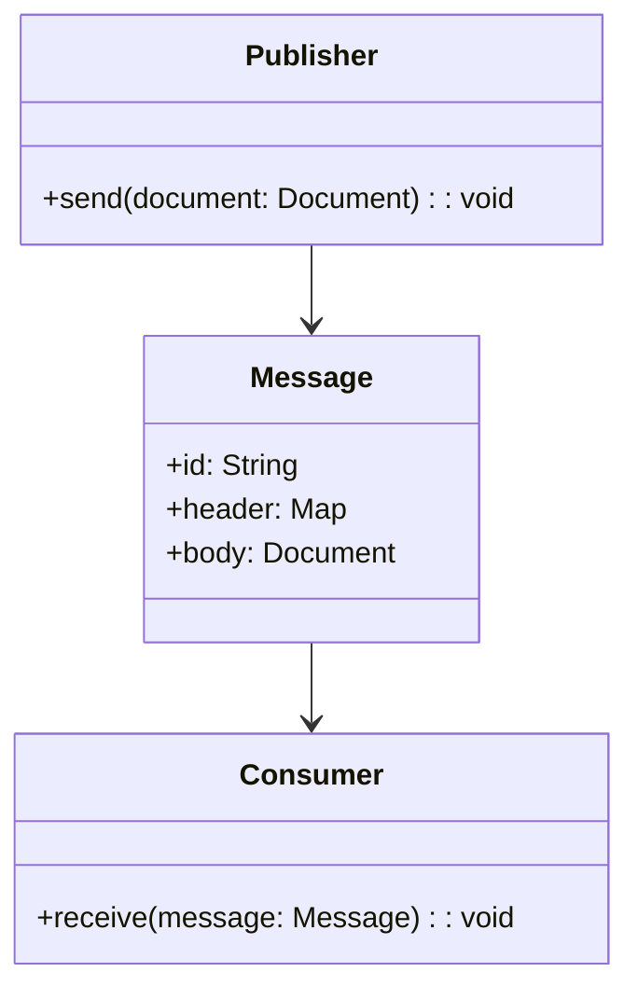
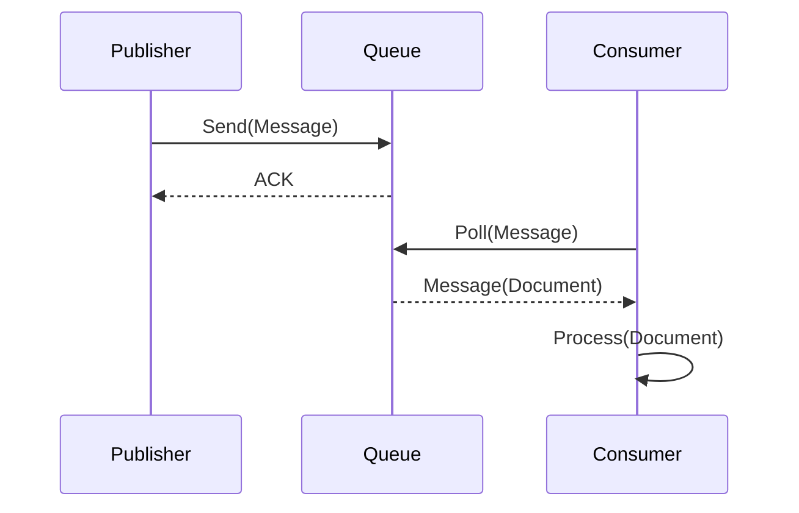
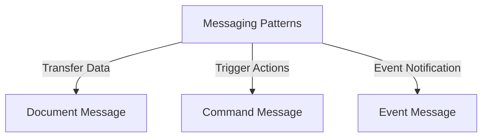

## Definition

The Document Message Pattern is a messaging style that involves sending data between applications in a structured document format, typically in XML, JSON, or another schema-based format.

## Intent

To enable robust and flexible data exchange between different systems by standardizing the message format, allowing interoperability and easier data integration.

## Also Known As

Structured Message, Document Transfer

## Detailed Explanation

In the Document Message pattern, the data payload is encapsulated within a message in a well-defined structure, typically using XML, JSON, or another readable schema-based format. The message can be designed to carry complex hierarchical data structures, making it easier to model business entities or transactions.

### Key Features

- **Versatility**: Handling complex data structures.
- **Interoperability**: Standardized formats such as XML or JSON.
- **Message Validation**: Uses schema definitions for structure validation.

### Diagram


### Example in Java using Spring Boot

```java
import org.springframework.jms.annotation.JmsListener;
import org.springframework.jms.core.JmsTemplate;
import org.springframework.beans.factory.annotation.Autowired;
import org.springframework.stereotype.Component;
import org.springframework.jms.annotation.EnableJms;

import java.util.HashMap;
import java.util.Map;

@EnableJms
@SpringBootApplication
public class DocumentMessageExample {

    public static void main(String[] args) {
        SpringApplication.run(DocumentMessageExample.class, args);
    }

    @Component
    public class Publisher {

        @Autowired
        private JmsTemplate jmsTemplate;

        public void send(Document document) {
            Map<String, Object> message = new HashMap<>();
            message.put("document", document);
            jmsTemplate.convertAndSend("documentQueue", message);
        }
    }

    @Component
    public class Consumer {

        @JmsListener(destination = "documentQueue")
        public void receive(Map<String, Object> message) {
            Document document = (Document) message.get("document");
            // Process the document
        }
    }
}
```

### Example in Scala using Akka

```scala
import akka.actor.{Actor, ActorSystem, Props}
import akka.pattern.ask
import akka.util.Timeout
import scala.concurrent.duration._

case class Document(content: String)
case class Message(messageId: String, headers: Map[String, String], body: Document)

class Publisher extends Actor {
  def receive = {
    case doc: Document =>
      val message = Message(java.util.UUID.randomUUID.toString, Map(), doc)
      // Send message to a Queue (not shown for brevity)
  }
}

class Consumer extends Actor {
  // method to process document
  def processDocument(doc: Document) = println(s"Processing document: ${doc.content}")

  def receive = {
    case message: Message =>
      processDocument(message.body)
  }
}

object DocumentMessageExample extends App {
  val system = ActorSystem("DocumentMessageSystem")
  val publisher = system.actorOf(Props[Publisher], "publisher")
  val consumer = system.actorOf(Props[Consumer], "consumer")

  implicit val timeout: Timeout = Timeout(5.seconds)

  // Simulate sending a document
  publisher ! Document("Sample content")
}
```

### Example Sequence Diagram


## Benefits

- **Flexibility**: Easily adapts to changes in the data model.
- **Interoperability**: Standardized formats (JSON, XML) make it easy to integrate with various systems.
- **Schema Validation**: Using schemas (XSD, JSON Schema) ensures data integrity.

## Trade-offs

- **Performance Overhead**: Parsing XML/JSON can be costly in terms of performance.
- **Complexity**: Schema management and validation add complexity.
- **Size**: Document messages can be larger in size compared to basic text messages.

## When to Use

- When you have structured, complex data.
- When interoperability between different systems is needed.
- When you need schema-based validation of message content.

## Example Use Cases

- Financial transactions.
- E-commerce order processing.
- Healthcare data exchange (HL7 standard).

## When Not to Use

- When messages are simple text or command messages.
- In cases where performance is a critical concern, and message size should be minimized.

## Anti-patterns

- Sending enormous document messages without considering impact on performance and bandwidth.
- Ignoring schema validation can lead to data integrity issues.

## Related Design Patterns

- **Command Message**: For simple command or action messages without complex structure.
- **Event Message**: For broadcasting events, typically without needing a structured document.

## References

- [Patterns of Enterprise Application Architecture](https://amzn.to/4cGutvM) by Martin Fowler
- **Enterprise Integration Patterns** by Gregor Hohpe and Bobby Woolf

## Open Source Frameworks

- **Apache Camel**: Supports message routing and document message handling.
- **Spring Integration**: Provides a messaging subsystem for Spring applications.
- **Akka**: A toolkit and runtime for building concurrent, distributed, and resilient message-driven applications.

## Cloud Computing

- **Amazon SQS**: Managed message queue service.
- **Google Pub/Sub**: A messaging service for exchanging event data among applications.

## Further Reading

- **Enterprise Integration Patterns (EIP)** by Gregor Hohpe and Bobby Woolf
- [Designing Data-Intensive Applications](https://amzn.to/4cuX2Na) by Martin Kleppmann
- **Building Microservices** by Sam Newman

### Group Related Patterns

- **Command Message**: For instructing an action.
- **Event Message**: For notifying about an event’s occurrence.

These patterns form the core of messaging styles for accomplishing various communication strategies in distributed systems.

---
