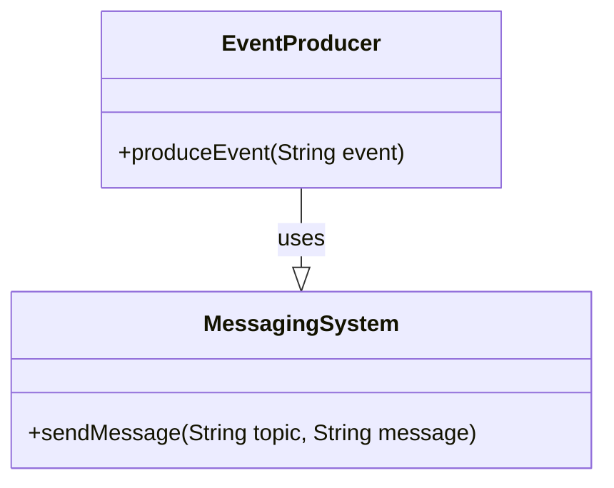
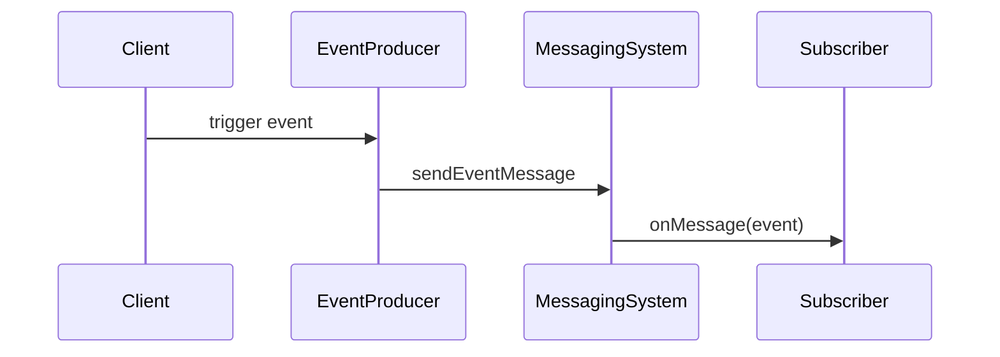
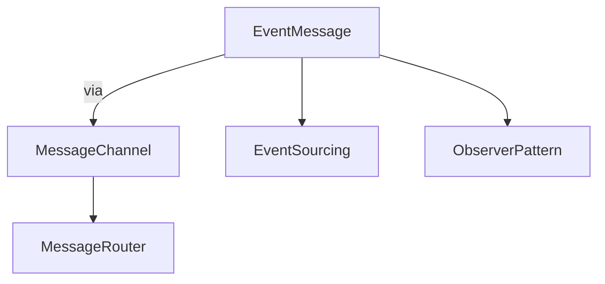

## Event Message

### Definition
Event Message refers to a message that indicates that an event has occurred in the sending application. These messages are designed to be transported from one application to another through a messaging system.

### Intent
The primary objective of the Event Message pattern is to allow applications to communicate significant changes or events in a decoupled manner. This promotes real-time processing and ensures that applications remain loosely coupled while still being able to respond to significant occurrences.

```
Also Known As:
- Notification Message
```

### Detailed Definitions and Explanations
In an Event-Driven Architecture (EDA), Event Messages are pivotal for integrating disparate systems. When one component or service detects an important change, it publishes an event message to inform other subscribed components or services.

### Key Features
- Loose Coupling
- Scalability
- Asynchronous Communication
- Real-time Event Processing

### Code Examples
#### Java Example with Apache Kafka
```java
import org.apache.kafka.clients.producer.*;

import java.util.Properties;

public class EventProducer {
    private final static String TOPIC = "event-topic";
    private final static String BOOTSTRAP_SERVERS = "localhost:9092";

    public static void main(String[] args) {
        Properties props = new Properties();
        props.put(ProducerConfig.BOOTSTRAP_SERVERS_CONFIG, BOOTSTRAP_SERVERS);
        props.put(ProducerConfig.KEY_SERIALIZER_CLASS_CONFIG, "org.apache.kafka.common.serialization.StringSerializer");
        props.put(ProducerConfig.VALUE_SERIALIZER_CLASS_CONFIG, "org.apache.kafka.common.serialization.StringSerializer");

        Producer<String, String> producer = new KafkaProducer<>(props);

        try {
            producer.send(new ProducerRecord<>(TOPIC, "key", "A significant event occurred"));
            System.out.println("Event message sent");
        } finally {
            producer.close();
        }
    }
}
```

#### Scala Example with Akka
```scala
import akka.actor.ActorSystem
import akka.kafka.ProducerSettings
import akka.kafka.scaladsl.SendProducer
import akka.Done
import org.apache.kafka.clients.producer.ProducerRecord
import org.apache.kafka.common.serialization.StringSerializer

import scala.concurrent.Future

object EventProducerApp extends App {
  implicit val system: ActorSystem = ActorSystem("EventProducerSystem")

  val config = system.settings.config.getConfig("akka.kafka.producer")
  val producerSettings = ProducerSettings(config, new StringSerializer, new StringSerializer)
  val producer = SendProducer(producerSettings)

  val record = new ProducerRecord[String, String]("event-topic", "A significant event occurred")
  val result: Future[Done] = producer.send(record)

  result.onComplete(_ => system.terminate())
}
```

### Example Class Diagram


#### Explanation
- **EventProducer**: Class responsible for producing events.
- **MessagingSystem**: Generic representation of a system (like Kafka) that handles the transmission of messages.

### Example Sequence Diagram


#### Explanation
1. **Client** initiates the event.
2. **EventProducer** generates and sends the event message to the **MessagingSystem**.
3. **MessagingSystem** delivers the event message to the **Subscriber**.

### Benefits
- **Decoupling**: Systems can evolve independently.
- **Scalability**: Supports distributed, scalable communication.
- **Real-time Processing**: Immediate event processing as they occur.
- **Flexibility**: Easier integration of new systems.

### Trade-offs
- **Complexity**: Introducing a messaging system can add complexity.
- **Message Overhead**: System resources are consumed to handle messages.
- **Eventual Consistency**: May lead to delays in data synchronization.

### When to Use
- When systems need to react to changes in real-time.
- When integrating heterogeneous systems in a decoupled manner.
- When scalable, event-driven processing is required.

### Example Use Cases
- **Order Processing**: Notifying inventory and shipment services when an order is placed.
- **User Activity**: Tracking user actions and updates.
- **Monitoring Systems**: Sending alerts based on specified thresholds.

### When Not to Use and Anti-Patterns
- When synchronous, tightly-coupled communication is necessary.
- For transactional operations requiring ACID guarantees.

### Related Design Patterns
- **Message Channels**: Defines the medium through which event messages travel.
- **Event Sourcing**: Capturing all changes as a sequence of event messages.
- **Observer Pattern**: Allows multiple subscribers to react to an event.

### References and Credits
- [Enterprise Integration Patterns: Designing, Building, and Deploying Messaging Solutions](https://amzn.to/3XXncn8) by Gregor Hohpe and Bobby Woolf.
- [Design Patterns: Elements of Reusable Object-Oriented Software](https://amzn.to/4cHIpFV) by Erich Gamma et al.

### Open Source Frameworks and Third-Party Tools
- **Apache Kafka**: Distributed streaming platform.
- **RabbitMQ**: Message-broker software.
- **Apache Pulsar**: Distributed pub-sub messaging system.

### Cloud Computing, SAAS, DAAS, PAAS
- **AWS SQS**: AWS's managed message queue service.
- **Google Pub/Sub**: Publish/subscribe messaging service by Google Cloud.
- **Azure Service Bus**: Messaging service by Microsoft Azure.

### Suggested Books for Further Studies
- [Building Microservices: Designing Fine-Grained Systems](https://amzn.to/3RYRz96) by Sam Newman.
- [Designing Data-Intensive Applications](https://amzn.to/4cuX2Na) by Martin Kleppmann.

### Groups of Related Patterns Diagrams
#### Messaging Patterns Group


#### Explanation
- **MessageChannel**: Defines channels for transporting messages.
- **MessageRouter**: Routes messages based on rules.
- **EventSourcing**: Captures all state changes as a sequence of events.
- **ObserverPattern**: Notifies multiple subscribers of changes/events.

By understanding and applying the Event Message pattern effectively, you can achieve scalable, decoupled, and real-time system integration.
