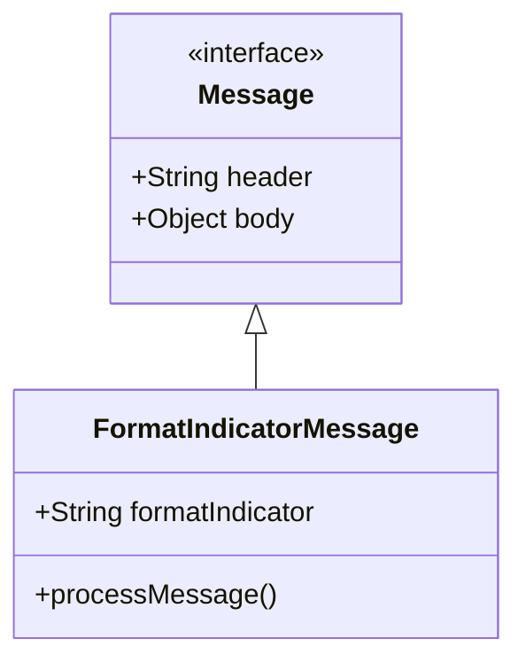
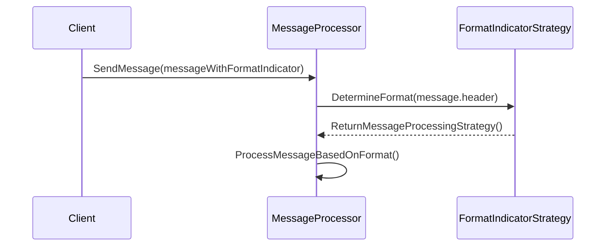

## Format Indicator

### Definition

The Format Indicator pattern addresses the challenge of designing messages in such a way that the data format can be changed or extended in the future without causing disruptions to the existing system.

### Intent

The primary intent is to provide a mechanism within a message's header or metadata that explicitly indicates its data format. This ensures that the receiving system can identify, parse, and process messages correctly, even as new formats are introduced.

### Also Known As

- Message Versioning
- Schema Evolution

### Detailed Explanation

The Format Indicator pattern typically involves adding a type indicator, version number, or schema URL in the message header. This indicator informs the receiving system of the exact data format, which allows for backward compatibility and future evolutions of the message schema.

#### Key Features

1. **Message Header Information**: Embedding format version or schema information in the message header.
2. **Backward Compatibility**: Enabling systems to support multiple message formats and allowing for gradual upgrades.
3. **Version-specific Processing**: Implementing logic to handle different message formats appropriately.
4. **Self-contained**: Each message includes enough information to describe its own format.

### Diagrams

#### Class Diagram


#### Explanation
In the class diagram, `FormatIndicatorMessage` extends the `Message` interface and includes a `formatIndicator` attribute which specifies the message format.

#### Sequence Diagram



#### Explanation

In the sequence diagram, the `Client` sends a message to the `MessageProcessor`. The `MessageProcessor` determines the format using the `FormatIndicatorStrategy` and then processes the message according to the specific format.

### Code Examples

#### Java Example using Spring Boot

```java
public class Message {
    private String header;
    private Object body;

    // getters and setters 
}

public class FormatIndicatorMessage extends Message {
    private String formatIndicator;

    public FormatIndicatorMessage(String header, Object body, String formatIndicator) {
        super(header, body);
        this.formatIndicator = formatIndicator;
    }

    public void processMessage() {
        // logic to process message based on formatIndicator
        switch (formatIndicator) {
            case "v1":
                // Process version 1 message format
                break;
            case "v2":
                // Process version 2 message format 
                break;
            // additional formats as needed
        }
    }
}
```

#### Scala Example using Akka

```scala
case class Message(header: String, body: Any)

case class FormatIndicatorMessage(header: String, body: Any, formatIndicator: String) extends Message(header, body) {
  def processMessage(): Unit = {
    formatIndicator match {
      case "v1" => // Process version 1 message format
      case "v2" => // Process version 2 message format
      // additional formats as needed
    }
  }
}

object MessageProcessor {
  def determineFormat(header: String): String = {
    // logic to extract format indicator from header
  }
}
```

### Benefits

- **Future-Proofing**: The system can accommodate changes in message formats.
- **Interoperability**: Enables different systems to interoperate even if they use different message formats.
- **Scalability**: New message formats can be introduced without breaking existing integrations.

### Trade-offs

- **Complexity**: Requires additional logic to parse and handle different formats.
- **Overhead**: Each message must include the format indicator, adding to the payload size.
- **Maintenance**: Effort needed to maintain backward compatibility with older formats.

### When to Use

- When you anticipate that the message format will evolve over time.
- When you need to maintain backward compatibility with older formats.
- In systems where multiple services or clients may work with different message formats.

### Example Use Cases

- **Financial Services**: Managing messages between different banks or financial institutions where message formats change over time.
- **Health Care**: Maintaining compatibility with different Electronic Health Record (EHR) systems.
- **API Evolution**: Incrementally upgrading API message formats while maintaining backward compatibility.

### When Not to Use and Anti-patterns

- **Stable Systems**: If the message format is unlikely to change, this pattern adds unnecessary complexity.
- **Single Format Systems**: When only one message format exists, versioning adds no value and introduces overhead.

### Related Design Patterns

- **Content Enricher**: Can be used to enrich messages with format-specific data.
- **Message Translator**: Converts messages from one data format to another, supporting different formats at the boundary.

### References

- **Enterprise Integration Patterns** by Gregor Hohpe and Bobby Woolf
- [Designing Data-Intensive Applications](https://amzn.to/4cuX2Na) by Martin Kleppmann

### Credits

- **Authors**: Gregor Hohpe and Bobby Woolf for their work on Enterprise Integration Patterns
- **Frameworks**: Spring Boot, Akka for their support for complex message processing scenarios

### Open Source Frameworks 

- **Spring Integration**: A framework for building enterprise integration solutions.
- **Akka**: A toolkit for building concurrent, distributed, and resilient message-driven applications.

### Cloud Computing and SaaS

- **AWS SQS**: Provides a reliable, highly-scalable hosted queue for storing messages.
- **Azure Service Bus**: Managed message broker that provides scalable and reliable service.
- **Google Cloud Pub/Sub**: Global, real-time messaging platform.

### Books for Further Studies

- **Enterprise Integration Patterns** by Gregor Hohpe and Bobby Woolf
- [Designing Data-Intensive Applications](https://amzn.to/4cuX2Na) by Martin Kleppmann

