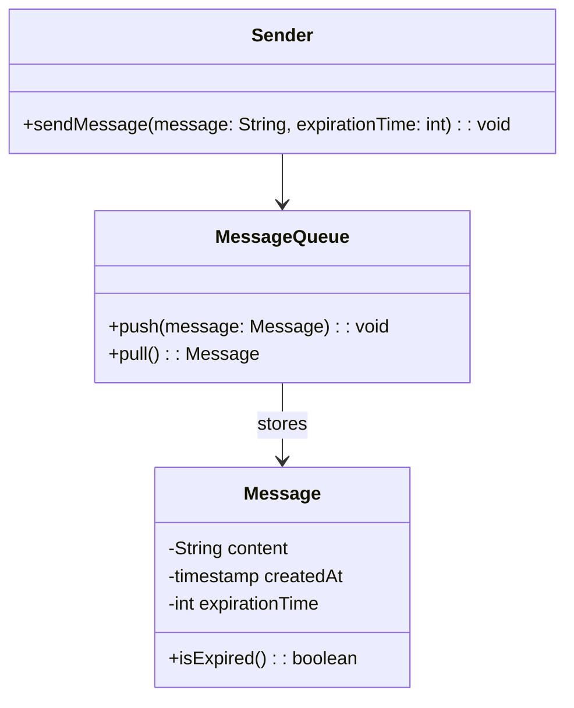
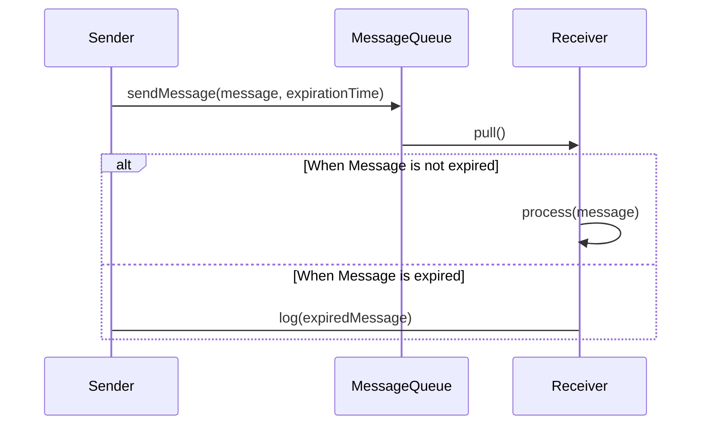

## Definition
Message Expiration is a messaging pattern where the sender marks a message with a time-to-live (TTL), after which the message should be considered stale and discarded or ignored if received.

## Intent
The intent of the Message Expiration pattern is to prevent processing stale messages that may no longer be relevant, ensuring system resources are not wasted.

## Also Known As
- TTL (Time-To-Live)
- Message TTL

## Detailed Definitions and Explanations
When working in distributed systems, messages might be delayed due to various reasons like network issues, broker unavailability, etc. In such cases, it becomes crucial to handle delayed messages appropriately. A message that might have been valid and actionable when sent could be irrelevant if processed much later.

### Key Features
- **TTL Setting:** Ability to specify an expiration time for messages.
- **Discard or Ignore:** Mechanisms to either discard or ignore the stale messages.

## UML Diagrams

### Class Diagram


### Sequence Diagram


## Benefits
- **Resource Efficiency:** Prevents wasted processing on irrelevant messages.
- **Better Data Consistency:** Ensures systems act on timely and relevant data.

## Trade-offs
- **Complexity:** Introducing TTL adds an extra layer of complexity and needs proper management.
- **Coordination:** All system components must be aware of and respect message expiration.

## When to Use
- When messages are time-sensitive and should not be processed if delayed.
- When the system demands up-to-date information to ensure accurate decision making.

## Example Use Cases
- Stock market trading systems where pricing messages have a short lifespan.
- Real-time monitoring systems where delayed data could result in incorrect alerts.

## When Not to Use and Anti-patterns
- When messages are not time-sensitive.
- Anti-pattern: Using message expiration where the message data can still be relevant or required later, leading to unnecessary data loss.

## Related Design Patterns
- **Idempotent Consumer:** Ensures that processing messages multiple times has the same effect as processing once.
- **Message Store:** Stores messages that are kept for future reprocessing.

## References and Credits
- [Enterprise Integration Patterns: Designing, Building, and Deploying Messaging Solutions](https://amzn.to/3XXncn8) by Gregor Hohpe and Bobby Woolf.

## Open Source Frameworks and Third-Party Tools
- **Apache Camel:** Provides support for setting TTL in messages.
- **Spring Boot with RabbitMQ/Kafka:** Allows setting message TTL via configuration.

## Cloud Computing
- **SaaS:** Platforms like Google Pub/Sub and AWS SQS support message expiration.
- **PaaS:** Pivotal Cloud Foundry for Spring Cloud Stream with Kafka/RabbitMQ bindings.

## Books for Further Studies
- [Enterprise Integration Patterns: Designing, Building, and Deploying Messaging Solutions](https://amzn.to/3XXncn8) by Gregor Hohpe and Bobby Woolf
- [Designing Data-Intensive Applications](https://amzn.to/4cuX2Na) by Martin Kleppmann

## Example Code

### Java with Apache Camel
```java
import org.apache.camel.CamelContext;
import org.apache.camel.builder.RouteBuilder;
import org.apache.camel.impl.DefaultCamelContext;

public class MessageExpirationExample {
    public static void main(String[] args) throws Exception {
        CamelContext context = new DefaultCamelContext();
        context.addRoutes(new RouteBuilder() {
            @Override
            public void configure() throws Exception {
                from("direct:start")
                    .setHeader("CamelMessageExpiration", constant(5 * 1000))
                    .to("activemq:queue:ExpiredQueue?timeToLive=5000"); // 5 seconds TTL
            }
        });
        context.start();
        Thread.sleep(10000);
        context.stop();
    }
}
```

### Scala with Akka
```scala
import akka.actor.{Actor, ActorSystem, Props}
import scala.concurrent.duration._

case class Message(content: String, expiration: FiniteDuration)

class Expirator extends Actor {
  import context.dispatcher

  def receive = {
    case message: Message =>
      context.system.scheduler.scheduleOnce(message.expiration, self, "expire")
      context.become(waiting(message))
  }

  def waiting(message: Message): Receive = {
    case "expire" =>
      println(s"Message expired: ${message.content}")
    case _ =>
      println(s"Processing: ${message.content}")
  }
}

object MessageExpirationExample extends App {
  val system = ActorSystem("MessageExpirationSystem")
  val expirator = system.actorOf(Props[Expirator], "expirator")

  expirator ! Message("important message", 5.seconds)

  system.terminate()
}
```

By specifying message time-to-live, handling expired messages distinctly becomes manageable and efficient, ensuring your systems work with up-to-date and relevant information.
