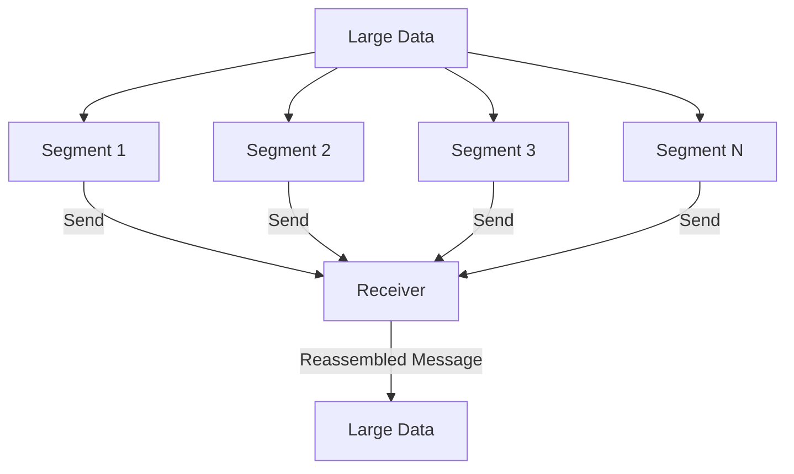
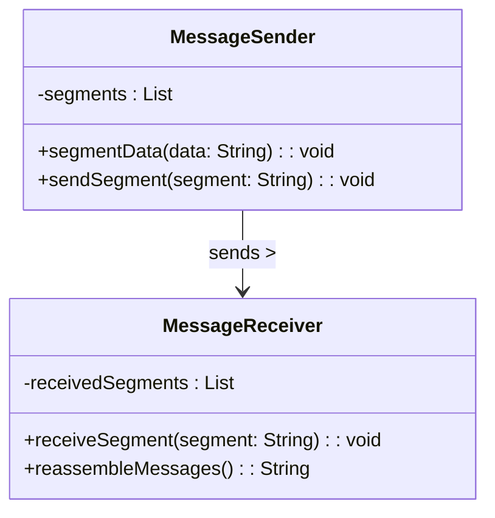
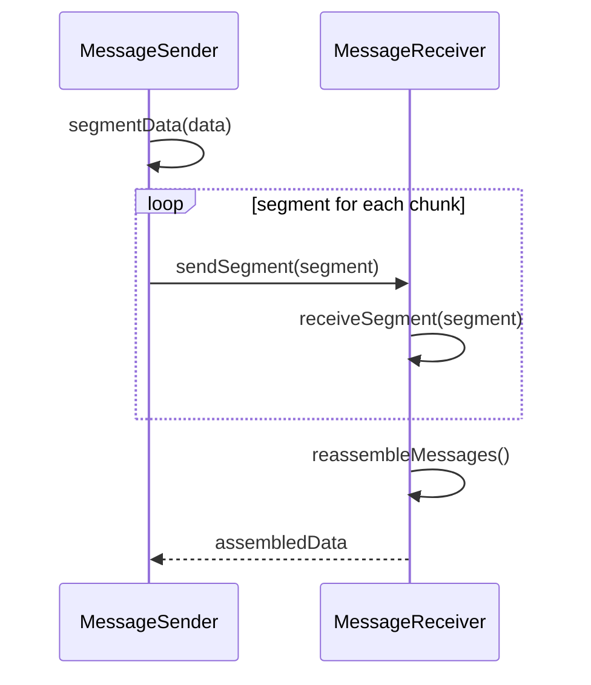

## Message Sequence

### Definition
The Message Sequence pattern allows for the transmission of an arbitrarily large amount of data by dividing it into smaller, manageable pieces that can be sent sequentially. This pattern ensures that the receiving system can reconstruct the complete message from these smaller segments.

### Intent
To manage the transmission of large data sets by breaking them into smaller pieces that can be sequenced and reassembled at the receiving end, ensuring reliable and efficient data transfer across distributed systems.

### Also Known As
- Data Fragmentation
- Segmentation

### Detailed Definitions and Explanations
#### Key Features
1. **Segmentation:** Large messages are divided into smaller, more manageable segments for easier transmission.
2. **Sequencing:** Each segment is assigned a unique sequence number to ensure the correct order during reassembly.
3. **Reassembly:** The receiver collects the segments and reassembles them into the original large message.

#### Conceptual Diagram


### Code Examples
#### Java Example using Apache Camel
```java
package com.example;

import org.apache.camel.builder.RouteBuilder;
import org.apache.camel.main.Main;

public class MessageSequenceRoute extends RouteBuilder {
    @Override
    public void configure() throws Exception {
        from("file:data/input?noop=true")
            .split(body().tokenize("\n", 100))
            .streaming()
            .log("Sending chunk: ${body}")
            .to("direct:processChunk");

        from("direct:processChunk")
            .log("Processing chunk: ${body}")
            .to("file:data/output?fileName=output.txt&fileExist=Append");
    }

    public static void main(String[] args) throws Exception {
        Main main = new Main();
        main.addRouteBuilder(new MessageSequenceRoute());
        main.run(args);
    }
}
```

#### Scala Example using Akka Streams
```scala
import akka.actor.ActorSystem
import akka.stream.scaladsl.{Sink, Source}
import akka.stream.{ActorMaterializer, Materializer}

import scala.concurrent.ExecutionContextExecutor
import scala.util.Random

object MessageSequenceExample extends App {
  implicit val system: ActorSystem = ActorSystem("message-sequence-system")
  implicit val materializer: Materializer = ActorMaterializer()
  implicit val ec: ExecutionContextExecutor = system.dispatcher

  val largeData = (1 to 10000).map(_ => Random.nextString(10))

  val source = Source(largeData).grouped(100)

  source.runWith(Sink.foreach(chunk => {
    println(s"Sending chunk: ${chunk.mkString(", ")}")
  }))
}
```

#### Example Class Diagram


### Example Sequence Diagram


### Benefits
- **Efficiency:** Breaks large data into smaller parts to facilitate efficient transmission and processing.
- **Reliability:** Allows for easier retry mechanisms if any segment fails to transmit.
- **Scalability:** Handles arbitrarily large data without issues related to message size limits of messaging protocols.

### Trade-offs
- **Complexity:** Added complexity in implementing segmentation and reassembly logic.
- **Ordering:** Ensuring segments arrive and are processed in the correct order can be challenging.
- **Overhead:** Additional metadata for sequencing increases data volume.

### When to Use
- When needing to send large amounts of data that exceeds typical message size limits.
- When the receiving system needs to process manageable chunks of data.

### Example Use Cases
- Streaming large files in pieces.
- Transmitting high-volume datasets across microservices.
- Processing large log files split into smaller segments.

### When Not to Use and Anti-Patterns
- If the data can comfortably fit within typical message size limits.
- If real-time streaming or immediate completeness of data is required.

### Related Design Patterns
- **Splitter:** Splits a message into smaller segments but does not necessarily sequence them.
- **Aggregator:** Reassembles multiple messages into a single message.
- **Message Channel:** Used for transporting each segment of the message.

### References
- [Enterprise Integration Patterns: Designing, Building, and Deploying Messaging Solutions](https://amzn.to/3XXncn8) by Gregor Hohpe and Bobby Woolf
- Official [Apache Camel Documentation](https://camel.apache.org/manual/index.html)
- Official [Akka Streams Documentation](https://doc.akka.io/docs/akka/current/stream/index.html)

### Credits
The examples and explanations provided are inspired by various open-source projects and official documentation of the respective technologies.

### Open Source Frameworks and Tools
- **Apache Camel:** Integration framework for working with multiple protocols and transports.
- **MuleSoft:** A widely used integration platform for connecting applications, data sources, and APIs.
- **Spring Boot:** Provides a simplified and rapid approach to building stand-alone, production-grade Spring-based applications.

### Cloud Computing
Patterns like Message Sequence are highly useful in PAAS (Platform as a Service) offerings where managed services such as message brokers (AWS SQS, Azure Service Bus) need to handle large payloads.

### Suggested Books for Further Studies
- [Designing Data-Intensive Applications](https://amzn.to/4cuX2Na) by Martin Kleppmann
- [Enterprise Integration Patterns: Designing, Building, and Deploying Messaging Solutions](https://amzn.to/3XXncn8) by Gregor Hohpe and Bobby Woolf
- [Building Microservices: Designing Fine-Grained Systems](https://amzn.to/3RYRz96) by Sam Newman

We hope this detailed entry on the Message Sequence pattern helps you understand when and how to implement it efficiently in your projects.
