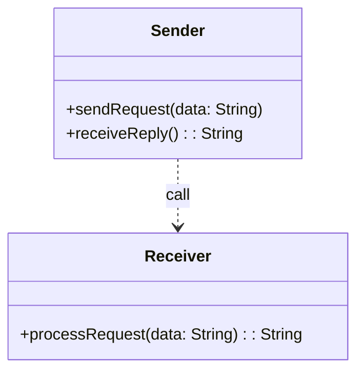
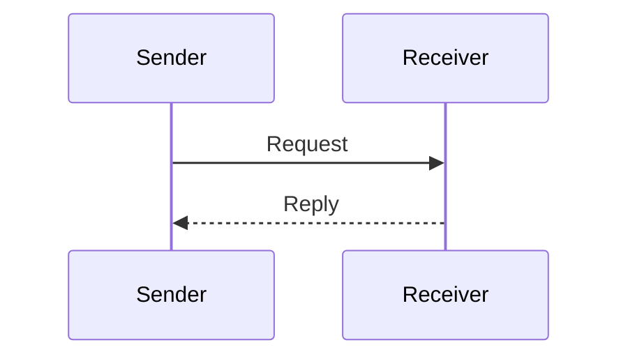

## Definition

The Request-Reply pattern allows for synchronous communication between distributed components by sending a request message and waiting for a reply message. This approach ensures that the sender can obtain necessary information or acknowledgements from the receiver before proceeding further.

## Intent

The primary intent of the Request-Reply pattern is to facilitate a two-way communication mechanism, allowing one application to send a request and wait for a response from another application. This is particularly useful when confirmation or additional data from the receiver is required before the sender can continue processing.

## Also Known As

- Synchronous Messaging
- Command-Response

## Detailed Definitions and Explanations

In a Request-Reply scenario, a sender dispatches a request message and then awaits a reply from the receiver. This pattern requires consideration of correlation mechanisms to align requests with their corresponding replies.

### Key Features

- **Synchronous Communication**: Ensures that the sender waits for the receiver's reply before continuing.
- **Correlation**: Mechanisms to match responses to their initial requests.
- **Timeout Management**: Handling of cases where the response does not arrive within the expected timeframe.

### Code Examples

#### Java with Apache Camel

```java
// Configuring Apache Camel route with Request-Reply
from("direct:start")
  .to("activemq:queue:request")
  .to("direct:processResponse");

from("activemq:queue:request")
  .process(exchange -> {
      String request = exchange.getIn().getBody(String.class);
      String response = "Received: " + request;
      exchange.getMessage().setBody(response);
  })
  .to("direct:response");

from("direct:response")
  .to("activemq:queue:response");

from("direct:processResponse")
  .to("activemq:queue:response")
  .process(exchange -> {
      String response = exchange.getIn().getBody(String.class);
      System.out.println("Received Reply: " + response);
  });
```

#### Scala with Akka

```scala
import akka.actor.{ Actor, ActorSystem, Props }
import akka.pattern.ask
import akka.util.Timeout

import scala.concurrent.duration._
import scala.concurrent.Await

case class Request(message: String)
case class Reply(message: String)

class RequestActor extends Actor {
  def receive: Receive = {
    case Request(message) =>
      sender() ! Reply(s"Received: $message")
  }
}

object RequestReplyApp extends App {
  val system = ActorSystem("request-reply-system")
  val requestActor = system.actorOf(Props[RequestActor], "requestActor")
  
  implicit val timeout: Timeout = Timeout(5.seconds)
  import system.dispatcher
  
  val future = requestActor ? Request("Hello Akka")
  val result = Await.result(future, timeout.duration).asInstanceOf[Reply]
  
  println(s"Received Reply: ${result.message}")
  
  system.terminate()
}
```

### Diagrams

#### Class Diagram



Explanation:
- Sender: An entity that sends a request and waits for the reply.
- Receiver: An entity that processes the request and sends a reply.

#### Sequence Diagram



Explanation:
- Sender sends a request to Receiver.
- Receiver processes the request and sends back a reply.

### Benefits

- **Immediate Feedback**: The sender can immediately know the outcome of the request.
- **Simplicity**: Easy to implement and understand.
- **Naturally Fits Certain Workflows**: Specifically suitable for request-response-like applications.

### Trade-offs

- **Tight Coupling**: Both the sender and receiver are tightly coupled, which can reduce flexibility.
- **Scalability**: Can lead to bottlenecks as the sender must wait for a reply.
- **Reliability**: Requires careful handling of timeouts and failures.

### When to Use

- When immediate feedback is required.
- When operations need confirmation or immediate data to proceed.
- Simple and predictable communication flows.

### Example Use Cases

- Service A querying Service B for additional data.
- A client asking a server for specific resource information.
- Command operations like initiating a financial transaction requiring confirmation.

### When Not to Use and Anti-patterns

- In highly scalable, asynchronous, or loosely coupled systems.
- When operations can afford to be decoupled and processed independently.

### Related Design Patterns

- **Asynchronous Messaging**: Focuses on decoupled communication without immediate reply requirements.
- **Correlation Identifier**: Implements the mechanism to correlate requests with their responses in async systems.
- **Circuit Breaker**: To manage failures in request-reply by preventing continuous failed requests.

### References and Credits

**Books:**
- *Enterprise Integration Patterns* by Gregor Hohpe and Bobby Woolf
- [Designing Data-Intensive Applications](https://amzn.to/4cuX2Na) by Martin Kleppmann

**Open Source Frameworks:**
- Apache Camel
- Akka
- Spring Boot
- Mule ESB

### Cloud Computing Integration

**SaaS (Software as a Service):**
- Managed messaging platforms to handle the Request-Reply pattern.

**PaaS (Platform as a Service):**
- Services like AWS Lambda invoking, which facilitates the Request-Reply communication.

**DaaS (Data as a Service):**
- Cloud databases providing on-request information to applications via request-reply pattern.

### Conclusion

The Request-Reply pattern is essential for synchronizing communications in distributed systems by providing a structured interaction for request and immediate reply scenarios. While its synchronous nature fits certain use cases, its inherent tight coupling and blocking behavior can be a downside for some large-scale applications.
