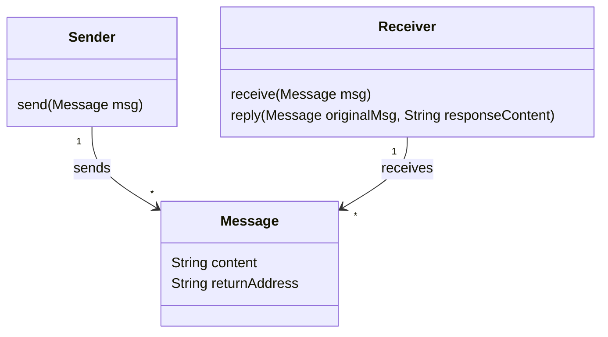
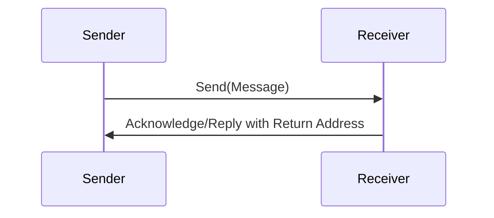
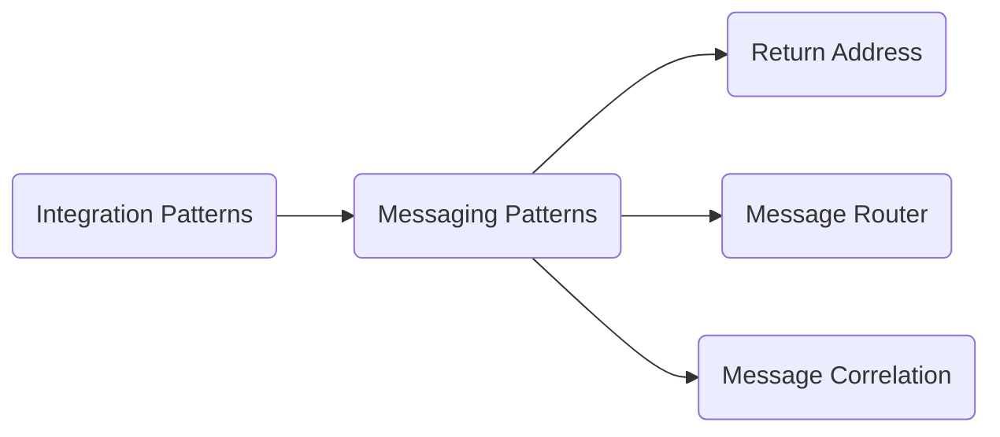

## Definition
The Return Address pattern ensures that in message-based communication, the endpoint knows where to send the reply to the message originator. The pattern mandates including a return address within each message, facilitating response routing.

## Intent
To provide a mechanism for handling responses in distributed systems, ensuring that replies reach the correct recipient.

## Also Known As
- Reply-To Address
- Response Address

## Detailed Definition and Explanation

When a service sends a request message, it often expects a reply. To ensure the reply can be correctly addressed, the requesting service embeds a return address in the outgoing message. The return address is typically included in the message headers.

### Diagrams

#### Class Diagram



#### Sequence Diagram



## Key Features
- Provides a means to send responses back to the original requester.
- Reduces the complexity of direct replies by standardizing the process.
- Enables asynchronous communication patterns.

## Code Examples

### Java with Apache Camel

```java
from("direct:start")
    .process(exchange -> {
        Message message = exchange.getIn();
        String returnAddress = exchange.getFromEndpoint().getEndpointUri();
        message.setHeader("ReturnAddress", returnAddress);
    })
    .to("direct:process");

from("direct:process")
    .process(exchange -> {
        Message in = exchange.getIn();
        String returnAddress = in.getHeader("ReturnAddress", String.class);
        
        // Simulate processing
        String response = "Processed message content";
        
        // Send Response back to the return address
        template.sendBody(returnAddress, response);
    });
```

### Scala with Akka

```scala
import akka.actor.Actor
import akka.actor.Props

case class Message(content: String, returnAddress: String)
case class Reply(content: String)

class Sender extends Actor {
  def receive = {
    case Message(content, returnAddress) =>
      context.actorSelection(returnAddress) ! Reply(s"Processed: $content")
  }
}

class Receiver extends Actor {
  val sender = context.actorOf(Props[Sender], "sender")

  def receive = {
    case msg: Message =>
      sender ! msg
    case reply: Reply =>
      println(s"Received reply: $reply.content")
  }
}
```

## Benefits
- Simplifies reply routing.
- Establishes a unified method for handling responses in distributed systems.
- Enhances the scalability and flexibility of the system.

## Trade-offs
- Additional overhead of managing and passing return addresses.
- Potential complexity in ensuring return addresses are valid and reachable.

## When to Use
- For distributed applications where request-response patterns are common.
- In scenarios demanding clear routing of responses back to the sender.

## Example Use Cases
- Order processing systems where services need to send confirmation or rejection messages back to the clients.
- Customer support systems requiring acknowledgment of received tickets.

## When Not to Use
- In entirely fire-and-forget messaging systems where responses are not required.
- Systems without reliable routing mechanisms to handle return addresses.

## Anti-patterns
1. Hardcoding return addresses resulting in brittle and non-flexible systems.
2. Ignoring invalid or unreachable return addresses leading to failures or orphaned responses.

## Related Patterns
- **Message Correlation**: Pairing requests and responses using correlation IDs.
- **Message Router**: Directing messages to appropriate destinations, which can be used in conjunction with return addresses.

## References and Credits
- Gregor Hohpe, Bobby Woolf, [Enterprise Integration Patterns: Designing, Building, and Deploying Messaging Solutions](https://amzn.to/3XXncn8).
- Apache Camel Documentation
- Akka Documentation

## Open Source Frameworks
- **Apache Camel**: A versatile open-source integration framework.
- **Akka**: Toolkit for building concurrent and distributed applications on the JVM.

## Cloud Computing
- **SaaS, PaaS, DaaS**: Systems deploying these cloud models could leverage return addresses for actions needing user acknowledgments.
- **PaaS**: Custom applications needing inter-service communication would use return addresses for handling replies.

## Suggested Books for Further Studies
- [Enterprise Integration Patterns: Designing, Building, and Deploying Messaging Solutions](https://amzn.to/3XXncn8) by Gregor Hohpe, Bobby Woolf
- _Building Microservices_ by Sam Newman
- [Designing Data-Intensive Applications](https://amzn.to/4cuX2Na) by Martin Kleppmann

## Grouping of Related Patterns



This grouping demonstrates how Return Address fits within the broader category of Messaging Patterns, often working in conjunction with patterns like Message Correlation and Message Router to solve similar types of problems in enterprise integration.

### Effectively Solving a Problem

To effectively handle response routing:
1. Use the Return Address Pattern to specify reply destinations.
2. Utilize Message Correlation for tracking responses.
3. Apply a Message Router to dynamically direct messages to the proper endpoints.

By combining these patterns, applications can achieve reliable and organized message handling in distributed systems.
