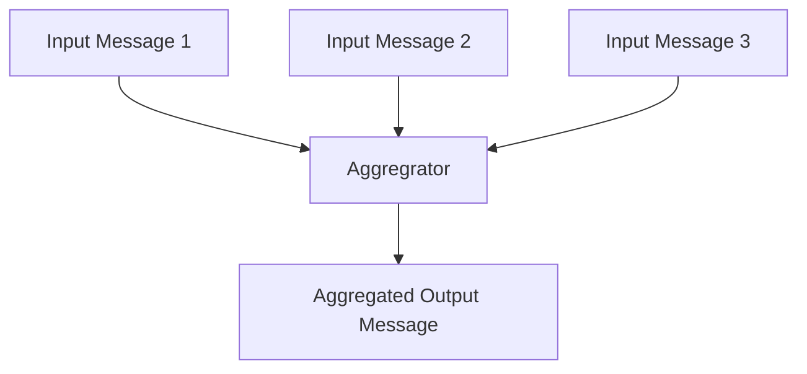
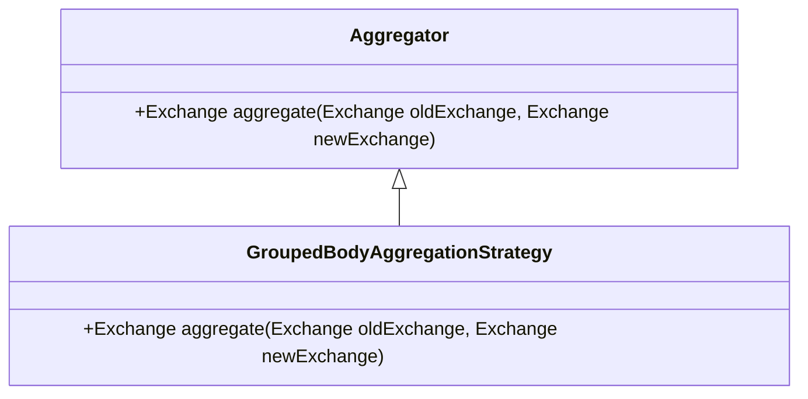
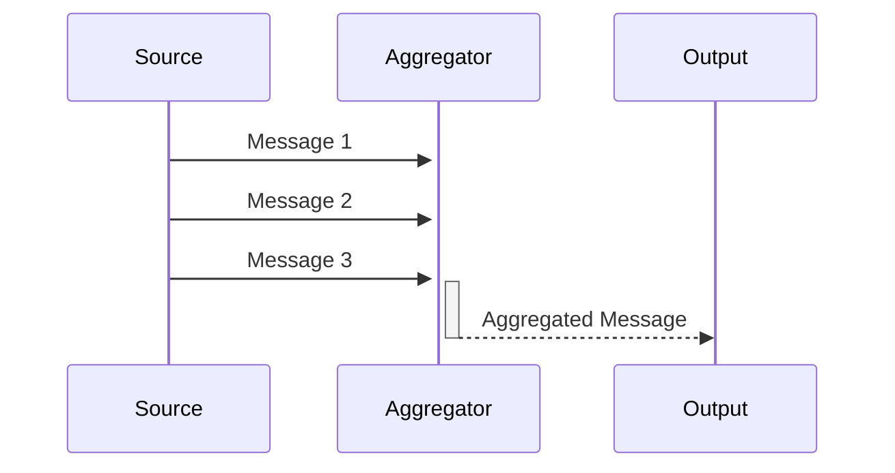
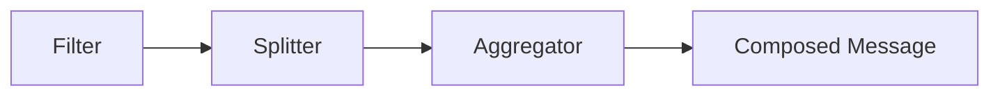

## Aggregator Pattern

The Aggregator pattern handles combining the results of individual, but related messages to process them as a whole.

### Intent

The intent of the Aggregator pattern is to collect and combine related messages, process them as a single entity, and produce an aggregated result. This pattern is often used when you need to combine pieces of data into a single composite message to forward to the next processing stage.

### Also Known As

- Combine
- Collector

### Detailed Definitions and Explanations

The Aggregator is a stateful filter that receives a stream of related but partially processed messages. It maintains a state to collect and store these messages until a condition is met (e.g., receiving all expected messages), then it compiles the messages into a single, composite message.




### Key Features

1. **Stateful Message Handling**: Maintains state to collect and store incoming messages.
2. **Condition-based Aggregation**: Triggers aggregation based on specific conditions (e.g., message count, time window).
3. **Composite Message Creation**: Produces a single message from a collection of related messages.

### Code Examples

#### Java Example with Apache Camel

```java
public class AggregatorRoute extends RouteBuilder {
    @Override
    public void configure() {
        from("direct:input")
            .aggregate(header("groupId"), new GroupedBodyAggregationStrategy())
            .completionSize(3)
            .to("mock:output");
    }
}

class GroupedBodyAggregationStrategy implements AggregationStrategy {
    @Override
    public Exchange aggregate(Exchange oldExchange, Exchange newExchange) {
        if (oldExchange == null) {
            return newExchange;
        }
        String oldBody = oldExchange.getIn().getBody(String.class);
        String newBody = newExchange.getIn().getBody(String.class);
        oldExchange.getIn().setBody(oldBody + " + " + newBody);
        return oldExchange;
    }
}
```

#### Scala Example with Akka Streams

```scala
import akka.actor.ActorSystem
import akka.stream.ActorMaterializer
import akka.stream.scaladsl._

object AggregatorExample extends App {
  implicit val system = ActorSystem("AggregatorSystem")
  implicit val materializer = ActorMaterializer()

  val input = Source(List(
    (1, "first"),
    (1, "second"),
    (1, "third")
  ))

  input
    .groupBy(100, _._1)
    .fold(("", Seq.empty[String])) {
      case ((_, acc), (_, value)) => ("group", acc :+ value)
    }
    .mergeSubstreams
    .map { case (_, combined) => combined.mkString(" + ") }
    .runForeach(println)

  system.terminate()
}
```

### Example Class Diagrams



### Example Sequence Diagrams



### Benefits

- Efficient message processing.
- Simplifies downstream processing by reducing the number of messages.
- Increases data consistency by grouping related data.

### Trade-offs

- Increased complexity in maintaining state.
- Potential performance bottlenecks if aggregation conditions are too stringent.
- Additional memory usage for storing intermediary messages.

### When to Use

- When multiple related messages need to be processed together.
- To ensure data consistency from multiple inputs.
- In event-driven architectures that need stateful message processing.

### Example Use Cases

- Combining sensor readings for a period of time.
- Collecting user actions for batch processing.
- Aggregating order items before payment processing.

### When Not to Use and Anti-patterns

- For single, independent messages that do not need combination.
- Instead of transforming or routing messages (use Transformer or Router patterns for those tasks).

### Related Design Patterns

- **Splitter**: The opposite of Aggregator, used to split a message into multiple parts.
- **Filter**: Can be used in conjunction to filter out non-relevant messages before aggregation.

### References

- *Enterprise Integration Patterns* by Gregor Hohpe and Bobby Woolf
- Apache Camel Docs: [Aggregator](https://camel.apache.org/components/latest/eips/aggregate-eip.html)
- Akka Streams [Docs](https://doc.akka.io/docs/akka/current/stream/index.html)

### Credits

- Inspired by *Enterprise Integration Patterns* by Gregor Hohpe and Bobby Woolf
- Apache Camel
- Akka Streams

### Open Source Frameworks

- **Apache Camel**: A versatile open-source integration framework handling routing and mediation rules.
- **Akka Streams**: A Reactive Streams library for Java and Scala.

### Third Party Tools

- **MuleSoft**: An integration platform for connecting applications, data, and devices.
- **Spring Integration**: A lightweight framework to integrate with other applications using events or messages.

### Cloud Computing

Integration patterns are essential for distributed systems on cloud platforms offering SaaS, PaaS, and IaaS solutions, often involving tools like AWS Step Functions, Azure Logic Apps, or Google Cloud Pub/Sub.

### Suggested Books for Further Studies

- *Enterprise Integration Patterns* by Gregor Hohpe and Bobby Woolf
- [Designing Data-Intensive Applications](https://amzn.to/4cuX2Na) by Martin Kleppmann

### Grouped Patterns for Data Processing

You can utilize different patterns in combination for addressing specific application's needs, such as:



**Filter** can remove irrelevant data before sending it to **Splitter** that divides data into manageable pieces, which **Aggregator** then combines into a **Composed Message**.

---

This structured content should help you understand and implement the Aggregator pattern effectively within your applications.
