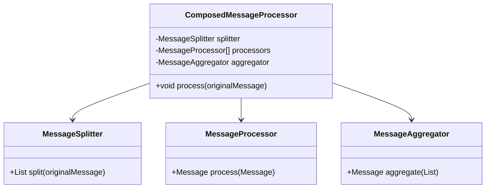
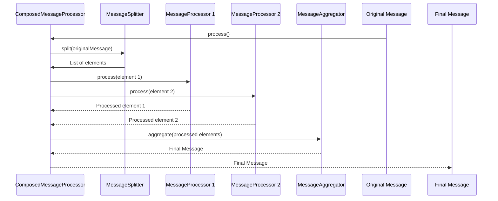
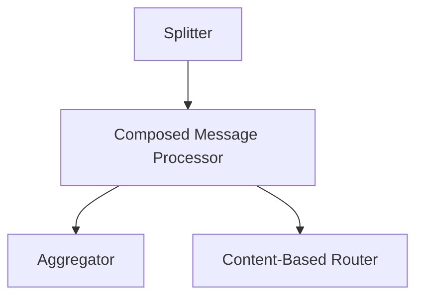

## Description

The **Composed Message Processor** pattern is used in situations where a message consists of multiple elements that need to be processed individually. This pattern ensures that each part of the message is handled correctly, maintaining the overall message flow and integrity.

### Intent

To breakdown a composite message into individual elements, process each element independently, and then reassemble the processed elements into a single output message.

### Also Known As

* CompositeProcessor
* Aggregator

---

## Detailed Definitions and Explanations with Diagrams

### Key Features

- Splitting and aggregation of messages
- Independent processing of message elements
- Error handling for individual elements

### Diagram

#### Class Diagram



#### Sequence Diagram



### Code Examples

#### Java (Spring Boot and Apache Camel)

```java
import org.apache.camel.builder.RouteBuilder;
import org.springframework.boot.SpringApplication;
import org.springframework.boot.autoconfigure.SpringBootApplication;

@SpringBootApplication
public class ComposedMessageProcessorApplication {

    public static void main(String[] args) {
        SpringApplication.run(ComposedMessageProcessorApplication.class, args);
    }

    @Component
    class ComposedMessageProcessorRoute extends RouteBuilder {

        @Override
        public void configure() {
            from("direct:input")
                .split(body().tokenize(","))
                .process(exchange -> {
                    // Processing logic for each element
                    String body = exchange.getIn().getBody(String.class);
                    body = body.toUpperCase();
                    exchange.getIn().setBody(body);
                })
                .end()
                .aggregate(constant(true), new GroupedBodyAggregationStrategy())
                .completionTimeout(5000)
                .to("direct:output");
        }
    }
}
```

#### Scala (Akka Streams)

```scala
import akka.actor.ActorSystem
import akka.stream.ActorMaterializer
import akka.stream.scaladsl.{Sink, Source}

import scala.concurrent.ExecutionContextExecutor
import scala.concurrent.Future

object ComposedMessageProcessor extends App {

  implicit val system: ActorSystem = ActorSystem("ComposedMessageProcessor")
  implicit val materializer: ActorMaterializer = ActorMaterializer()
  implicit val ec: ExecutionContextExecutor = system.dispatcher

  val elements = List("element1", "element2", "element3")
  
  val processingFlow = Source(elements)
    .mapAsync(1)(element => Future {
      element.toUpperCase
    })
    .runWith(Sink.fold(List.empty[String])((list, element) => list :+ element))

  processingFlow.onComplete { result =>
    println(s"Processed elements: ${result.get}")
    system.terminate()
  }
}
```

### Examples

#### Class Diagram

This diagram shows the principal classes involved in applying the Composed Message Processor pattern, showing their relationships and the interactions needed to process a composed message.

#### Sequence Diagram

The sequence diagram demonstrates the step-by-step message flow from the original message through the splitting, processing, to the aggregation stage with final message output.

---

## Benefits

- **Modular Processing**: Each element is handled individually, which allows for more straightforward, manageable processing.
- **Scalability**: Processing logic can be scaled out by deploying multiple processors.
- **Error Isolation**: Failures are isolated to individual elements, allowing continued processing of others.

---

## Trade-offs

- **Complexity**: Additional components for splitting and aggregating introduce more points of failure.
- **Coordination overhead**: Aggregating results from multiple processors incurs coordination overhead.

---

## When to Use

- When a message contains multiple discrete elements that need separate handling.
- For parallel processing of message elements to improve throughput.
- In cases where modular and independent processing is beneficial.

---

## Example Use Cases

- **Batch Processing**: Breaking down a batch of transactions into individual transactions and processing them separately.
- **ETL Pipelines**: Splitting input records, processing each record individually, and combining results.
- **Order Processing**: Processing each item in an order independently and then assembling the final processed order.

---

## When Not to Use

- When messages are simple or should not be divided into multiple elements.
- For processing that needs to be tightly-coupled.

### Anti-patterns

- **Over-engineering for Simple Messages**: Introducing unnecessary complexity.
- **Inefficient Aggregation**: Inefficiently gathering and consolidating results can lead to bottlenecks.

---

## Related Design Patterns

- **Splitter**: Breaks down a compound message into individual elements.
- **Aggregator**: Combines multiple messages into a single message.

### Comparisons

- **Splitter**: Whereas the Splitter simply breaks down a message without concern for reassembly, the Composed Message Processor includes steps to independently process and recompose messages.

### References

- *Enterprise Integration Patterns* by Gregor Hohpe and Bobby Woolf.

### Credits

- Apache Camel for the practical implementation concepts.
- Akka for showcasing processing in the Actor model.

### Open Source Frameworks

- **Apache Camel**: For Java-based routing and processing.
- **Akka**: For Scala-based message processing.
- **Spring Integration**: For Java-based enterprise application integration.
- **Apache Flink**: Stream processing framework.

### Third Party Tools

- **Spring Boot**: Simplifies Spring application development.
- **MuleSoft**: For endpoint integration and orchestration.

### Cloud Computing Integration

- **AWS Lambda**: For serverless processing of message elements.
- **Azure Functions**: Offers serverless execution of functions in response to events.
- **Google Cloud Functions**: For running event-driven serverless functions.

### Suggested Books for Further Studies

- *Enterprise Integration Patterns* by Gregor Hohpe and Bobby Woolf.
- [Designing Data-Intensive Applications](https://amzn.to/4cuX2Na) by Martin Kleppmann.
- [Patterns of Enterprise Application Architecture](https://amzn.to/4cGutvM) by Martin Fowler.

---

## Pattern Grouping

### Message Routing Patterns



### Description

**Message Routing Patterns** facilitate the dynamic routing, splitting, and aggregation of messages, typically used to ensure that messages are handled by the appropriate processors.

写:

Generated a detailed description of the Composed Message Processor pattern, with discussions ranging from definitions to intricate class and sequence diagrams, benefits, trade-offs, and when to appropriately use the pattern. Tailoring this pattern within key frameworks such as Apache Camel and Akka Streams empowers its functionality in Java and Scala.
