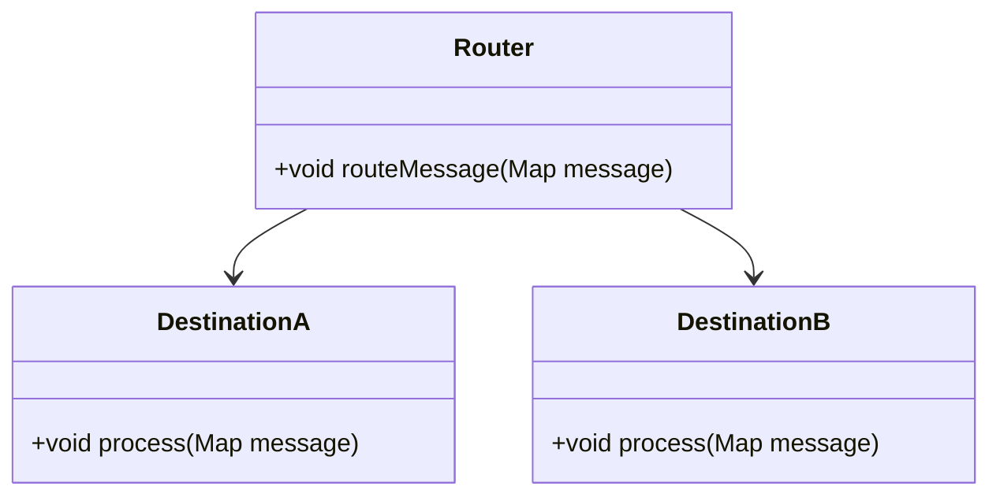
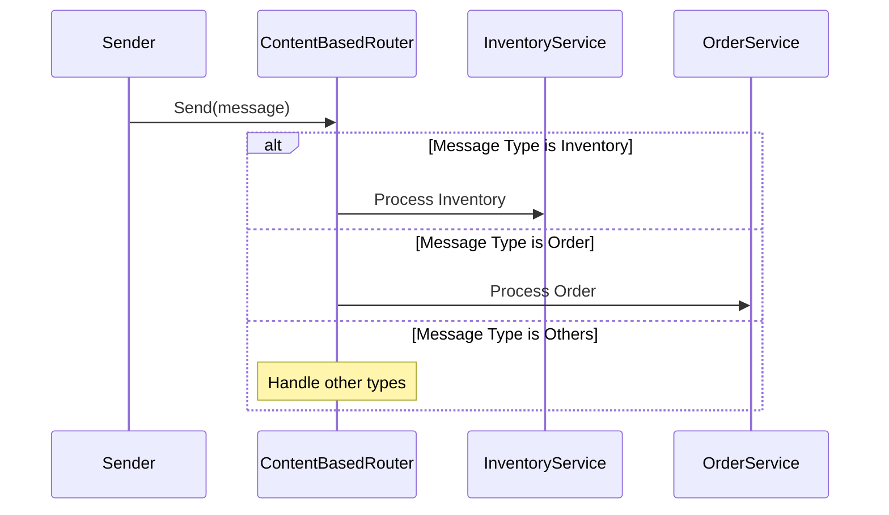

The **Content-Based Router** pattern dynamically routes messages to different destinations based on the content of the message. This pattern is useful when the implementation of a single logical function (e.g., inventory check) is spread across multiple physical systems, allowing the router to direct each message to the appropriate destination.

## Intent
Direct messages to appropriate destinations by evaluating message content and applying routing logic to determine the target endpoint.

**Also Known As:** Conditional Router, Dynamic Router

## Detailed Definitions and Explanations

### Key Features
- Routes messages based on message content.
- Implemented typically using DSL rules.
- Facilitates separation of routing logic from business logic.
- Helps build scalable, decoupled systems.

### Example Code Implementations

#### Java with Apache Camel
```java
import org.apache.camel.builder.RouteBuilder;
import org.apache.camel.impl.DefaultCamelContext;

public class ContentBasedRouterExample extends RouteBuilder {

    public static void main(String[] args) throws Exception {
        DefaultCamelContext context = new DefaultCamelContext();
        context.addRoutes(new ContentBasedRouterExample());
        context.start();
        Thread.sleep(5000);
        context.stop();
    }

    @Override
    public void configure() throws Exception {
        from("direct:start")
            .choice()
                .when(header("type").isEqualTo("inventory"))
                    .to("direct:inventory")
                .when(header("type").isEqualTo("orders"))
                    .to("direct:orders")
                .otherwise()
                    .to("direct:others");

        // Sample endpoints
        from("direct:inventory").log("Inventory Route: ${body}");
        from("direct:orders").log("Orders Route: ${body}");
        from("direct:others").log("Others Route: ${body}");
    }
}
```

#### Scala with Akka
```scala
import akka.actor.{Actor, ActorSystem, Props}

case class Message(content: String, messageType: String)

class RouterActor extends Actor {
  def receive = {
    case Message(content, messageType) =>
      messageType match {
        case "inventory" => println(s"Inventory Route: $content")
        case "orders"    => println(s"Orders Route: $content")
        case _           => println(s"Others Route: $content")
      }
  }
}

object ContentBasedRouterExample extends App {
  val system = ActorSystem("ContentRouterSystem")
  val router = system.actorOf(Props[RouterActor], name = "router")

  router ! Message("Check inventory stock", "inventory")
  router ! Message("Order item #123", "orders")
  router ! Message("Unhandled message type", "unknown")
}
```

### Class Diagram



### Sequence Diagram



### Benefits
- **Flexibility**: Allows dynamic routing based on rule evaluation.
- **Scalability**: Enables distributed handling of tasks by various sub-systems.
- **Decoupling**: Separates routing logic from business logic.

### Trade-offs
- **Complexity**: Rule-based routing logic can become complex.
- **Performance**: Can introduce latency due to dynamic evaluations.
- **Maintenance**: Routing logic needs to be kept in sync with business needs.

### When to Use
- When different subsystems handle different aspects of the same logical function (e.g., different inventory checks in different regions).
- When message processing needs to be routed to different services based on message attributes.

#### Example Use Cases
- Routing customer orders to different processing units based on geographic region.
- Directing log messages to various storage services based on log severity.
- Distributing notifications to various channels (email, SMS, push) based on user preferences.

### When Not to Use and Anti-patterns
- If routing logic is simple or seldom changes, a less complex approach like static routing may suffice.
- Over-engineered solutions for straightforward processes can lead to unnecessary complexity.

### Related Design Patterns
- **Message Filter**: Filters out unwanted messages before routing.
- **Recipient List**: Sends the same message to multiple recipients.
- **Message Translator**: Converts messages to an appropriate format before routing.

### References
- **[Enterprise Integration Patterns: Designing, Building, and Deploying Messaging Solutions](https://amzn.to/3XXncn8) by Gregor Hohpe and Bobby Woolf** for in-depth pattern details.
- **Apache Camel** documentation for implementation specifics.
- **Akka Toolkit** documentation for actor-based routing.

### Open Source Frameworks
- **Apache Camel**: Integration framework for routing and mediation.
- **Spring Integration**: Provides configuration for enterprise integration patterns.
- **Akka**: Actor-based model supporting routing in distributed systems.

### Cloud Computing, SaaS, PaaS
- **AWS Step Functions**: Useful for orchestrating microservices and routing decisions in a cloud environment.
- **Microsoft Azure Logic Apps**: Platform for automating workflows with various routing decisions based on content.

### Books for Further Studies
- *[Enterprise Integration Patterns: Designing, Building, and Deploying Messaging Solutions](https://amzn.to/3XXncn8) by Gregor Hohpe and Bobby Woolf*
- *"Camel in Action" by Claus Ibsen and Jonathan Anstey*

