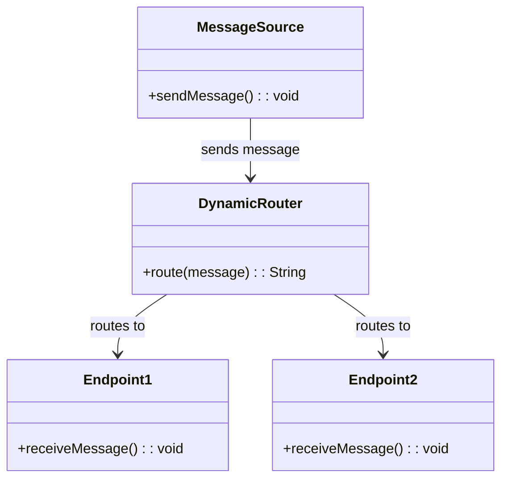
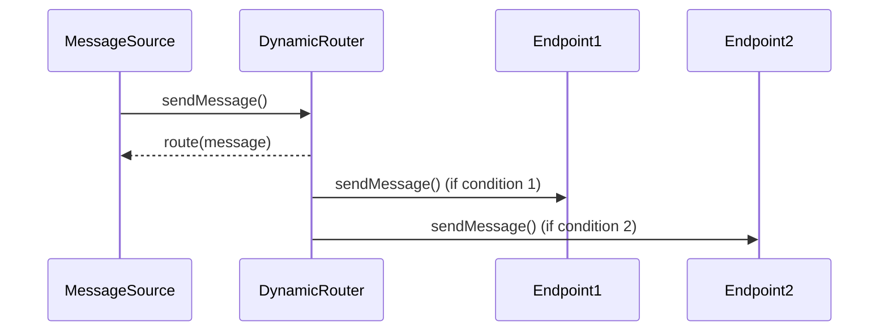

## Definition

The **Dynamic Router Pattern** is an Enterprise Integration Pattern used to route messages to different endpoints (destinations) based on dynamic conditions and routing logic. The decisions can be made based on the content of the message, headers, or any runtime information.

## Intent

The intent of the Dynamic Router is to decouple the router from specific endpoints, providing the flexibility to change routing destinations dynamically without modifying the routing logic.

### Also Known As

- Content-Based Router
- Dynamic Channel Router

## Detailed Explanation

The Dynamic Router pattern enhances the message routing principle by determining destinations at runtime rather than being hardcoded. This promotes flexibility and maintainability within integration flows.

```
    +-------------+       +-------+       +----------+
    |             |       |       |       |          |
    |   Message   +------>+Dynamic+------>+Endpoint1 |
    |   Source    |       | Router|       |          |
    |             |       |       |       +----------+
    +-------------+       +-------+       +----------+
                                          |          |
                                          +----------+
                                          | Endpoint2|
                                          |          |
                                          +----------+
```
**Figure 1:** Dynamic Router in a Messaging System

### Flow Process

1. **Message Source**: Sends the message into the routing system.
2. **Dynamic Router**: Contains routing logic to evaluate the message and determines the appropriate endpoint based on current conditions.
3. **Endpoints**: Various destinations that the messages can be routed to based on evaluated conditions.

### Key Features

- **Dynamic Decision-Making**: Route messages to endpoints at runtime.
- **Flexibility**: Easier to add or change endpoints without impacting routing logic.
- **Loose Coupling**: Similar to the Service Locator pattern, it reduces the direct dependency on all possible destinations.

## Code Examples

### Java Example using Apache Camel

```java
from("direct:start")
    .dynamicRouter(method(DynamicRouterBean.class, "route"));

public class DynamicRouterBean {

    public String route(Exchange exchange, @Header(Exchange.SLIP_ENDPOINT) String previous) {
        // Custom routing logic here
        if ("endpoint1".equals(previous)) {
            return "direct:endpoint2";
        } else {
            return "direct:endpoint1";
        }
    }
}
```

### Scala Example using Akka Streams

```scala
import akka.actor.ActorSystem
import akka.stream._
import akka.stream.scaladsl._

implicit val system = ActorSystem("DynamicRouterSystem")
implicit val materializer = ActorMaterializer()

val dynamicRouter = Flow[String].statefulMapConcat { () =>
  var state = ""

  { elem =>
    state match {
      case "route1" => state = "route2"; List("dest1", elem)
      case "route2" => state = "route1"; List("dest2", elem)
      case _        => state = "route1"; List("dest1", elem)
    }
  }
}

Source(List("msg1", "msg2", "msg3"))
  .via(dynamicRouter)
  .runWith(Sink.foreach(println))
```

## UML Diagrams

### Class Diagram



### Sequence Diagram



## Benefits

- **Scalability**: Add new routing destinations without impacting existing architecture.
- **Maintainability**: Decouple routing logic and destinations for easier changes.
- **Flexibility**: Dynamic content-based routing allows for multiple routing decisions at runtime.

## Trade-offs

- **Complexity**: Dynamic routing can add complexity to the system.
- **Latency**: The dynamic decision-making process might introduce slight delays.
- **Error-Prone**: Misconfigurations in the routing logic can lead to routing issues.

## When to Use

- When the destination of a message is not known until runtime.
- When routing needs to be adaptable and modifiable without changing code.
- In scenarios where decoupling of routes and destinations is required.

## Example Use Cases

- **Event-Driven Architectures**: Where events are routed based on their payload to different processing pipelines.
- **Log Analysis Systems**: Sending logs to different processing services based on log severity or source.
- **IoT Applications**: Differentiating device data routing based on device type or data payload.

## When Not to Use and Anti-Patterns

- **Predictable Routing**: If the routes are static and predictable, simpler routing logic might suffice.
- **Performance-Critical Applications**: Where any routing decision latency is intolerable.
- **Overly Complex Routing Rules**: Can obscure the business logic and make troubleshooting difficult.

## Related Design Patterns

### Content-Based Router

Routes messages based on examining their content at runtime but with a more fixed approach compared to the Dynamic Router.

### Recipient List

Routes a message to multiple recipients dynamically and can overlap in increasingly complex routing scenarios.

## References

1. [Enterprise Integration Patterns: Designing, Building, and Deploying Messaging Solutions](https://amzn.to/3XXncn8) by Gregor Hohpe and Bobby Woolf
2. [Apache Camel Documentation](https://camel.apache.org/manual/latest/routing-slip.html)
3. [Akka Streams Documentation](https://doc.akka.io/docs/akka/current/stream/index.html)

## Open Source Frameworks

- **Apache Camel**
- **Spring Integration**
- **Akka Streams**
- **Apache Flink**

## Cloud Computing, SAAS, DAAS, PAAS 

Utilize cloud services like AWS Lambda, Google Cloud Functions, or Azure Functions for implementing dynamic routing logic to achieve highly scalable routing strategies with minimal infrastructure overhead.

## Suggested Readings

- [Enterprise Integration Patterns: Designing, Building, and Deploying Messaging Solutions](https://amzn.to/3XXncn8) by Gregor Hohpe and Bobby Woolf
- [Scala for the Impatient](https://amzn.to/45PPdPi) by Cay S. Horstmann
