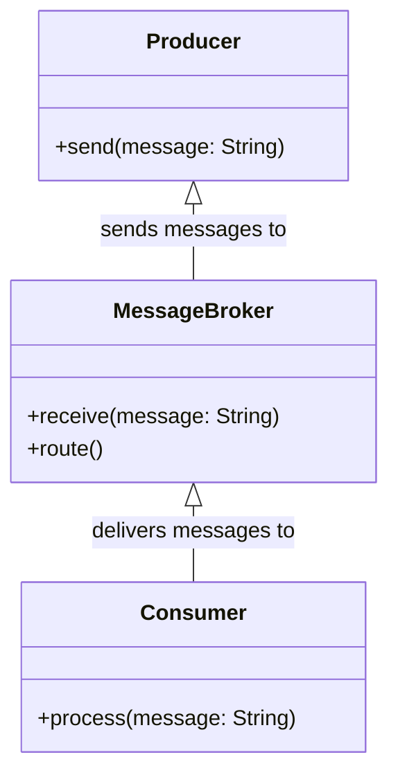
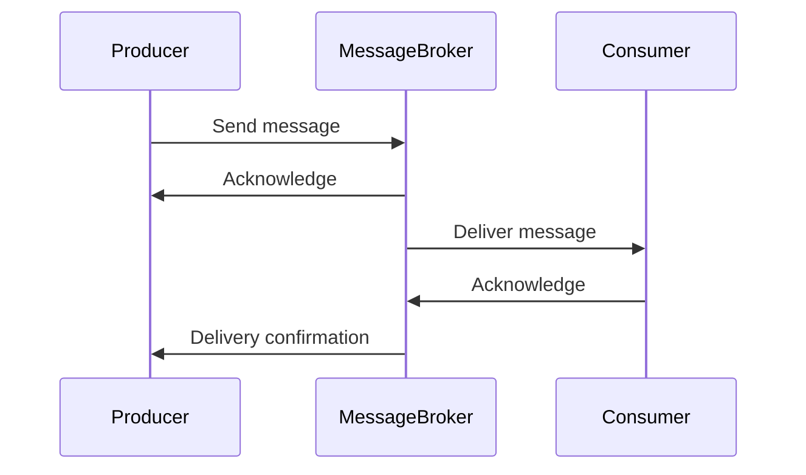

## Message Broker

### Definition
A **Message Broker** is an architectural pattern for implementing a communication system where messages are transmitted through an intermediary (the broker) that handles both the receipt and delivery of messages. This intermediary allows for decoupling of the sender and receiver, meaning they do not need to be aware of each other's existence or network addresses.

### Intent
To decouple the source of messages from their destinations and effectively control the message flow across various systems. This pattern promotes a flexible, maintainable, and scalable architecture.

### Also Known As
- Middleware
- Message-Oriented Middleware (MOM)

### Detailed Explanation
A Message Broker facilitates communication between multiple systems by receiving messages from sources (producers) and routing them to appropriate destinations (consumers). It provides functionalities such as message transformation, routing, mediation, and protocol conversion.

#### Key Features
- **Decoupling**: Separates message producers from consumers.
- **Flexibility**: Enables dynamic routing and handling of messages.
- **Scalability**: Supports message queuing and load balancing.
- **Reliability**: Often ensures message delivery through persistent storage.
- **Centralized Control**: Facilitates centralized monitoring and management of messages.

### Code Examples

#### Java (Using Apache Camel)
```java
import org.apache.camel.CamelContext;
import org.apache.camel.builder.RouteBuilder;
import org.apache.camel.impl.DefaultCamelContext;

public class MessageBrokerExample {
    public static void main(String[] args) throws Exception {
        CamelContext context = new DefaultCamelContext();
        context.addRoutes(new RouteBuilder() {
            @Override
            public void configure() {
                from("file:inputFolder?noop=true")
                .to("jms:queue:orderQueue");
            }
        });
        context.start();
        Thread.sleep(5000);
        context.stop();
    }
}
```

#### Scala (Using Akka)
```scala
import akka.actor._
import akka.kafka.ConsumerSettings
import akka.kafka.scaladsl.Consumer
import org.apache.kafka.common.serialization.StringDeserializer
import akka.stream.scaladsl.Sink

object MessageBrokerExample extends App {
  implicit val system: ActorSystem = ActorSystem("MessageBrokerSystem")
  implicit val materializer = ActorMaterializer()

  val consumerSettings = ConsumerSettings(system, new StringDeserializer, new StringDeserializer)
    .withBootstrapServers("localhost:9092")
    .withGroupId("group1")
    .withProperty("auto.offset.reset", "earliest")

  Consumer
    .plainSource(consumerSettings, Subscriptions.topics("orderTopic"))
    .mapAsync(1) { msg =>
      // process the message
      println(s"Received: ${msg.value}")
      Future.successful(Done)
    }
    .runWith(Sink.ignore)
}
```

### Example Class Diagram


### Example Sequence Diagram


### Benefits
- **Decoupling**: Promotes loose coupling between producers and consumers.
- **Flexibility**: Simplifies changes and additions to the system.
- **Scalability**: Manages high-volume traffic effectively.
- **Reliability**: Ensures message delivery even during failures.
- **Centralized Management**: Simplifies monitoring and managing message flows.

### Trade-offs
- **Complexity**: Introduces additional components and configuration.
- **Latency**: May add latency due to intermediary message handling.
- **Single Point of Failure**: The broker can become a single point of failure if not replicated or clustered.
- **Cost**: Additional hardware and software resources for managing the broker.

### When to Use
- Need to decouple systems to allow for independent scaling and maintenance.
- Central control and management of message flows is required.
- Supporting varying message protocols between sources and destinations.
- Ensuring reliable message delivery in distributed systems.

### Example Use Cases
- E-commerce systems where order processing components need to communicate independently.
- Financial systems requiring secure and reliable transaction processing.
- IoT systems where sensor data needs to be routed to different analytical services.

### When Not to Use
- Simple applications where direct point-to-point communication is sufficient.
- Low-latency requirements where intermediary processing overhead is unacceptable.
- Systems without sufficiently complex integration requirements.

### Anti-patterns
- Overusing a message broker for trivial integration tasks can lead to unnecessary complexity.
- Not planning for fault tolerance and redundancy leading to a single point of failure.

### Related Design Patterns
- **Message Queue**: FIFO mechanism for message storage and delivery.
- **Publish-Subscribe**: Multiple consumers receive broadcast messages.
- **Content Filter**: Filters and routes messages based on their content.

### References
- Hohpe, Gregor, and Bobby Woolf. [Enterprise Integration Patterns: Designing, Building, and Deploying Messaging Solutions](https://amzn.to/3XXncn8). Addison-Wesley, 2004.
- Apache Camel Documentation: [Apache Camel](https://camel.apache.org/)
- Akka Streams Documentation: [Akka Streams](https://doc.akka.io/docs/akka/2.6/stream/)

### Tools and Frameworks
- **Apache Camel**
- **MuleSoft Anypoint Platform**
- **Spring Integration**
- **Apache Kafka**
- **RabbitMQ**
- **Akka Streams**

### Cloud Computing
- **AWS SQS**
- **Google Pub/Sub**
- **Microsoft Azure Service Bus**

### Suggested Books for Further Studies
- [Enterprise Integration Patterns: Designing, Building, and Deploying Messaging Solutions](https://amzn.to/3XXncn8) by Gregor Hohpe and Bobby Woolf

By understanding and implementing the **Message Broker** pattern, you can build flexible, scalable, and maintainable distributed systems that gracefully decouple producers and consumers, ensuring robust message handling and reduced system dependencies.
