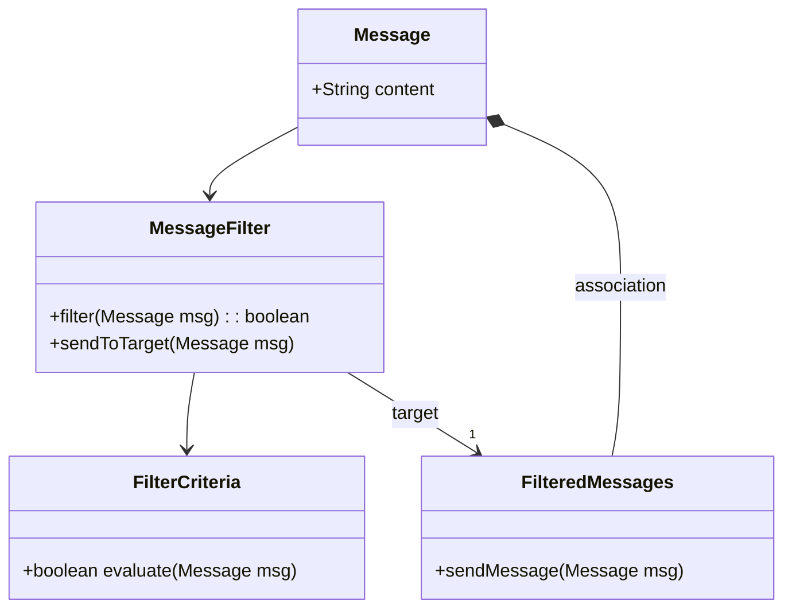
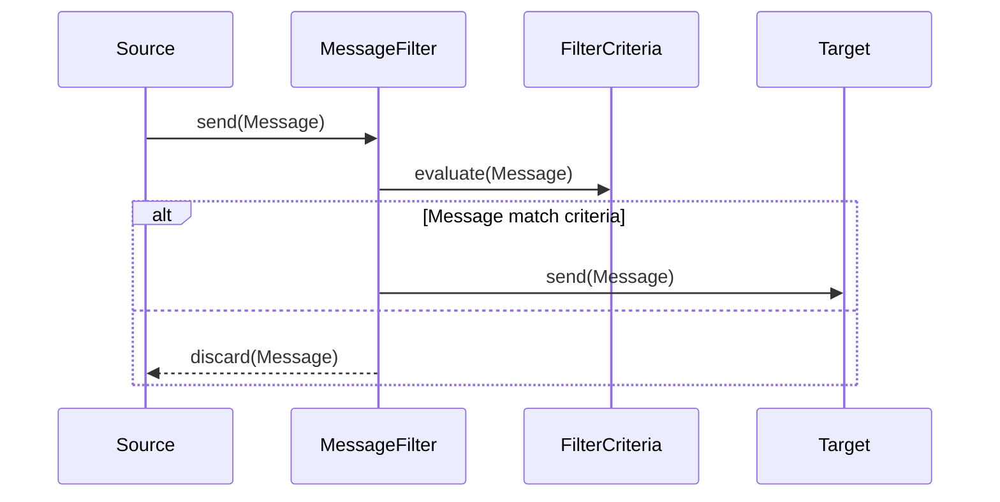

## Message Filter

### Definition
The **Message Filter** pattern allows a system to filter messages and ensure that only interesting and relevant messages are processed, while uninteresting ones are discarded or redirected.

### Intent
The intent of the Message Filter pattern is to alleviate the receiving system from the burden of processing irrelevant or unwanted messages, thereby improving efficiency and reducing overhead.

### Also Known As
- Message Router
- Content-Based Router (when the filter logic is content-based)

### Detailed Definition and Explanation
The Message Filter acts as a gatekeeper in a messaging system. It examines incoming messages against a set of criteria or rules. Messages that do not meet these criteria are discarded or sent to a different channel. This helps ensure that downstream components only receive messages they are interested in, thus optimizing processing and resource utilization.

#### Key Features:
1. **Selective Messaging**: Only allows relevant messages to pass.
2. **Criteria-Based**: Filtering based on predefined conditions or criteria.
3. **Improves Efficiency**: Reduces unnecessary message processing by downstream components.
4. **Supports Different Actions**: Unmatched messages can be discarded, logged, or routed to an alternative channel.

### Diagrams

#### Example Class Diagram

**Explanation**: 
- The `MessageFilter` evaluates messages against `FilterCriteria`.
- If criteria are met, the `Message` is forwarded to `FilteredMessages`.

#### Example Sequence Diagram

**Explanation**: 
- The `Source` sends messages to `MessageFilter`.
- `MessageFilter` evaluates the message using `FilterCriteria`.
- If the message matches criteria, it's forwarded to the `Target`.
- Otherwise, the message is discarded by `MessageFilter`.

### Code Examples

#### Java Example using Apache Camel
```java
from("jms:queue:incoming")
    .filter(simple("${body.content} contains 'interesting'"))
    .to("jms:queue:filtered");
```
In this example, messages from the `incoming` queue are filtered based on whether their content contains the word "interesting". Relevant messages are sent to the `filtered` queue.

#### Scala Example using Akka Streams
```scala
val messageFilter = Flow[String].filter(_.contains("interesting"))
val source = Source(List("interesting message", "boring message"))
val sink = Sink.foreach[String](println)

source.via(messageFilter).runWith(sink)
```
Here, messages containing the word "interesting" are allowed to pass through the filter and are then printed to the console.

### Benefits
- **Efficiency**: Decreases processing load by filtering out unnecessary messages.
- **Focus**: Ensures that components only handle messages of interest.
- **Cleaner Architecture**: Centralized message filtering logic.

### Trade-offs
- **Complexity**: Introduces additional complexity for managing filter criteria.
- **Performance**: Potential performance bottlenecks if filtering involves complex evaluations.

### When to Use
- When the downstream components unnecessarily process a large volume of irrelevant messages.
- In scenarios where specific messages need different handling, e.g., alerts.

### Example Use Cases
- **Notification Systems**: Filter out non-critical notifications.
- **Event Processing**: Only process events relevant to specific consumers.
- **Log Analysis**: Filter out non-informative logs before processing.

### When Not to Use and Anti-Patterns
- **Homogeneous Message Content**: If all messages are inherently valuable.
- **Over-Filtering**: Strain on performance due to overly complex filtering logic.

### Related Design Patterns
- **Content-Based Router**: Routes messages based on content, a more complex cousin.
- **Message Translator**: Transforms messages, often used in conjunction.

### References and Credits
- *Enterprise Integration Patterns* by Gregor Hohpe and Bobby Woolf
- Apache Camel [website](https://camel.apache.org/)
- Akka Streams [documentation](https://doc.akka.io/docs/akka/current/stream/index.html)

### Open Source Frameworks
- **Apache Camel**: Integration framework with pattern implementations.
- **Spring Integration**: Part of the Spring framework with comprehensive EIP support.
- **Akka**: Actor-based system with stream support.

### Cloud Computing and Platforms
- **AWS Lambda**: Serverless computing, where filtering logic can be implemented as microservices.
- **Google Cloud Pub/Sub**: Cloud messaging platform offering filtering capabilities.
- **Azure Service Bus**: Provides message filtering features.

### Books for Further Studies
- *Enterprise Integration Patterns* by Gregor Hohpe and Bobby Woolf
- [Scala for the Impatient](https://amzn.to/45PPdPi) by Cay S. Horstmann
- [Java Concurrency in Practice](https://amzn.to/3W4j5nZ) by Brian Goetz


