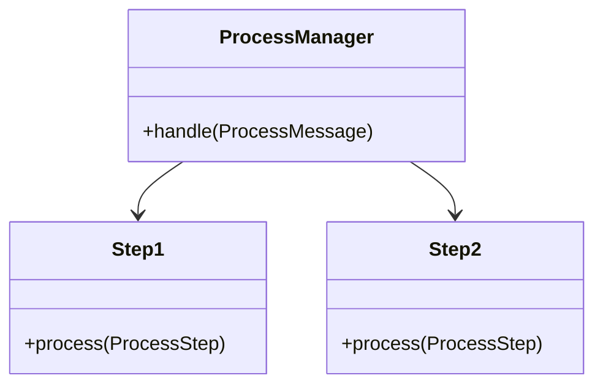
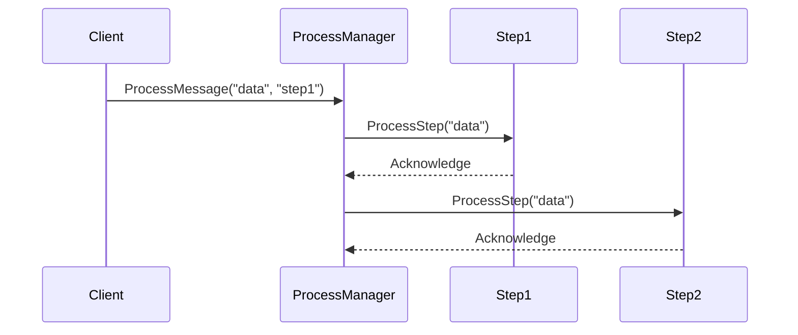

## Process Manager Pattern

### Definition 

The **Process Manager Pattern** is designed to route a message through various processing steps, handling the order and conditions dynamically at runtime.

**Intent**: The primary purpose of this pattern is to manage complex workflows where the sequence and nature of processing steps can change depending on the context.

**Also Known As**: Workflow Manager, Routing Slip Pattern

### Detailed Explanation

In scenarios where workflows are not linear and may vary depending on runtime data, the Process Manager pattern provides the capability to define, manage, and alter the steps in the workflow without hardcoding the flow logic. It decouples the steps in a process and allows for dynamic reconfiguration and complex routing logic.

### Key Features
- **Dynamic Routing**: Ability to determine which steps to take based on the message content and other conditions.
- **Decoupling**: Separation of processing logic and routing logic.
- **State Management**: Maintains state across processing steps.

### Code Examples

#### Java and Apache Camel
```java
import org.apache.camel.builder.RouteBuilder;
import org.apache.camel.model.rest.RestBindingMode;

public class ProcessManagerRoute extends RouteBuilder {
    @Override
    public void configure() {
        restConfiguration().bindingMode(RestBindingMode.json);
        
        from("direct:start")
            .choice()
                .when(header("action").isEqualTo("step1")).to("direct:step1")
                .when(header("action").isEqualTo("step2")).to("direct:step2")
                // add further steps
            .otherwise().to("direct:end");

        from("direct:step1")
            .process(exchange -> {
                // Define step1 processing
            })
            .to("direct:nextStep");

        from("direct:step2")
            .process(exchange -> {
                // Define step2 processing
            })
            .to("direct:nextStep");

        // Continue as needed
    }
}
```

#### Scala and Akka
```scala
import akka.actor.{Actor, Props}

class ProcessManagerActor extends Actor {
  def receive: Receive = {
    case ProcessMessage(data, step) =>
      step match {
        case "step1" => context.actorOf(Step1Actor.props) ! ProcessStep(data)
        case "step2" => context.actorOf(Step2Actor.props) ! ProcessStep(data)
        // Add further steps
        case _ => println("End of Process")
      }
  }
}

case class ProcessMessage(data: String, step: String)
case class ProcessStep(data: String)

object Step1Actor {
  def props: Props = Props(new Step1Actor)
}

class Step1Actor extends Actor {
  def receive: Receive = {
    case ProcessStep(data) => println(s"Step1 processing: $data")
  }
}

object Step2Actor {
  def props: Props = Props(new Step2Actor)
}

class Step2Actor extends Actor {
  def receive: Receive = {
    case ProcessStep(data) => println(s"Step2 processing: $data")
  }
}
```

### Example Class Diagrams

Mermaid:


### Example Sequence Diagrams

Mermaid:


### Benefits

- **Flexibility**: Easily adapt the process flow based on various factors.
- **Scalability**: Suitable for large and complex workflows in distributed systems.
- **Maintainability**: Clean separation of concerns between routing and processing logic.

### Trade-offs

- **Performance**: Conditional logic and message routing might introduce latency.
- **Complexity**: Increased overall complexity may require sophisticated error handling and state management.
- **Debugging**: Dynamic behavior makes testing and debugging more challenging.

### When to Use

- Complex, dynamic workflows.
- When runtime conditions dictate different processing paths.
- Decoupling processing logic and routing logic is beneficial.

### Example Use Cases

- Order processing in e-commerce where different products may require different processing steps.
- Insurance claim processing where the workflow varies depending on claim type, user inputs, and other variables.

### When Not to Use and Anti-patterns

- For simple, linear workflows – introduces unnecessary complexity.
- When performance is a critical issue and latency needs to be minimized.

### Related Design Patterns

- **Routing Slip**: Explicitly lists the processing steps in the message header.
- **Saga Pattern**: Manages distributed transactions where each step is a local transaction.

### References and Credits

- _[Enterprise Integration Patterns: Designing, Building, and Deploying Messaging Solutions](https://amzn.to/3XXncn8)_ by Gregor Hohpe, Bobby Woolf.

### Open Source Frameworks 

- **Apache Camel**: A versatile integration framework.
- **Akka**: Actor-based model suitable for complex workflows.

### Third Party Tools

- **MuleSoft**: Enterprise service bus.
- **Camunda BPM**: Workflow and decision automation platform.

### Cloud Computing, SAAS, DAAS, PAAS

- **AWS Step Functions**: For designing and running workflows that connect different services.
- **Google Cloud Workflows**: Orchestrates and automates tasks.

### Further Reading

- _"Camel in Action"_ by Claus Ibsen and Jonathan Anstey.
- _"Akka in Action"_ by Raymond Roestenburg and Rob Bakker.

---

By leveraging the Process Manager pattern, organizations can build robust and adaptive workflows that cater to various dynamic processing requirements efficiently.
