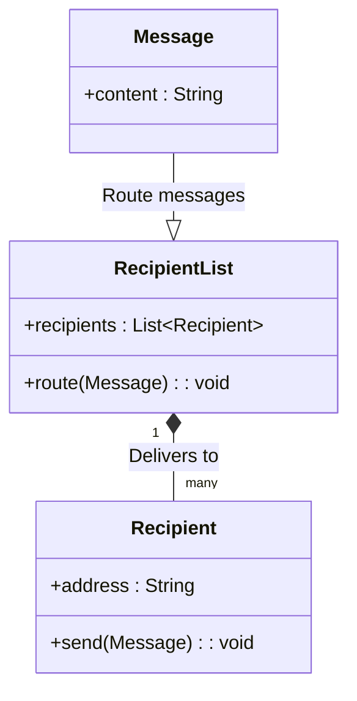
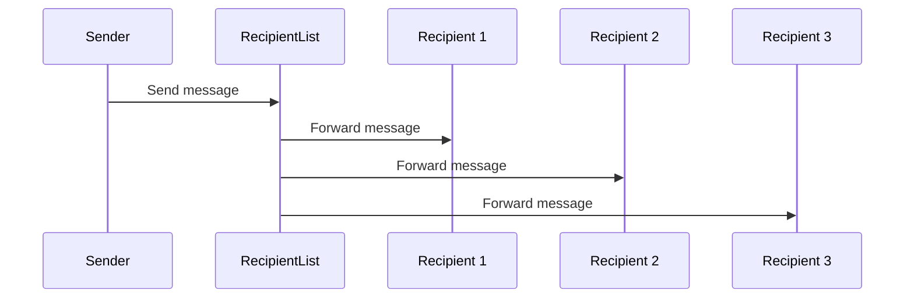
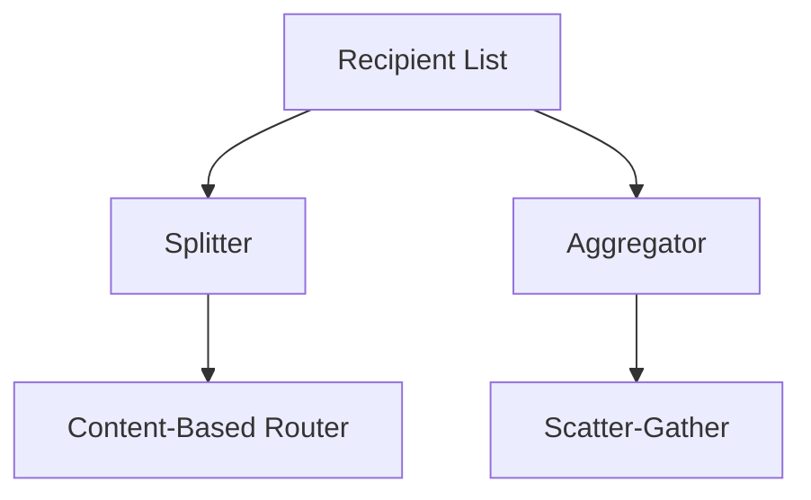

## Recipient List

### Definition
The Recipient List pattern routes a message to a dynamically specified list of recipients.

### Intent
The intention behind the Recipient List pattern is to enable flexible and dynamic routing of a message to multiple recipients based on an externally provided list, allowing for increased agility and the ability to manage recipients at runtime.

### Also Known As
Dynamic Router

### Detailed Explanation

#### Key Features
- **Dynamic Recipients:** Allows routing to multiple, dynamically determined recipients.
- **Scalability:** Can handle changing business requirements by adding or removing recipients from the list.
- **Flexibility:** Works seamlessly with various types of message formats, transports, and protocols.

### Class Diagram


### Code Examples

#### Java (Apache Camel)
```java
import org.apache.camel.builder.RouteBuilder;
import org.apache.camel.main.Main;

public class RecipientListExample extends RouteBuilder {
    public static void main(String[] args) throws Exception {
        Main main = new Main();
        main.configure().addRoutesBuilder(new RecipientListExample());
        main.run(args);
    }

    @Override
    public void configure() throws Exception {
        from("direct:start")
            .recipientList(header("recipients"));
    }
}
```

#### Scala (Akka Streams)
```scala
import akka.actor.ActorSystem
import akka.stream.scaladsl.{Sink, Source, Broadcast}

implicit val system: ActorSystem = ActorSystem("RecipientListExample")

val recipients = List("actor1", "actor2", "actor3")

val source = Source.single("This is a message")

val broadcast = Broadcast[String](recipients.size)

val graph = source ~> broadcast

recipients.zipWithIndex.foreach {
  case (recipient, i) => broadcast ~> Sink.actorRef(actorSystem.actorOf(Props[RecipientActor], recipient), "completed")
}

implicit val materializer = ActorMaterializer()
graph.run(materializer)
```

### Example Sequence Diagram


### Benefits
- **Extensibility:** Easy to add or remove recipients without changing the core routing logic.
- **Reusability:** Can be reused across various parts of the system without duplication.
- **Configuration:** Can be configured at runtime, making it highly adaptable.

### Trade-offs
- **Complexity:** Introduction of dynamic behavior may complicate the message routing logic.
- **Performance:** Extra overhead in resolving and invoking multiple recipients in one routing pass.

### When to Use
- When you need to route messages to multiple endpoints or services dynamically.
- When the list of recipients can change at runtime based on certain criteria or configurations.

### Example Use Cases
- **Email Broadcasting:** Sending promotional emails to a dynamically changing list of subscribers.
- **Event Notifications:** Notifying a list of services about a particular event.
- **Microservices:** Routing requests to multiple microservices in a scalable system.

### When Not to Use and Anti-patterns
- Avoid using if recipients are always known at design time. Static routing would be a better approach.
- Not suitable for high-performance scenarios where routing delays are unacceptable.

### Related Design Patterns
- **Splitter Pattern:** For breaking down a message into multiple pieces and processing them separately.
- **Aggregator Pattern:** For combining multiple messages into a single message.

### References and Credits
- [Enterprise Integration Patterns by Gregor Hohpe and Bobby Woolf](https://www.enterpriseintegrationpatterns.com/)
- [Apache Camel Documentation](https://camel.apache.org/)
- [Akka Documentation](https://akka.io/docs/)

### Open Source Frameworks and Tools
- **Apache Camel:** For integration and routing.
- **Akka Streams:** For reactive stream processing.
- **Spring Integration:** For building message-driven applications.

### Cloud Computing, SAAS, DAAS, PAAS
- **AWS Simple Notification Service (SNS):** For broadcasting messages to a list of recipients.
- **Google Pub/Sub:** For routing messages to various subscribers.

### Suggested Books for Further Studies
- [Enterprise Integration Patterns: Designing, Building, and Deploying Messaging Solutions](https://amzn.to/3XXncn8) by Gregor Hohpe and Bobby Woolf
- "Camel in Action" by Claus Ibsen and Jonathan Anstey
- "Reactive Messaging Patterns with the Actor Model" by Vaughn Vernon

### Grouping of Related Patterns using Mermaid Diagrams

#### Routing Patterns Group


#### Group Patterns Descriptions
- **Recipient List**: Routes to a dynamic list of recipients.
- **Splitter**: Splits a message into multiple fragments and routes them to different destinations.
- **Aggregator**: Combines multiple messages into a single unified message.
- **Content-Based Router**: Routes messages based on content or message attributes.
- **Scatter-Gather**: Routes a request to multiple recipients and aggregates the responses.

Use these patterns to design robust and adaptable message routing systems that efficiently handle various messaging scenarios.

---
