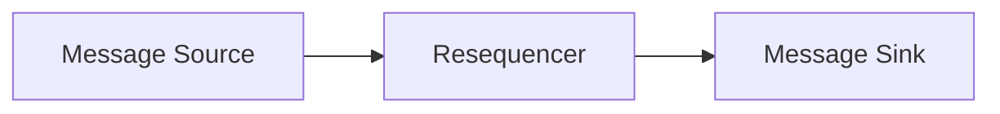
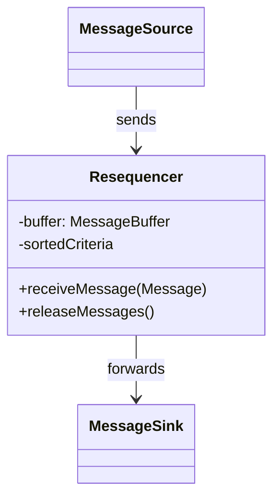
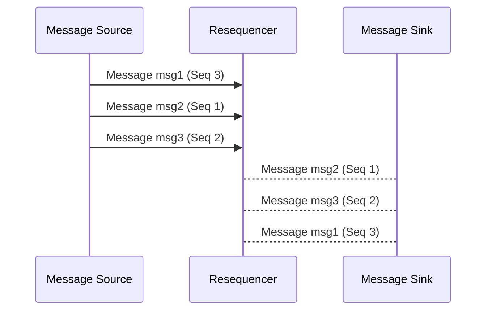

## Definition
The Resequencer Enterprise Integration Pattern is used to rearrange a stream of related but out-of-sequence messages into the correct order by storing them and releasing them in sequence.

## Intent
To maintain the correct order of messages based on a specific identifying attribute, such as a sequence number or timestamp, ensuring that all downstream processes handle message data correctly and consistently.

## Also Known As
- Message Resequencing
- Out-of-Order Message Handling

## Detailed Definition and Explanation
The Resequencer Pattern acts within a message processing system to reorder incoming messages based on certain criteria before passing them on. It typically sits between message sources and the system's core process, analyzing attributes like sequence numbers or timestamps to achieve the correct order.

### Diagram

In the above diagram, a message source sends out-of-order messages that the Resequencer orders correctly before passing them to the message sink.

## Key Features
1. **Ordering of Messages**: Organizes messages by defined criteria (e.g., sequence number).
2. **Buffer Management**: Temporarily stores messages until they can be sent in the correct order.
3. **Timeout Management**: Specifies how long to wait for missing messages before releasing subsequent messages.

## Code Examples

### Java Example using Apache Camel
```java
from("direct:input")
    .resequence(header("sequenceNumber"))
    .batch()
    .timeout(1000)
    .to("direct:output");
```

### Scala Example using Akka Streams
```scala
import akka.actor.ActorSystem
import akka.stream.scaladsl.{Flow, Sink, Source}
import akka.util.Timeout

import scala.concurrent.duration._

implicit val system: ActorSystem = ActorSystem("ResequencerSystem")
implicit val timeout: Timeout = Timeout(1.second)

val outOfOrderMessages = Source(List((3, "c"), (1, "a"), (2, "b")))

val resequencerFlow = Flow[(Int, String)].statefulMapConcat { () =>
  var buffer = scala.collection.mutable.PriorityQueue.empty[(Int, String)](Ordering.by(-_._1))
  
  msg => {
    println(s"Received message: $msg")
    buffer.enqueue(msg)
    
    // Sorting and releasing logic
    if (buffer.size >= 3) buffer.dequeueAll(i => true) else Seq.empty[(Int, String)]
  }
}

outOfOrderMessages
  .via(resequencerFlow)
  .to(Sink.foreach(println))
  .run()
```

## Class Diagram


### Class Diagram Explanation
- **MessageSource**: The origin of the messages that might be out of order.
- **Resequencer**: Receives messages, determines order, and holds them until they can be released in the correct sequence.
- **MessageSink**: Receives correctly ordered messages.

## Sequence Diagram


### Sequence Diagram Explanation
1. **Message Source** sends three out-of-sequence messages to **Resequencer**.
2. **Resequencer** processes and orders the messages.
3. **Resequencer** releases messages to **Message Sink** in correct sequence.

## Benefits
- **Data Consistency**: Ensures that messages are processed in the correct order.
- **Correct Sequence**: Prevents errors in downstream systems dependent on message order.

## Trade-offs
- **Latency**: Introduces delay waiting for out-of-sequence messages to arrive.
- **Complexity**: Adds additional complexity to manage buffer states and timeouts.

## When to Use
- When message order is critical to the business logic.
- While processing event streams that must maintain sequence for correctness.

## Example Use Cases
- Financial transaction processing.
- Ordered data event feeds.
- Log processing where the order of log entries is significant.

## When Not to Use
- When messages are idempotent, and order does not affect processing.
- In real-time systems where latency must be minimized.

## Anti-Patterns
- Simple buffering without recheck might lead to stale data processing.
- Ignoring timeout constraints can cause unnecessary delays.

## Related Design Patterns
1. **Aggregator Pattern**: Collects and consolidates multiple messages into a single message.
2. **Message Filter Pattern**: Removes unnecessary or redundant messages from a stream.

## References and Credits
- [Enterprise Integration Patterns: Designing, Building, and Deploying Messaging Solutions](https://amzn.to/3XXncn8) by Gregor Hohpe and Bobby Woolf.
- Apache Camel Resequencer Documentation.
- Akka Streams Documentation.

## Open Source Frameworks and Third-Party Tools
- **Apache Camel**: Provides an implementation of the Resequencer pattern.
- **Spring Integration**: Supports message resequencing capabilities.
- **Akka Streams**: Allows custom implementation of resequencing logic.

## Cloud Computing, SAAS, DAAS, PAAS
- AWS manages services like Amazon Kinesis Data Streams and Amazon SNS for message processing that can be integrated with custom resequencers.
- Google Cloud Platform's Pub/Sub messaging can benefit from sequence management in distributed systems.

## Further Reading
- [Patterns of Enterprise Application Architecture](https://amzn.to/4cGutvM) by Martin Fowler.
- [Designing Data-Intensive Applications](https://amzn.to/4cuX2Na) by Martin Kleppmann.

---

This format ensures a comprehensive understanding of the Resequencer pattern from multiple angles, featuring both conceptual content and practical implementations in Java and Scala.
