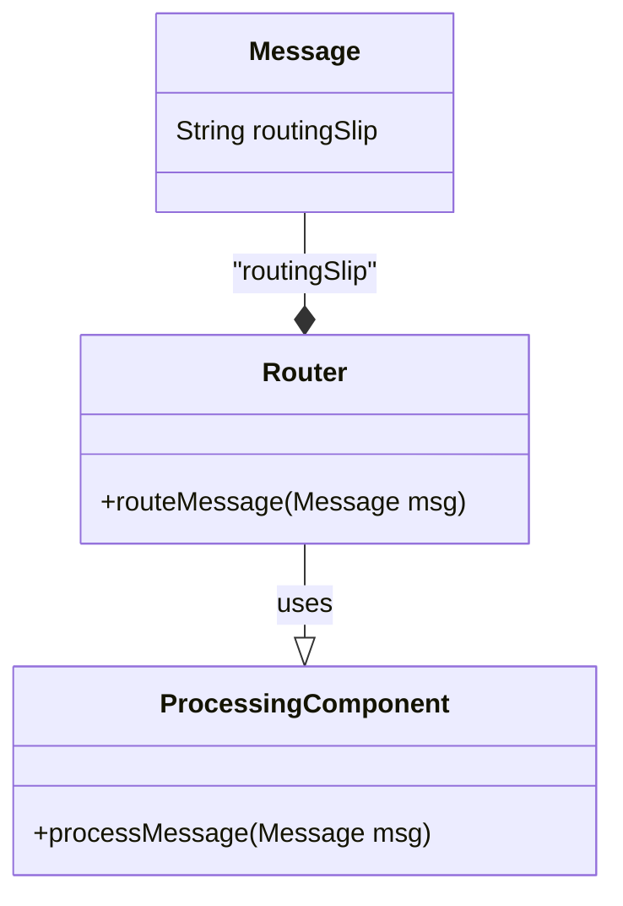
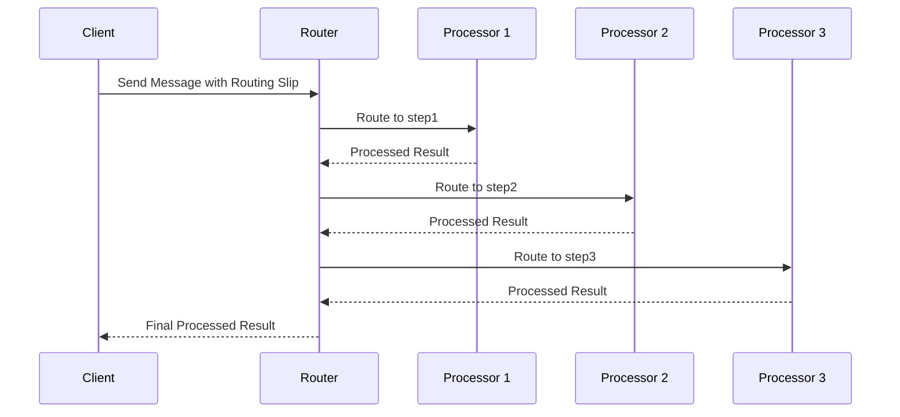

## Definition
The Routing Slip pattern provides a means to pass a message through a series of processing steps where the sequence of steps is not predetermined and can vary for each message. 

## Intent
The intent of the Routing Slip pattern is to enable dynamic and flexible routing of messages through various processing stages, allowing for the sequence of steps to be defined at runtime.

## Also Known As
- Dynamic Router
- Command Routing
- Flexible Workflow

## Detailed Definitions and Explanations

The Routing Slip pattern involves attaching a routing slip to a message, which includes a list of processing steps the message should go through. Each processing component reads the next step from the slip, performs its task, updates the slip, and passes the message along to the next component.

### Key Features
- **Dynamic Routing**: The sequence of steps is determined at runtime.
- **Decoupled Processing**: Processing steps are independent and unaware of each other.
- **Extensibility**: New processing steps can be easily added without affecting the existing system.
- **Configurability**: The routing slip can be modified to change processing pipelines dynamically.

### Example Code
#### Java with Apache Camel
```java
import org.apache.camel.builder.RouteBuilder;
import org.apache.camel.main.Main;

public class RoutingSlipExample {
    public static void main(String[] args) throws Exception {
        Main main = new Main();
        main.configure().addRoutesBuilder(new RouteBuilder() {
            @Override
            public void configure() {
                from("direct:start")
                    .routingSlip(header("routingSlip"));  // Header contains the list of steps

                from("direct:step1")
                    .log("Processed by Step 1");

                from("direct:step2")
                    .log("Processed by Step 2");

                from("direct:step3")
                    .log("Processed by Step 3");
            }
        });
        main.run(args);
    }
}
```

#### Scala with Akka
```scala
import akka.actor.ActorSystem
import akka.stream.scaladsl.{Flow, Sink, Source}
import akka.stream.ActorMaterializer

object RoutingSlipExample extends App {
  implicit val system = ActorSystem("routing-slip-example")
  implicit val materializer = ActorMaterializer()

  val step1 = Flow[String].map(msg => {
    println(s"Processed by Step 1: $msg")
    msg
  })
  
  val step2 = Flow[String].map(msg => {
    println(s"Processed by Step 2: $msg")
    msg
  })
  
  val step3 = Flow[String].map(msg => {
    println(s"Processed by Step 3: $msg")
    msg
  })

  val routes = Map("step1" -> step1, "step2" -> step2, "step3" -> step3)

  val processRoute = Flow[(String, List[String])].flatMapConcat { case (msg, slip) =>
    Source.single((msg, slip)).via(routingSlipFlow)
  }

  def routingSlipFlow =
    Flow[(String, List[String])].via(Flow[(String, List[String])].expand {
      case (msg, steps) => Iterator.iterate((msg, steps)) {
        case (m, s :: rest) => (m, rest)
        case (m, Nil)       => (m, Nil)
      }
    }).via(Flow[(String, List[String])].collect {
      case (msg, step :: rest) => ((msg, rest), routes(step))
    }).mapAsync(1) {
      case ((msg, rest), flow) => Source.single(msg).via(flow).runWith(Sink.head).map(newMsg => (newMsg, rest))
    }

  Source(List(("Message1", List("step1", "step2", "step3")), ("Message2", List("step2", "step3"))))
    .via(processRoute)
    .runWith(Sink.ignore)
}
```

### Example Class Diagram


### Example Sequence Diagram


## Benefits
- **Flexibility**: Easily reconfigure routing logic without changing code.
- **Scalability**: New steps can be added without impacting existing flow.
- **Separation of Concerns**: Independent processing steps enhance system maintability.

## Trade-offs
- **Complexity**: Increased runtime decision-making can add complexity.
- **Debugging**: Tracing the dynamic flow of messages can be challenging.
- **Performance**: May impact performance slightly due to runtime evaluations.
  
## When to Use
- **Dynamic Workflows**: When the sequence of processes can change frequently.
- **Modular Processing**: To allow independent development and maintenance of processing steps.
- **Extensible Frameworks**: Systems that need flexibility to add new processing components dynamically.

## Example Use Cases
- **Order Processing**: Varying validation and enrichment steps based on order type.
- **ETL Pipelines**: Data workflows with configurable transformation steps.
- **Message Protocol Translation**: Messages needing adaptive routing based on content or headers.

## When Not to Use
- **Fixed Route Pipelines**: When the sequence of processing steps is static and known at design-time.
- **High-performance Requirements**: Where performance overhead due to dynamic routing is unacceptable.

### Anti-patterns
- **Overengineering**: Using it when simpler, static routing suffices.
- **Insufficient Logging**: Lack of proper logging can make debugging very difficult.

## Related Design Patterns
- **Content-based Router**: Routes messages based on their content.
- **Message Bus**: Provides a robust backbone for passing data among services.
- **Process Manager**: Manages the orchestration of business processes.

## References and Credits
- _Enterprise Integration Patterns_ by Gregor Hohpe and Bobby Woolf
- Apache Camel Official Documentation
- Akka Streams Documentation
- MuleSoft Documentation
- Spring Boot Guides

## Open Source Frameworks
- **Apache Camel**
- **Mule**
- **Spring Integration**
- **Akka**

## Third-Party Tools
- **Camel K**
- **WSO2 Enterprise Integrator**

## Cloud Computing Applicability
- **SaaS**: Using Routing Slip for multi-tenant service processing.
- **PaaS**: Implementing dynamic routing in cloud-native applications.
- **IaaS**: Leveraging for flexible backend service orchestration.

## Books for Further Studies
- _Enterprise Integration Patterns_ by Gregor Hohpe and Bobby Woolf
- _Distributed Systems_ by Andrew S. Tanenbaum
- [Designing Data-Intensive Applications](https://amzn.to/4cuX2Na) by Martin Kleppmann

---

This comprehensive guide provides detailed information about the Routing Slip pattern, including its implementation in different programming languages and frameworks, helping you understand and effectively utilize this pattern in your enterprise integration scenarios.
