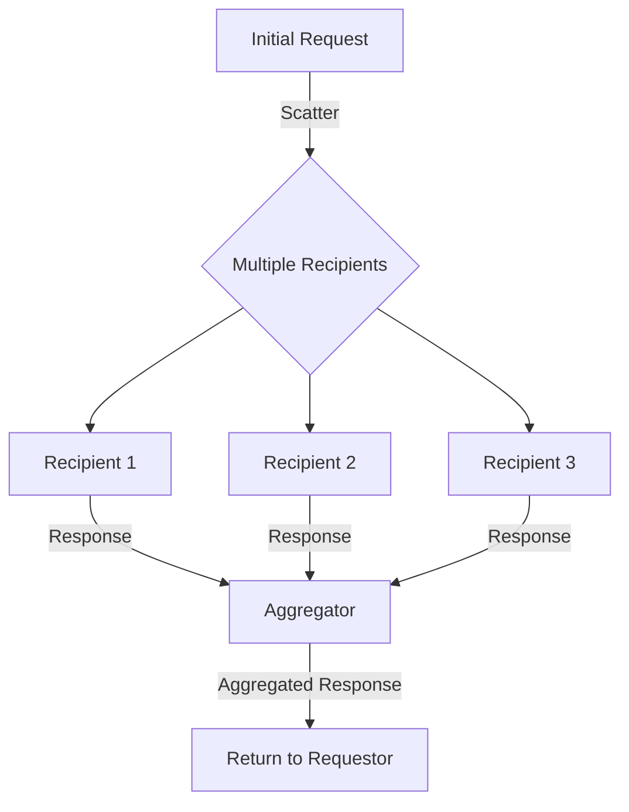
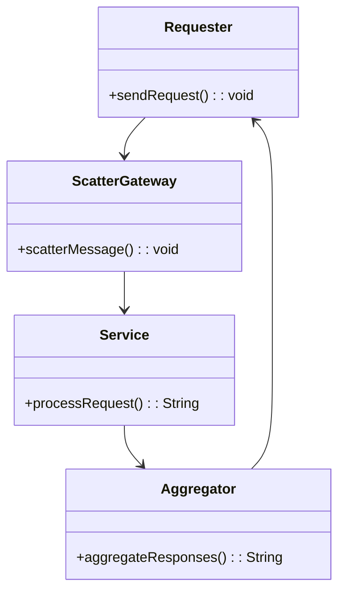
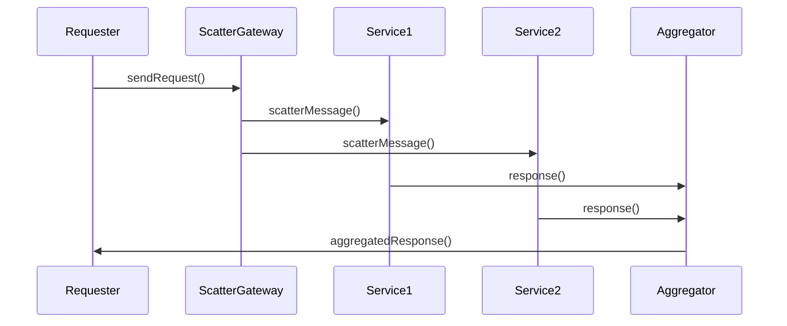

The Scatter-Gather pattern sends a message to multiple recipients and waits for their responses to compile them into a single aggregated response.

## Intent

To send a message to multiple recipients, gather their responses, and return the aggregated response to the requester.

## Also Known As

- Fan-Out/Fan-In
- Response Aggregator

## Detailed Explanation

The Scatter-Gather pattern is used to achieve parallel processing by distributing requests across multiple recipients and then aggregating the responses. This pattern is commonly used in situations where the information required is distributed across multiple services that can operate independently.

### Key Features

- **Parallel Processing:** Send messages to multiple recipients simultaneously.
- **Response Aggregation:** Collect responses from multiple recipients and combine them.
- **Fault Tolerance:** Handle failures in recipient services independently.
- **Scalability:** Easily adaptable to an increasing number of recipient services.

### Diagram



## Code Examples

### Java with Apache Camel

```java
from("direct:start")
    .scatterGather().to("direct:service1", "direct:service2", "direct:service3")
    .timeout(2000)
    .aggregationStrategy(new AggregationStrategy() {
        @Override
        public Exchange aggregate(Exchange oldExchange, Exchange newExchange) {
            if (oldExchange == null) {
                return newExchange;
            }
            String oldBody = oldExchange.getIn().getBody(String.class);
            String newBody = newExchange.getIn().getBody(String.class);
            oldExchange.getIn().setBody(oldBody + "," + newBody);
            return oldExchange;
        }
    })
    .completionPredicate(e -> e.getProperty("CamelAggregatedCompletedBy").equals("timeout"))
    .end()
    .to("mock:result");
```

### Scala with Akka

```scala
class ScatterGatherActor extends Actor {
  import context.dispatcher
  implicit val timeout: Timeout = Timeout(5.seconds)
  
  def receive: Receive = {
    case "start" =>
      val originalSender = sender()
      val services = List("/user/service1", "/user/service2", "/user/service3")
      
      val futures = services.map(servicePath => ask(context.actorSelection(servicePath), "request").mapTo[String])
      val aggregated = Future.sequence(futures).map(_.mkString(","))
      
      aggregated pipeTo originalSender
  }
}
```

### Example Class Diagram



### Example Sequence Diagram



### Benefits

- **Parallelism:** Allows messages to be processed in parallel across multiple services.
- **Resilience:** Fault at one recipient does not impact others.
- **Scalability:** Scales horizontally by adding more recipient services.

### Trade-offs

- **Complexity:** Managing multiple responses and failure scenarios can add complexity.
- **Latency:** Added latency due to waiting for responses from all recipients.
- **Aggregation Logic:** Needs additional logic to aggregate different types of responses.

### When to Use

- When parallel processing can yield significant performance benefits.
- When responses from multiple services need to be combined to form a complete result.
- In distributed systems where services can operate independently.

### Example Use Cases

- **Data Aggregation:** Collecting data from various microservices for a dashboard.
- **Search Engines:** Sending search queries to different indexed chunks of data.

### When Not to Use

- When real-time response is critical, and latency cannot be tolerated.
- When the system cannot handle the overhead of managing multiple responses.

### Anti-patterns

- **Excessive Fan-Out:** Sending a message to too many services, leading to potential bottlenecks and complexity.
- **Single Point of Failure:** If the aggregator fails, the system may be unable to return responses.

### Related Patterns

- **Aggregator:** Combines multiple messages into a single message.
- **Message Routing:** Routes messages based on specified criteria, forming part of the scatter process.
- **Content-Based Router:** Routes a message to multiple recipients based on its content.

### Open Source Frameworks

- **Apache Camel:** Provides extensive support for integration patterns including Scatter-Gather.
- **Mule ESB:** Suited for orchestrating and aggregating responses in enterprise environment.
- **Spring Integration:** Part of the Spring framework for implementing messaging architectures.
- **Akka:** Excellent for actor-based concurrent applications that fit scatter-gather patterns.

### Cloud Computing

- **AWS Step Functions:** For orchestrating distributed messaging and aggregation workloads.
- **Google Cloud Dataflow:** Can be used for scatter-gather processing in data pipelines.
- **Microsoft Azure Logic Apps:** To create workflows involving scatter-gather actions.

### Suggested Books

- *Enterprise Integration Patterns* by Gregor Hohpe and Bobby Woolf
- [Designing Data-Intensive Applications](https://amzn.to/4cuX2Na) by Martin Kleppmann
- *Building Microservices* by Sam Newman

### References

- [Enterprise Integration Patterns - Scatter-Gather](https://www.enterpriseintegrationpatterns.com/patterns/messaging/BroadcastAggregate.html)
- [Apache Camel Documentation](https://camel.apache.org/)

### Credits

- Gregor Hohpe for pioneering Enterprise Integration Patterns.
- Open-source contributors maintaining frameworks like Apache Camel, Mule, and Akka.

---
By grouping related patterns, such as Aggregator and Message Routing, into higher-level conceptual categories like "Message Routing Solutions" and visualizing them through Mermaid diagrams, you can gain deeper insights into their synergies and contrasts. For instance, aligning Scatter-Gather with Aggregator and Content-Based Router exhibits their collective ability to manage, route, and consolidate message flows effectively within distributed systems.
