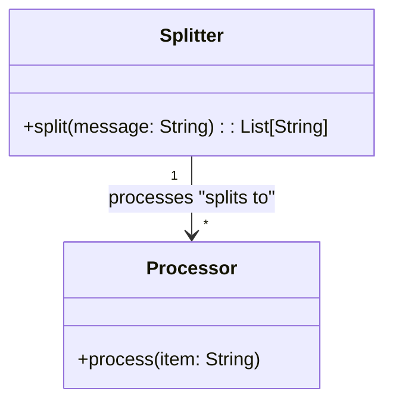
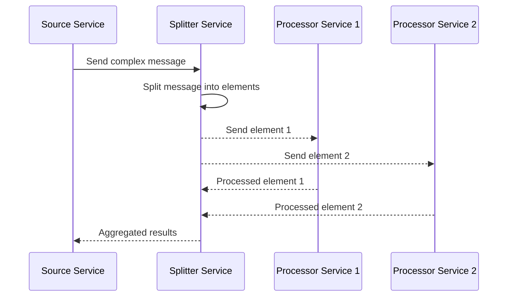

## Splitter Pattern

### Definition
The Splitter Pattern deals with splitting one message into multiple messages, each containing data related to a single item from the original message.

### Intent
To enable independent processing of individual items contained within a complex message by breaking it down into smaller, manageable units.

### Also Known As
- Message Splitter
- Data Splitter

### Detailed Explanation

### Key Features
- **Granular Processing**: Allows individual processing of elements.
- **Decoupling**: Decouples the reception of complex messages from their processing.

### Example Class Diagram



### Example Sequence Diagram



### Code Examples

#### Java with Apache Camel
```java
import org.apache.camel.builder.RouteBuilder;
import org.apache.camel.impl.DefaultCamelContext;

public class SplitterExample {
    public static void main(String[] args) throws Exception {
        DefaultCamelContext context = new DefaultCamelContext();
        context.addRoutes(new RouteBuilder() {
            @Override
            public void configure() {
                from("direct:start")
                .split(body().tokenize(","))
                .to("log:item")
                .end();
            }
        });

        context.start();
        context.createProducerTemplate().sendBody("direct:start", "A,B,C,D");
        context.stop();
    }
}
```

#### Scala with Akka Streams
```scala
import akka.actor.ActorSystem
import akka.stream.scaladsl.{Sink, Source}

object SplitterExample extends App {
  implicit val system: ActorSystem = ActorSystem("splitter-system")

  val complexMessage = "A,B,C,D"
  val elements = complexMessage.split(",")

  Source(elements.toList)
    .map(element => s"Processing element: $element")
    .runWith(Sink.foreach(println))
  
  system.terminate()
}
```

### Benefits
- Enables parallel processing of message components.
- Simplifies handling of complex messages.
- Improves scalability and error isolation.

### Trade-offs
- Splitting messages can introduce overhead.
- Re-aggregating results might add complexity.
- Order of processing might need management to avoid inconsistencies.

### When to Use
- When incoming messages encapsulate multiple, independently processable parts.
- When optimizing throughput and latency by parallelizing work.

### Example Use Cases
- Processing orders, where each order may include multiple products.
- Handling log or event data streams containing multiple records.
- Data transformation tasks involving complex payloads.

### When Not to Use and Anti-patterns
- One-size-fits-all processing of messages – can lead to unnecessary complexity.
- When all parts of a message need to be processed together in sequence – in this case, consider Aggregate Pattern.

### Related Design Patterns
- **Aggregator Pattern**: Often used in combination with Splitter to reassemble split parts.
- **Content Filter Pattern**: Filters out unwanted parts before or after splitting.
- **Message Router Pattern**: Routes split messages to the appropriate processors.

### References and Credits
- [Enterprise Integration Patterns](https://www.enterpriseintegrationpatterns.com/)
- [Apache Camel Splitter EIP](https://camel.apache.org/components/latest/eips/split-eip.html)
- [Akka Streams](https://doc.akka.io/docs/akka/current/stream/)
- [MuleSoft Splitter](https://docs.mulesoft.com/mule-runtime/4.3/split-and-aggregate-example)

### Open Source Frameworks
- **Apache Camel**: Integration framework with numerous EIP implementations.
- **Spring Integration**: Part of the Spring ecosystem providing comprehensive support for EIPs.
- **Akka**: Actor-based toolkit for building concurrent and distributed systems in Scala and Java.
- **Apache Flink**: Stream-processing framework capable of complex event processing.
- **MuleSoft**: An integration platform for connecting applications, data, and devices.

### Cloud Computing and SAAS/PAAS Integration
- **AWS Lambda**: For serverless microservice implementations.
- **Google Cloud Pub/Sub**: Streaming data for real-time messaging.

### Suggested Books
- [Enterprise Integration Patterns: Designing, Building, and Deploying Messaging Solutions](https://amzn.to/3XXncn8) by Gregor Hohpe and Bobby Woolf.
- [Designing Data-Intensive Applications](https://amzn.to/4cuX2Na) by Martin Kleppmann.
- *Building Microservices* by Sam Newman.

By understanding and applying the Splitter Pattern, one can greatly enhance the flexibility, scalability, and maintainability of enterprise integration solutions.
