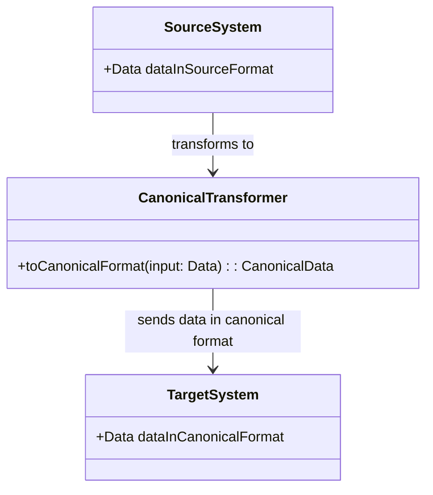
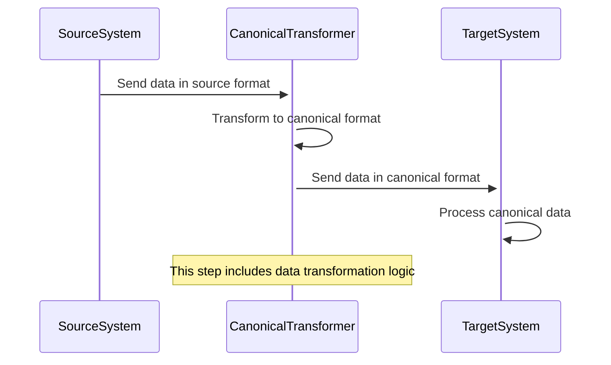

## Canonical Data Model

### Definition

The Canonical Data Model (CDM) is a design pattern used in enterprise application integration. It establishes a single, standardized data format (canonical model) that enables communication between disparate systems using different data formats.

### Intent

The primary intent of the Canonical Data Model is to minimize the dependencies between different applications by creating a common data format for information exchange. This simplifies the transformation and integration of data from one application to another.

### Also Known As

- Standard Data Model
- Unified Data Model

### Detailed Definition and Explanations

#### Key Features

1. **Standardized Data Format**: Establishes a common data structure reducing the need for multiple data transformations between systems.
2. **Decoupling Systems**: Reduces direct dependencies making system changes easier and more maintainable.
3. **Simplified Integration**: Simplifies the integration processes between heterogeneous systems.
4. **Centralized Schema Management**: Provides a central reference schema making governance easier.

#### Code Examples

**Example in Java using Spring Boot and Apache Camel**

```java
import org.apache.camel.builder.RouteBuilder;
import org.springframework.boot.SpringApplication;
import org.springframework.boot.autoconfigure.SpringBootApplication;
import org.springframework.context.annotation.Bean;

@SpringBootApplication
public class CanonicalDataModelApplication {

    public static void main(String[] args) {
        SpringApplication.run(CanonicalDataModelApplication.class, args);
    }

    @Bean
    public RouteBuilder routeBuilder() {
        return new RouteBuilder() {
            @Override
            public void configure() {
                from("direct:sourceSystem")
                    .marshal().json()
                    .bean(CanonicalTransformer.class, "toCanonicalFormat")
                    .to("direct:targetSystem");
            }
        };
    }
}

public class CanonicalTransformer {
    public String toCanonicalFormat(Object input) {
        // Transform input to canonical format.
        // Implementation depends on the canonical model's schema.
        return transformedData;
    }
}
```

**Example in Scala using Akka Streams and Apache Kafka**

```scala
import akka.actor.ActorSystem
import akka.kafka.ConsumerSettings
import akka.kafka.scaladsl.Consumer
import akka.kafka.scaladsl.Producer
import akka.stream.ActorMaterializer
import org.apache.kafka.common.serialization.StringDeserializer
import org.apache.kafka.common.serialization.StringSerializer

object CanonicalDataModelApp extends App {
  implicit val system = ActorSystem("CanonicalDataModelSystem")
  implicit val materializer = ActorMaterializer()

  val consumerSettings = ConsumerSettings(system, new StringDeserializer, new StringDeserializer)
    .withGroupId("group1")
    .withBootstrapServers("localhost:9092")

  val producerSettings = ActorMaterializer(producerSystem, new StringSerializer, new StringSerializer)
    .withBootstrapServers("localhost:9092")

  val done = Consumer
    .plainSource(consumerSettings, Subscriptions.topics("sourceTopic"))
    .map(record => CanonicalTransformer.toCanonicalFormat(record.value))
    .runWith(Producer.plainSink(producerSettings))

  system.registerOnTermination(() => done.flatMap(_ => system.terminate)(materializer.executionContext))
}

object CanonicalTransformer {
  def toCanonicalFormat(input: String): String = {
    // Transform input to canonical format.
    // Implementation depends on the canonical model's schema.
    transformedData
  }
}
```

### Example Class Diagram

Below is a simplified class diagram, visualizing the relationship between different components dealing with the Canonical Data Model:



### Example Sequence Diagram

Below is a detailed sequence of events showing the data transformation flow:



### Benefits

1. **Reduced Complexity**: Reduces overall system complexity by minimizing the number of required data transformations.
2. **Increased Maintainability**: Improved maintainability due to reduced coupling between systems.
3. **Enhanced Flexibility**: More flexible integration framework allowing easier addition or modification of systems.

### Trade-offs

1. **Initial Setup**: Initial effort required to define and set up the canonical model.
2. **Performance Overheads**: Additional layers of data transformation could potentially impact performance.
3. **Governance Requirements**: Requires robust governance policies to manage and maintain the canonical model.

### When to Use

1. When integrating multiple systems with diverse data formats.
2. In large enterprise environments needing a scalable and maintainable data integration solution.
3. When aiming to decouple systems for increased resiliency and flexibility.

### Example Use Cases

1. A retail company integrating legacy systems, e-commerce platforms, and CMS systems.
2. Financial services aggregating and normalizing transaction data from multiple banking and external systems.
3. Healthcare providers normalizing patient data coming from different systems and standards.

### When Not to Use

1. Small-scale applications with only a few simple data integrations.
2. Scenarios requiring minimal initial development effort.
3. When performance is critical, and minimal latency is preferred.

#### Anti-patterns

1. Overcomplicating simple integrations.
2. Inadequate canonical model governance leading to inconsistencies.
3. Excessive transformations impacting system performance.

### Related Design Patterns

1. **Message Translator**: Translates messages from one format to another but lacks the central standardization of CDM.
2. **Enterprise Service Bus (ESB)**: Often implements the CDM to facilitate message routing and transformation.
3. **Repository Pattern**: Manages access to data, but does not emphasize standardizing data formats.

### References and Further Reading

- *Enterprise Integration Patterns* by Gregor Hohpe and Bobby Woolf.
- [Patterns of Enterprise Application Architecture](https://amzn.to/4cGutvM) by Martin Fowler.

### Open Source Frameworks and Tools

1. **Apache Camel**: Provides a variety of integration patterns, including Canonical Data Model.
2. **MuleSoft**: A comprehensive integration platform that supports CDM.
3. **Spring Integration**: Another powerful integration framework supporting CDM.

### Cloud Computing Aspects

The Canonical Data Model can also be applied in cloud environments (SaaS, PaaS, DaaS):

- **AWS**: AWS Lambdas, SQS, and Glue can be involved in transforming data to and from the canonical model.
- **Azure**: Service Bus and Logic Apps can facilitate canonical data transformations.
- **Google Cloud**: Google Pub/Sub and Dataflow serve useful roles in cloud-based data transformations.

### Suggest Books for Further Studies

- [Enterprise Integration Patterns: Designing, Building, and Deploying Messaging Solutions](https://amzn.to/3XXncn8) by Gregor Hohpe and Bobby Woolf
- [Patterns of Enterprise Application Architecture](https://amzn.to/4cGutvM) by Martin Fowler

This structuring helps grasp the Canonical Data Model pattern with examples and various aspects for deeper understanding.
