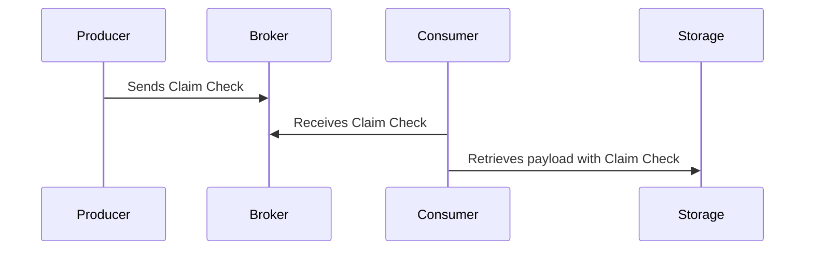

## Claim Check Pattern

### Intent
The Claim Check pattern aims to minimize the data volume being transferred in a messaging system by separating the actual payload from the metadata and using a reference pointer to the stored payload.

### Also Known As
- Payload Pointer

### Definition and Explanation
The Claim Check pattern offloads large message payloads into shared storage and transfers a reference or ID to the payload (the "claim check") through the messaging system. The receiver then uses this claim check to retrieve the full payload from the shared storage.

### Key Features
- **Reduced message size**: Only the necessary metadata and a reference pointer are sent via the messaging system.
- **Decoupling**: Payload and metadata are separated, making the system more flexible and maintainable.
- **Optimized performance**: Decreased network load leads to more efficient and faster messaging.

### Diagram
```
graph TD
    A[Message Producer] -->|Claim Check| B[Message Broker]
    B --> C[Message Consumer]
    C -->|Retrieves payload using Claim Check| D[Shared Storage]
```

### Benefits
- **Performance improvement**: Less network congestion and faster message processing.
- **Scalability**: More manageable message sizes allow easier scaling of the system.
- **Efficiency**: Systems only exchange necessary data till large payloads are explicitly needed.

### Trade-offs
- **Complexity**: Requires additional infrastructure to manage shared storage and claim check mappings.
- **Latency**: Increased time in retrieving separate payloads might affect time-sensitive applications.
- **Consistency**: Additional measure logistics to ensure the consistency between the reference and the actual data in storage.

### Example Code

#### Java with Apache Camel

```java
import org.apache.camel.builder.RouteBuilder;
import org.apache.camel.main.Main;
import org.apache.camel.Exchange;

public class ClaimCheckExample {
    public static void main(String[] args) throws Exception {
        Main main = new Main();
        main.bind("claimCheckService", new ClaimCheckService());
        main.addRouteBuilder(new ClaimCheckRoute());
        main.run(args);
    }

    static class ClaimCheckRoute extends RouteBuilder {
        @Override
        public void configure() {
            from("direct:start")
                .bean("claimCheckService", "storePayload")
                .to("direct:sendMessage");

            from("direct:sendMessage")
                .to("activemq:queue:claimCheckQueue");

            from("activemq:queue:claimCheckQueue")
                .bean("claimCheckService", "retrievePayload")
                .to("direct:processMessage");
        }
    }

    static class ClaimCheckService {
        private final Map<String, Object> storage = new HashMap<>();
        public void storePayload(Exchange exchange) {
            String id = UUID.randomUUID().toString();
            storage.put(id, exchange.getIn().getBody());
            exchange.getIn().setBody(id);
        }

        public void retrievePayload(Exchange exchange) {
            String id = exchange.getIn().getBody(String.class);
            exchange.getIn().setBody(storage.get(id));
        }
    }
}
```

#### Scala with Akka
```scala
import akka.actor.ActorSystem
import akka.actor.Props
import akka.actor.Actor
import akka.actor.ActorRef

object ClaimCheckExample extends App {
  val system = ActorSystem("ClaimCheckSystem")

  val claimCheckService = system.actorOf(Props[ClaimCheckService], "claimCheckService")
  val producer = system.actorOf(Props(classOf[MessageProducer], claimCheckService), "messageProducer")
  val consumer = system.actorOf(Props(classOf[MessageConsumer], claimCheckService), "messageConsumer")

  producer ! "LargePayloadData"

  class MessageProducer(service: ActorRef) extends Actor {
    def receive: Receive = {
      case payload: String =>
        service ! StorePayload(payload, self)
    }
  }

  class MessageConsumer(service: ActorRef) extends Actor {
    def receive: Receive = {
      case ClaimCheck(id) =>
        service ! RetrievePayload(id, self)
      case payload: String =>
        println(s"Processed payload: $payload")
    }
  }

  class ClaimCheckService extends Actor {
    var storage = Map[String, String]()
    
    def receive: Receive = {
      case StorePayload(data, sender) =>
        val id = java.util.UUID.randomUUID().toString
        storage += (id -> data)
        sender ! ClaimCheck(id)
      case RetrievePayload(id, sender) =>
        sender ! storage(id)
    }
  }

  case class StorePayload(data: String, sender: ActorRef)
  case class ClaimCheck(id: String)
  case class RetrievePayload(id: String, sender: ActorRef)
}
```

### Sequence Diagram



### Example Use Cases
- Streaming large multimedia files where the metadata is necessary for indexing and processing.
- Financial systems transferring significant transaction data segregating transaction details metadata with receipts or detailed summaries.

### When Not to Use
- Low latency-critical applications where the overhead of fetching payloads induces unacceptable delays.
- Smaller payload messages where the complexity tradeoff isn't advantageous.

### Related Patterns
- **Content Filter**: Filters out unimportant pieces of the message payload.
- **Message Router**: Routes messages through different pathways based on metadata.
- **Message Store**: Database or store specifically designed for durable storage of message payloads.

### References
- Enterprise Integration Patterns by Gregor Hohpe and Bobby Woolf

### Open Source Frameworks & Tools
- [Apache Camel](https://camel.apache.org/)
- [Akka](https://akka.io/)
- [MuleSoft](https://www.mulesoft.com/)

### Cloud Computing
The Claim Check pattern applies well to DAAS (Data as a Service) models where data access and storage are articulated by services provisions.

### Further Reading
- [Enterprise Integration Patterns: Designing, Building, and Deploying Messaging Solutions](https://amzn.to/3XXncn8) by Gregor Hohpe and Bobby Woolf
- [Designing Data-Intensive Applications](https://amzn.to/4cuX2Na) by Martin Kleppmann

By implementing the Claim Check pattern correctly, you can effectively solve data transfer issues in modern distributed systems, ensuring scalability and efficiency without sacrificing necessary information.
