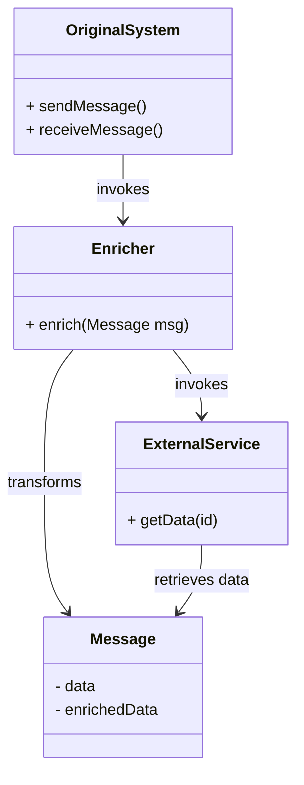
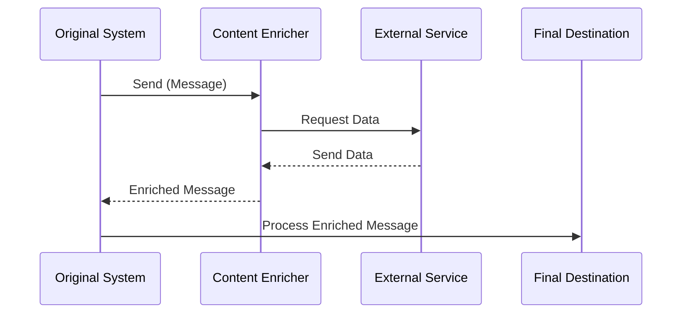

The **Content Enricher** pattern is widely used in enterprise integration to enhance incomplete messages with additional data from external sources before further processing or sending them to their final destination.

## Intent
To enrich a message with data from external sources to ensure all required information is present before processing.

## Also Known As
- Data Enhancer
- Message Enhancer

## Detailed Explanation
When a message does not contain all the required information for processing, the **Content Enricher** pattern fills in the missing data by retrieving information from an external source such as a database, web service, or another message.

### Key Features
- **Message Interception:** Intercepts the message to check for missing or incomplete information.
- **Data Retrieval:** Retrieves the missing or incomplete data from external sources.
- **Message Transformation:** Incorporates the retrieved data into the original message.
- **Seamless Integration:** Ensures the enhanced message is consistent with system requirements.

### Example Class Diagram


### Example Sequence Diagram


### Example Code in Java (Apache Camel)

```java
from("direct:start")
    .process(new Processor() {
        public void process(Exchange exchange) throws Exception {
            Message message = exchange.getIn();
            // Assume the message needs additional data
            String id = message.getHeader("id", String.class);
            // Call external service to enrich message
            String additionalData = externalService.getData(id);
            message.setBody(message.getBody(String.class) + additionalData);
        }
    })
    .to("mock:end");
```

### Example Code in Scala (Akka)

/* Note: Original message and additional data retrieval models are assumed */

```scala
class EnrichmentActor(externalService: ActorRef) extends Actor {
  def receive: Receive = {
    case msg: Message =>
      val enrichFuture: Future[AdditionalData] = (externalService ? GetData(msg.id)).mapTo[AdditionalData]
      enrichFuture.onComplete {
        case Success(data) => sender() ! msg.enrich(data)
        case Failure(_)    => sender() ! Failure(new Exception("Enrichment failed"))
      }
  }
}
```

## Benefits
- **Data Completeness:** Ensures messages contain all necessary information.
- **Flexibility:** Allows information sources to be updated independently.
- **Scalability:** External data services can adapt and provide data as needed.

## Trade-offs
- **Complexity:** Introduces additional points of failure.
- **Performance Overhead:** External data fetches can incur latency.
- **Dependency:** Requires reliable external data sources.

## When to Use
- When messages are incomplete or lack necessary data items before proceeding.
- When additional data is available from reliable external sources.

## Example Use Cases
- Enriching transaction data with customer information.
- Adding weather data to location-based messages.
- Supplementing order details with inventory data from another system.

## When Not to Use and Anti-Patterns
- When all the required data is already available within the message.
- If enrichment data retrieval can significantly degrade system performance.
- Over-reliance on external services which may not be consistently available.

## Related Patterns
- **Content Filter:** The opposite of Content Enricher, removes unnecessary data.
- **Normalizer:** Standardizes data formats.

## Open Source Frameworks
- **Apache Camel**
- **Spring Integration**
- **Mule ESB**

## Cloud Computing Relevance
- **SaaS:** Enrich messages for enhanced software service functionalities.
- **PaaS:** Integrate as a processing mechanism within services.
- **DaaS:** Data services provide enrichment data directly through APIs.

## Suggested Books
- [Enterprise Integration Patterns: Designing, Building, and Deploying Messaging Solutions](https://amzn.to/3XXncn8) by Gregor Hohpe and Bobby Woolf

## Conclusion
The **Content Enricher** pattern is a powerful tool in enterprise integration, enabling systems to communicate effectively by ensuring messages are enriched with all required data. Proper implementation of this pattern can significantly enhance the robustness and completeness of the data-driven systems.

Feel free to refer to the references for more in-depth understanding and applications.
