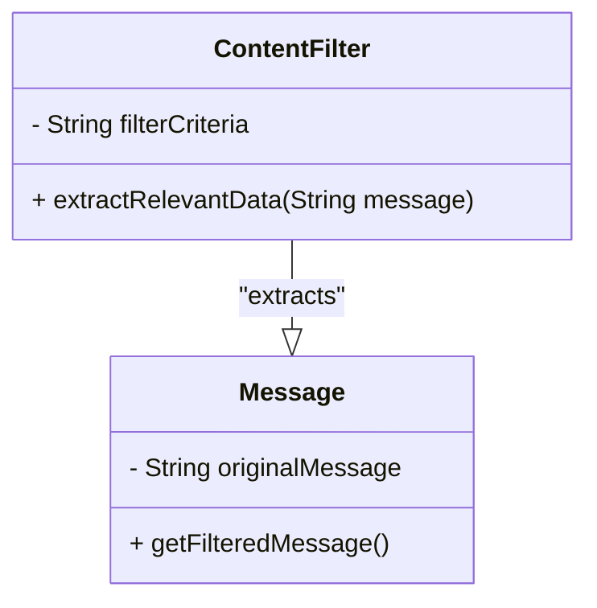
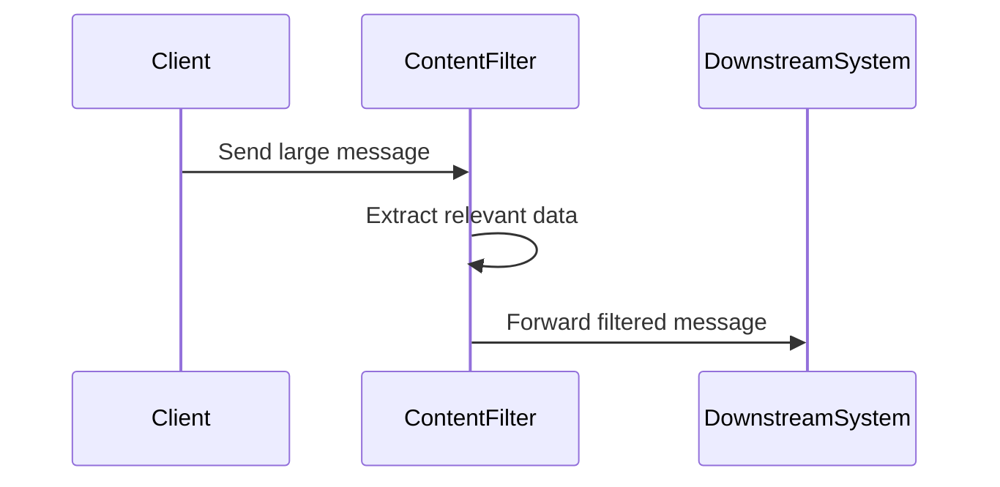

The **Content Filter** pattern addresses the need to simplify dealing with large messages by focusing on extracting and forwarding only the relevant data items.

### Intent

The primary intent of the Content Filter pattern is to transform a large inbound message into a smaller, more manageable message containing only the essential data needed for downstream processing.

### Also Known As

- Message Filter
- Data Filter

## Detailed Definition and Explanation

The Content Filter pattern works by identifying and extracting only the necessary data items from a message while discarding the rest. This is useful when messages contain large amounts of surplus information that is unnecessary for further processing. The filter ensures that only relevant data is passed downstream, optimizing processing efficiency and resource utilization.

### Key Features

- Extracts specified portions of the data from a larger message.
- Ensures smaller, more manageable message sizes.
- Reduces noise and superfluous information in the message flow.
- Enables downstream applications and services to only handle pertinent data.

### Code Examples

#### Java: Using Apache Camel

```java
import org.apache.camel.CamelContext;
import org.apache.camel.impl.DefaultCamelContext;
import org.apache.camel.builder.RouteBuilder;

public class ContentFilterExample {
    public static void main(String[] args) throws Exception {
        CamelContext context = new DefaultCamelContext();
        context.addRoutes(new RouteBuilder() {
            @Override
            public void configure() {
                from("direct:start")
                    .filter().xpath("/message/body/item")
                    .to("mock:result");
            }
        });
        context.start();
        Thread.sleep(5000);
        context.stop();
    }
}
```

#### Scala: Using Akka Streams

```scala
import akka.actor.ActorSystem
import akka.stream._
import akka.stream.scaladsl._
import akka.util.ByteString

import scala.concurrent._

object ContentFilterExample extends App {
  implicit val system = ActorSystem("ContentFilterExample")
  implicit val materializer = ActorMaterializer()

  val source = Source.single(ByteString("<message><body><item>Content</item></body></message>"))

  val filterFlow = Flow[ByteString].map { bs =>
    val text = bs.utf8String
    if (text.contains("<item>")) ByteString(text)
    else ByteString("")
  }

  val sink = Sink.foreach(println)

  source.via(filterFlow).runWith(sink).onComplete(_ => system.terminate())
}
```

### Example Class Diagram



### Example Sequence Diagram



## Benefits

- **Reduced Complexity**: Fewer data items to deal with.
- **Optimized Performance**: Less computational overhead for downstream systems.
- **Enhanced Focus**: Only critical data is forwarded for processing.

## Trade-offs

- **Initial Processing Overhead**: Filtering requires processing that may introduce a slight overhead.
- **Maintenance**: Filters need to be kept updated if the message structures change.

## When to Use

- When messages contain excess data that isn’t needed downstream.
- In scenarios of limited processing capabilities or bandwidth.
- To enhance processing speed and reduce storage requirements.

### Example Use Cases

- **Financial Transactions**: Filtering out only transaction amounts from large financial statements.
- **E-commerce**: Extracting order details from verbose order submission messages.
- **IoT**: Focusing on sensor values from complex data payloads.

## When Not to Use

- When entire message content is needed at later stages.
- Messages change dynamically and frequently.

## Related Design Patterns

- **Message Translator**: Converts messages to an acceptable format for the destination.
- **Content Enricher**: Enhances messages with additional data.

### References

- Gregory Hohpe and Bobby Woolf, [Enterprise Integration Patterns: Designing, Building, and Deploying Messaging Solutions](https://amzn.to/3XXncn8).
- Apache Camel Documentation, [link](https://camel.apache.org/).

## Credits

- Apache Camel, Akka, Spring Boot for providing frameworks to implement these patterns.

## Open Source Frameworks

- Apache Camel
- Akka Streams

## Cloud Computing

- **SAAS**: Filtering services when using applications with event-driven architectures.
- **PAAS**: Utilizing cloud platforms for deploying content filter services.
- **DAAS**: Data filtering services before data analytics.

## Suggested Books for Further Studies

- [Enterprise Integration Patterns: Designing, Building, and Deploying Messaging Solutions](https://amzn.to/3XXncn8) by Gregory Hohpe and Bobby Woolf.
- **Building Microservices** by Sam Newman.
- [Designing Data-Intensive Applications](https://amzn.to/4cuX2Na) by Martin Kleppmann.
