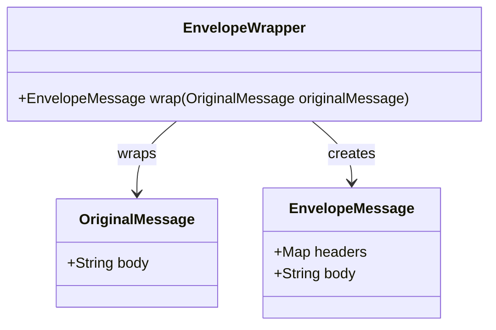
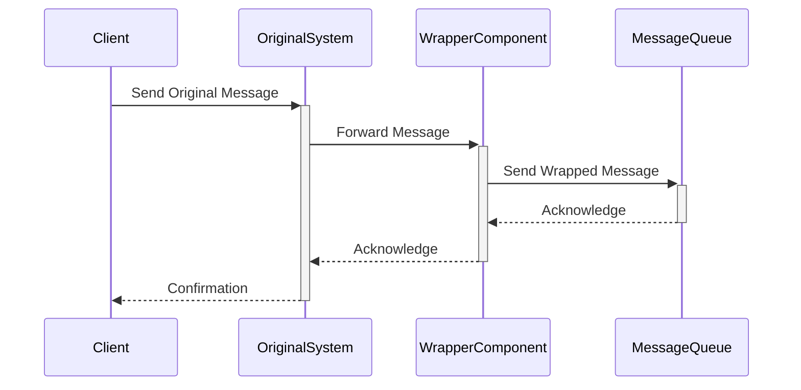

## Introduction

The Envelope Wrapper Pattern allows existing systems to participate in a messaging exchange that requires specific message formats, such as message header fields or encryption, by encapsulating the original message and adding the required metadata.

## Intent

To enable legacy systems or external systems to participate in a modern or specific communication channel that imposes certain requirements on the message format by wrapping the original message in a new envelope structure that meets these requirements.

## Also Known As

- Message Wrapper
- Envelope Pattern
- Message Envelope 

## Detailed Definitions and Explanations

The Envelope Wrapper Pattern allows you to encapsulate a core message within an "envelope" that includes required metadata, formatting compliance, and other needed header information. This structure helps to ensure systems can communicate effectively, even if they natively do not support the required format.

### Key Features

- **Adaptation:** Converts messages from existing formats into the required format for predefined messaging exchanges.
- **Encapsulation:** Packages the original message with necessary headers, metadata, or security information.
- **Decoupling:** Decouples the message format requirements from the core application logic, allowing easier integration.

### Code Examples

#### Java Example with Apache Camel

```java
from("direct:start")
    .process(new Processor() {
        public void process(Exchange exchange) throws Exception {
            Message originalMessage = exchange.getIn();
            Message envelopeMessage = new DefaultMessage(exchange.getContext());
            envelopeMessage.setBody(originalMessage.getBody());
            envelopeMessage.setHeader("MyHeader", "HeaderValue");
            // Add more headers or metadata as needed
            exchange.getIn().setBody(envelopeMessage);
        }
    })
    .to("direct:end");
```

#### Scala Example with Akka and Kafka

```scala
import akka.actor.ActorSystem
import akka.kafka.scaladsl.Producer
import akka.stream.scaladsl.Source
import org.apache.kafka.clients.producer.ProducerRecord

object EnvelopeWrapperExample extends App {
  implicit val system = ActorSystem("EnvelopeWrapperSystem")
  val envelopeWrapper = Flow[String].map { body =>
    val envelopeBody = s"""{ "headers": { "MyHeader": "HeaderValue" }, "body": "$body" }"""
    new ProducerRecord[String, String]("topic", envelopeBody)
  }

  Source(List("Message1", "Message2"))
    .via(envelopeWrapper)
    .runWith(Producer.plainSink(producerSettings))
}
```

### Example Class Diagrams



### Example Sequence Diagrams



## Benefits

- **Compatibility:** Allows legacy systems to participate in modern messaging protocols.
- **Security:** Facilitates the addition of necessary security elements like encryption.
- **Standardization:** Enforces standardized message structure without altering existing systems.

## Trade-offs

- **Overhead:** Adds extra processing steps and potential latency.
- **Complexity:** Introduces additional components into the system architecture.
- **Maintenance:** Requires ongoing maintenance to keep wrappers up to date with evolving protocol requirements.

## When to Use

- When integrating legacy systems with modern messaging infrastructure.
- When introducing additional metadata or security features to messages without altering the original system.
- When a unified message format is required across diversified platforms.

## Example Use Cases

- Integrating legacy financial systems with new payment processing infrastructure.
- Adding encryption headers and metadata for compliance in healthcare messaging.
- Standardizing messaging formats in multi-partner supply chain systems.

## When Not to Use and Anti-patterns

- **Simplicity Needed:** If the messaging infrastructure is already homogenous or complexity is unnecessary.
- **Performance Critical:** In highly latency-sensitive systems where overhead is a significant concern.
- **Direct Integration:** When direct API-based integration without message transformation is feasible.

## Related Design Patterns

- **Message Translator**: Used when the message content, not just the envelope, needs transformation.
- **Content Enricher**: Adds missing information to messages that the receiving system requires.
- **Security Wrapper**: A specific type of wrapper focused exclusively on adding security features.

## References and Credits

- [Enterprise Integration Patterns](https://www.enterpriseintegrationpatterns.com/Book/) by Gregor Hohpe and Bobby Woolf
- Documentation of frameworks such as Apache Camel, Mule, Akka, Apache Kafka, and Spring Boot.

## Open Source Frameworks and Tools

- **Apache Camel**: Facilitates the implementation of EIPs through simple Java APIs.
- **MuleSoft**: Provides a robust platform for building integration applications.
- **Spring Integration**: Offers messaging and integration support as part of the Spring ecosystem.
- **Akka Streams**: For reactive and scalable stream processing in a JVM environment.
- **Apache Kafka Streams**: For processing data stored in Kafka with a consistent message format.

## Cloud Computing and SaaS Considerations

Implementing envelope wrappers in cloud-based platforms (e.g., AWS Lambda, Azure Functions) ensures compatibility across distributed services without necessitating major changes to the existing infrastructure.

## Suggested Books for Further Study

- *Enterprise Integration Patterns* by Gregor Hohpe and Bobby Woolf
- [Designing Data-Intensive Applications](https://amzn.to/4cuX2Na) by Martin Kleppmann
- *Microservices Patterns* by Chris Richardson

By implementing the Envelope Wrapper Pattern, your system can smoothly transition into participating within different messaging infrastructures, ensuring compatibility, compliance, and seamless integration without overhauling the existing system.

---
