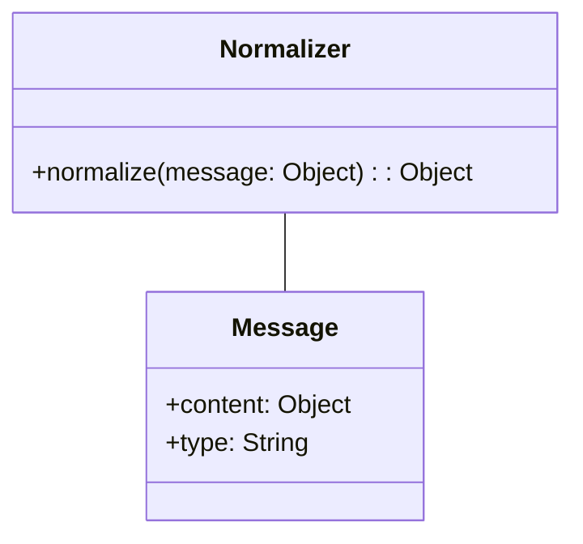
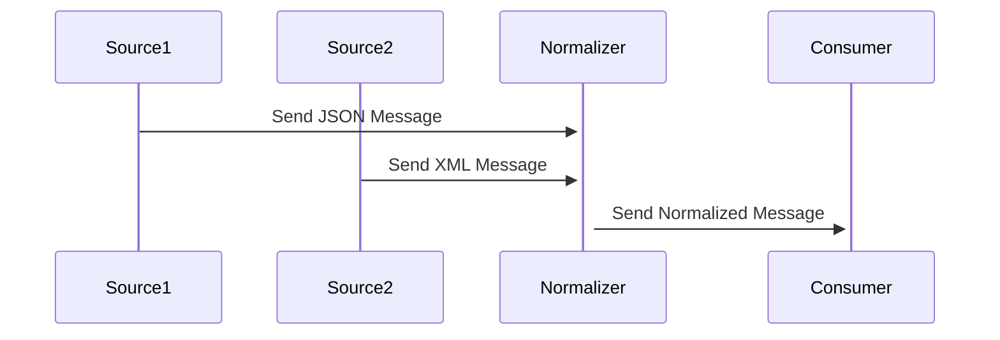

## Normalizer

### Definition
The Normalizer pattern handles the process of transforming various incoming message formats into a common format to ensure semantic equivalence.

### Intent
- To convert several different message formats into a uniform format.
- To streamline downstream processing by ensuring that all messages conform to a standard.

### Also Known As
- Canonical Data Model
- Data Transform
- Transformer

### Detailed Definition

The Normalizer pattern is essential in scenarios where you have multiple data sources sending the same information in different formats. Without a mechanism to standardize these incoming messages, further processing becomes cumbersome and error-prone.

### Key Features
- **Format Conversion**: Transforms a message from one format to another.
- **Schema Mapping**: Maps different schemas into a common schema.
- **Data Enrichment**: Enhances data completeness and accuracy.

### Diagrams

#### Class Diagram



Explanation: The `Normalizer` class takes a message object of varying type and content and ensures it is transformed into a formatted message.

#### Sequence Diagram



Explanation: The diagram shows how the normalizer takes messages in JSON and XML format from Source1 and Source2 respectively, and sends a unified, consistent message to the Consumer.

### Code Examples

#### Java Example using Spring Boot

```java
@Component
public class MessageNormalizer {
    public NormalizedMessage normalize(Object message) {
        if (message instanceof JSONMessage) {
            // Convert JSON to NormalizedMessage
        } else if (message instanceof XMLMessage) {
            // Convert XML to NormalizedMessage
        }
        // return NormalizedMessage
    }
}
```

#### Scala Example using Akka

```scala
class MessageNormalizer extends Actor {
  def receive: Receive = {
    case jsonMsg: JSONMessage => // Handle JSON
    case xmlMsg: XMLMessage => // Handle XML
    case _ => // Handle default
  }
}
```

### Benefits
- Simplifies processing by downstream systems.
- Reduces complexity by creating a standardized data model.
- Improves data quality and consistency.

### Trade-offs
- Additional processing overhead.
- Increased complexity in the transformation logic.
- Schema evolution might introduce additional changes.

### When to Use
- When dealing with multiple data sources having different formats.
- When aiming for a unified data processing pipeline.

### Example Use Cases
- Integrating data from different APIs (e.g., REST, SOAP).
- Aggregating data from various sensors with varying formats.

### When Not to Use
- For simple scenarios where all messages already come in a standardized format.
- When the performance overhead of transformation is too high.

### Anti-patterns
- **Format Creep**: Introducing too many formats can lead to an unmanageable system.
- **Over-normalization**: Unnecessary complex transformation logic hurting performance.

### Related Design Patterns
- **Content Enricher**: Adds additional data to the message.
- **Content Filter**: Filters unnecessary parts of a message and passes the rest for further processing.

### References and Credits
- [Enterprise Integration Patterns: Designing, Building, and Deploying Messaging Solutions](https://amzn.to/3XXncn8) by Gregor Hohpe and Bobby Woolf
- [Designing Data-Intensive Applications](https://amzn.to/4cuX2Na) by Martin Kleppmann

### Open Source Frameworks and Tools
- Apache Camel
- Spring Integration
- Mule ESB
- Akka Streams

### Cloud Computing, SAAS, DAAS, PAAS
- AWS Step Functions
- Azure Logic Apps
- Google Cloud Dataflow

### Further Reading
- [Enterprise Integration Patterns: Designing, Building, and Deploying Messaging Solutions](https://amzn.to/3XXncn8) by Gregor Hohpe and Bobby Woolf.

