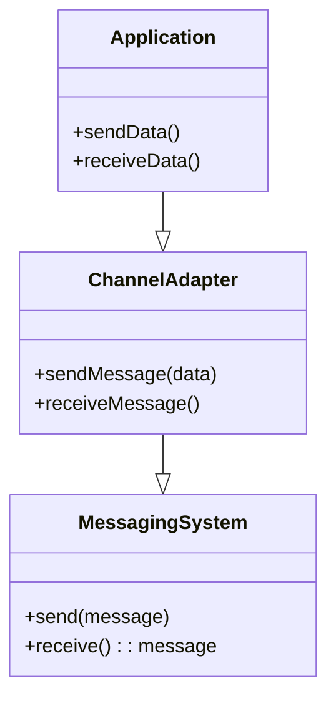

## Channel Adapter

The **Channel Adapter** pattern is a fundamental integration pattern that enables applications to send and receive messages from a messaging system. It’s particularly useful in scenarios where direct interaction with the messaging system’s APIs would introduce needless complexities and dependencies in your application code.

### Intent

Connect an application to a messaging system, enabling it to send and receive messages seamlessly.

### Also Known As

- Messaging Adapter
- Integration Adapter

### Detailed Explanation

A Channel Adapter is designed to abstract the interactions between an application and a message channel. It transforms the data from the application format to the messaging format and vice-versa, minimizing the dependencies on specific messaging APIs.

### Key Features

- **Decoupled Communication**: Isolates the application from the messaging system details.
- **Transformation**: Adapts data formats between the application and messaging system.
- **Flexible Integration**: Easily integrate new applications without modifying existing ones.

### Mermaids diagrams

#### Class Diagram



*Explanation*: The `Application` interacts with `ChannelAdapter` to send and receive data. The `ChannelAdapter` bridges the application with the `MessagingSystem` handling the format transformations.

#### Sequence Diagram

```mermaid
sequenceDiagram
    participant App as Application
    participant Adapter as ChannelAdapter
    participant MsgSys as MessagingSystem
    
    App->>Adapter: sendData(data)
    Adapter->>MsgSys: sendMessage(data)
    MsgSys->>MsgSys: Process Message
    return response
    Adapter->>App: send Confirmation
```

*Explanation*: This sequence diagram demonstrates an application's data sending process. The application sends data to the channel adapter, which then sends a formatted message to the messaging system.

### Implementation Examples

#### Java Example with Apache Camel

```java
import org.apache.camel.CamelContext;
import org.apache.camel.impl.DefaultCamelContext;
import org.apache.camel.builder.RouteBuilder;

public class ChannelAdapterExample {
    public static void main(String[] args) throws Exception {
        CamelContext context = new DefaultCamelContext();
        context.addRoutes(new RouteBuilder() {
            public void configure() {
                from("direct:start")
                  .to("jms:queue:exampleQueue")
                  .to("log:received");
            }
        });
        context.start();
    }
}
```

#### Scala Example with Akka

```scala
import akka.actor.ActorSystem
import akka.stream.ActorMaterializer
import akka.stream.alpakka.jms.scaladsl.JmsProducer
import akka.stream.alpakka.jms.JmsProducerSettings
import javax.jms.TextMessage
import org.apache.activemq.ActiveMQConnectionFactory

object ChannelAdapterApp extends App {
  implicit val system = ActorSystem("ChannelAdapterSystem")
  implicit val materializer = ActorMaterializer()

  val connectionFactory = new ActiveMQConnectionFactory("brokerURL")
  val settings = JmsProducerSettings(system, connectionFactory).withQueue("exampleQueue")

  val source = Source.single("Example Message")

  source.map(msg => JmsTextMessage(msg)).runWith(JmsProducer.textSink(settings))
}
```

### Benefits

- **Decoupling**: Minimizes the impact of messaging system changes on application code.
- **Ease of Integration**: Simplifies the process of connecting applications to the messaging system.
- **Code Reusability**: Promotes reusability of the integration layer.

### Trade-offs

- **Overhead**: Additional adapters can introduce performance overhead.
- **Complexity**: The requirement to maintain and deploy additional components.

### When to Use

- When developing applications that need to integrate with a messaging system.
- When isolating application code from messaging system specifics is critical.
- In a distributed system where different applications need to communicate through a message broker.

### Example Use Cases

- Integrating a legacy system with a modern messaging queue.
- Connecting microservices in a cloud-native architecture.
- Facilitating communication between disparate enterprise applications.

### When Not to Use

- If the application is designed to tightly integrate with a specific messaging API.
- In cases where lightweight and direct communication is sufficient.

### Related Patterns

- **Messaging Gateway**: A higher-level pattern that uses channel adapters to aggregate incoming messages.
- **Message Translator**: Transforms message formats between applications and the messaging system.

### References

- [Enterprise Integration Patterns](https://www.enterpriseintegrationpatterns.com/patterns/messaging/ChannelAdapter.html)
- [Apache Camel Documentation](https://camel.apache.org/manual/latest/channel-adapter.html)
- [Spring Integration Documentation](https://docs.spring.io/spring-integration/docs/current/reference/html/index.html)

### Open Source Frameworks

- Apache Camel
- Spring Integration
- Mule ESB
- Akka

### Cloud Computing

- **Microsoft Azure Service Bus**: Provides a fully managed enterprise message broker.
- **Amazon AWS SNS/SQS**: Connects decoupled microservices through messaging systems.
- **Google Cloud Pub/Sub**: Facilitates asynchronous messaging services.

### Books for Further Studies

- **Enterprise Integration Patterns** by Gregor Hohpe and Bobby Woolf
- **Spring Integration in Action** by Iwein Fuld and Jonas Partner

By understanding the Channel Adapter pattern, you can ensure that your applications can be efficiently decoupled from messaging systems and can easily evolve as integration requirements change.
