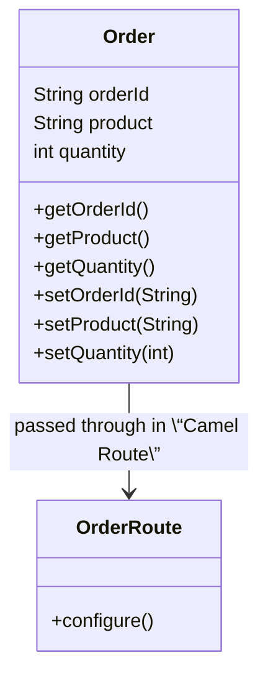
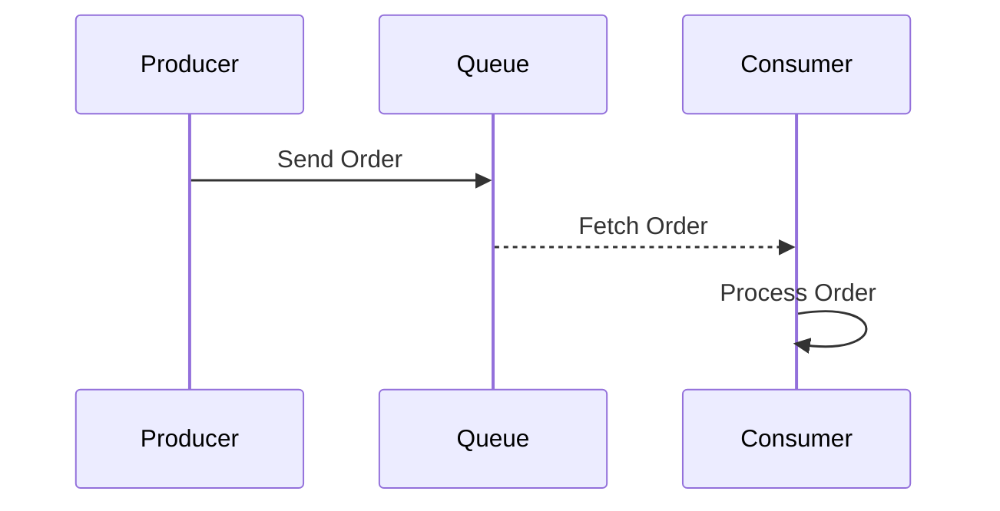
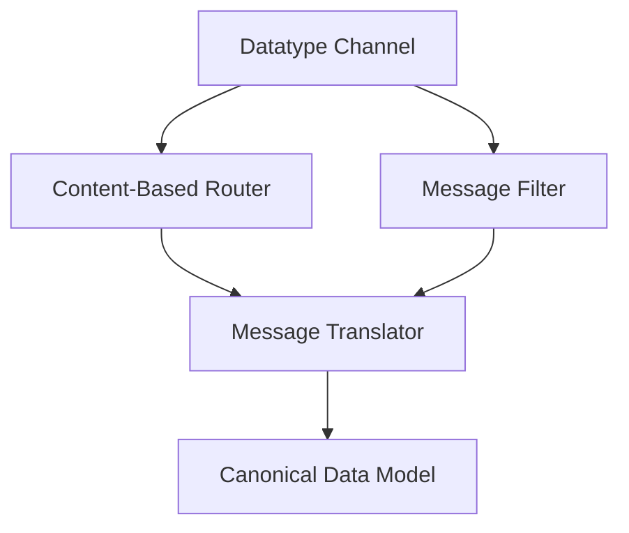

### Datatype Channel

The Datatype Channel pattern facilitates sending data items such that the receiver knows how to process them correctly. By establishing a channel dedicated to a specific data type, it ensures both the sender and receiver understand the data's structure and type.

#### Also Known As
- Type-specific Channel

#### Intent
Ensure data sent through a messaging system is understandable and processable by the receiver by delineating channels based on specific data types.

#### Explanation

By implementing a Datatype Channel, the sender and receiver communicate using a predefined format, reducing compatibility issues caused by data type mismatches.

#### Key Features

- Type Safety: Establish specific channels for different data types to avoid type-confusion.
- Simplifies Parsing: The receiver doesn't need to determine the data type, simplifying processing logic.
- Clear Communication: Enhances clarity by associating each channel with a specific data type.

#### Example in Java (Apache Camel)
Here's an example of using Apache Camel to implement a Datatype Channel for sending `Order` objects:

```java
// Define the Order class
public class Order {
    private String orderId;
    private String product;
    private int quantity;

    // Getters and Setters
}

// Camel Route for the Order data type channel
import org.apache.camel.builder.RouteBuilder;

public class OrderRoute extends RouteBuilder {
    @Override
    public void configure() {
        from("direct:orders")
            .to("jms:queue:orderQueue")
            .log("Order processed: ${body}");
    }
}
```

#### Example in Scala (Akka)
Here's an Akka example where we send `Order` objects via a specific channel:

```scala
import akka.actor.{Actor, ActorSystem, Props}
import akka.stream.{ActorMaterializer, Materializer}
import akka.stream.scaladsl.{Sink, Source}

// Define the Order class
case class Order(orderId: String, product: String, quantity: Int)

// Actor that processes Order messages
class OrderActor extends Actor {
  def receive = {
    case order: Order => println(s"Processing order: $order")
  }
}

object DatatypeChannelExample extends App {
  implicit val system: ActorSystem = ActorSystem("DatatypeChannel")
  implicit val materializer: Materializer = ActorMaterializer()

  val orderActor = system.actorOf(Props[OrderActor], "orderActor")

  val orders = List(
    Order("1", "Widget", 5),
    Order("2", "Gadget", 9)
  )

  Source(orders)
    .to(Sink.foreach(orderActor ! _))
    .run()
}
```

#### Class Diagram



#### Sequence Diagram



#### Benefits

- **Consistency**: Ensure that data is consistently typed between services.
- **Decoupling**: Sender and receiver do not need to negotiate data formats on-the-fly.
- **Clear Contracts**: Each channel has a clear contract about what type of data it will carry.

#### Trade-offs

- **Channel Proliferation**: May lead to an increased number of channels to manage.
- **Complexity**: Requires initial setup and definition of channels.

#### When to Use

- Use when different types of data need to be communicated consistently within a system.
- When sender and receiver responsibilities are clearly delineated and should not involve dynamic type resolution.

#### Example Use Cases

- E-commerce systems where order information, shipping updates, and payment confirmations are handled on different channels.
- Microservices architectures where individual services need to handle specific data artifacts.

#### When Not to Use and Anti-patterns

- Avoid if the system needs to handle very dynamic or loosely defined message structures.
- Anti-pattern: Overcomplicating with unnecessary additional channels especially when simpler typed messages would suffice.

#### Related Design Patterns

- **Content-Based Router**: Routes messages to different channels based on data content.
- **Message Translator**: Translates message formats for different systems.

#### References and Credits

- *Enterprise Integration Patterns* by Gregor Hohpe and Bobby Woolf
- Apache Camel Documentation
- Akka Documentation

#### Open Source Frameworks
- Apache Camel
- Mule ESB
- Spring Integration

#### Third-Party Tools
- RabbitMQ
- ActiveMQ

#### Cloud Computing

- SaaS: Amazon Simple Queue Service (SQS)
- PaaS: Google Cloud Pub/Sub

#### Further Study
- *Enterprise Integration Patterns* by Gregor Hohpe and Bobby Woolf
- [Designing Data-Intensive Applications](https://amzn.to/4cuX2Na) by Martin Kleppmann

##### Grouping Related Patterns (Mermaid Diagram)


Description:
- **Content-Based Router**: Directs messages to different channels based on their content.
- **Message Filter**: Filters messages of interest from a channel.
- **Message Translator**: Converts message formats for interoperability.
- **Canonical Data Model**: Establishes a common data model for diverse systems to reduce integration complexity.

Each pattern aids in managing and transforming data efficiently, enhancing system interoperability.
