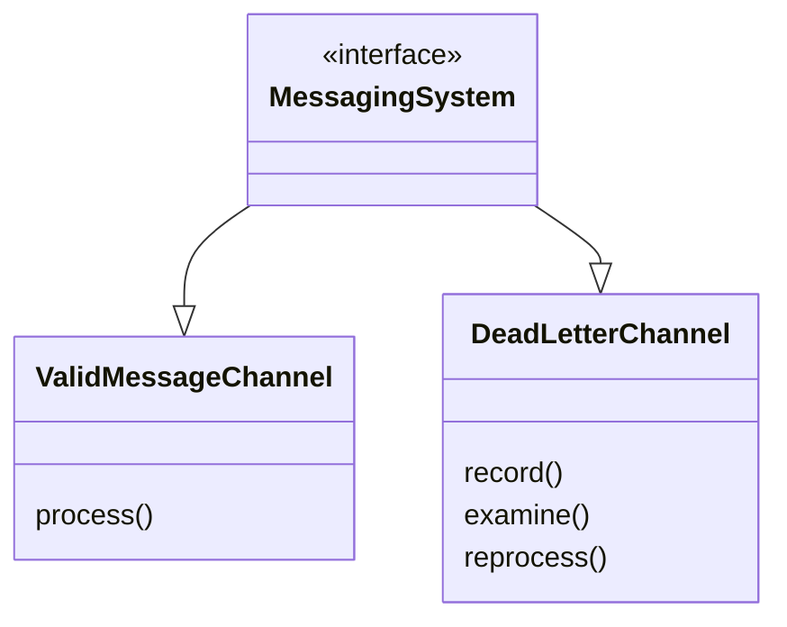
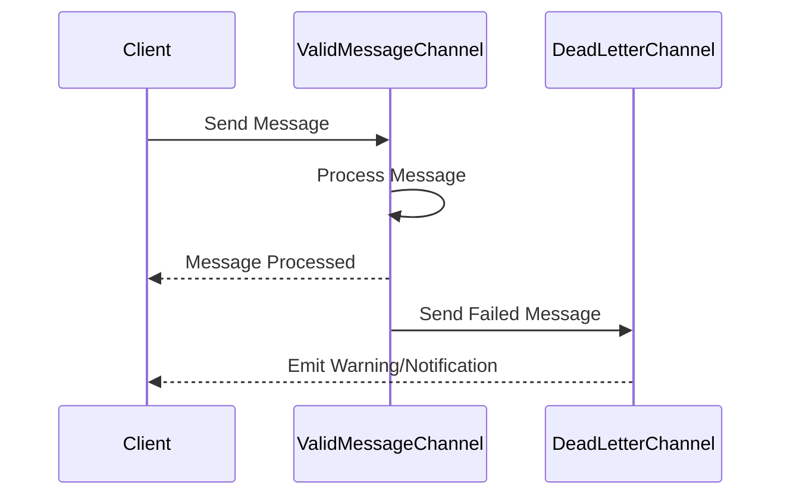

## Definition

The Dead Letter Channel pattern handles messages within a messaging system that cannot be delivered to their intended destination. When a message cannot be processed, it is routed to a dedicated channel known as the Dead Letter Channel (DLC) for further inspection and handling.

## Intent

The intent of the Dead Letter Channel is to prevent faulty or unprocessable messages from stalling the entire message processing system. It provides a way to isolate and handle such messages effectively.

## Also Known As

- Dead Letter Queue
- Invalid Message Channel

## Detailed Definitions and Explanations

### Key Features

- **Isolation**: Restricts problematic messages to a contained environment.
- **Monitoring**: Facilitates monitoring of undelivered messages.
- **Reprocessing**: Supports potential reprocessing of sorted messages.
- **Analysis**: Enables detailed analysis to understand reasons for failures.

### Benefits

- Ensures the primary message processing system remains robust.
- Provides a clear path for addressing message handling issues.
- Simplifies error diagnosis and resolution.

### Trade-offs

- Adds additional infrastructure complexity.
- Requires monitoring and management by operational teams.
- Potentially large number of undeliverable messages can overwhelm the DLC.

### When to Use

- In systems with high reliability and strict delivery guarantees.
- Where undelivered or faulty messages need detailed inspection and reprocessing.

### When Not to Use

- Simple systems where failed messages can be discarded without significant impacts.
- Systems with flexible message delivery requirements.

### Example Use Cases

- Payment processing systems for undeliverable transaction messages.
- E-commerce platforms for orders that fail specific validation checks.

## Example Code in Java and Scala

### Example in Java with Apache Camel

```java
import org.apache.camel.builder.RouteBuilder;
import org.apache.camel.main.Main;

public class DeadLetterChannelExample {

    public static void main(String[] args) throws Exception {
        Main main = new Main();
        main.configure().addRoutesBuilder(new RouteBuilder() {
            @Override
            public void configure() {
                errorHandler(deadLetterChannel("jms:deadLetterQueue"));
                
                from("jms:incomingOrders")
                    .process(exchange -> {
                        // Business logic here
                        // Throw an Exception to imitate processing failure
                        throw new Exception("Order processing failed!");
                    });
            }
        });
        
        main.run(args);
    }
}
```

### Example in Scala with Apache Kafka

```scala
import org.apache.kafka.clients.consumer.KafkaConsumer
import org.apache.kafka.clients.producer.{KafkaProducer, ProducerRecord}

import java.util.Properties
import scala.collection.JavaConverters._

object DeadLetterChannelExample extends App {

  val props: Properties = new Properties()
  props.put("bootstrap.servers", "localhost:9092")
  props.put("group.id", "group1")
  props.put("key.deserializer", "org.apache.kafka.common.serialization.StringDeserializer")
  props.put("value.deserializer", "org.apache.kafka.common.serialization.StringDeserializer")
  props.put("key.serializer", "org.apache.kafka.common.serialization.StringSerializer")
  props.put("value.serializer", "org.apache.kafka.common.serialization.StringSerializer")

  val consumer = new KafkaConsumer[String, String](props)
  consumer.subscribe(List("incomingOrders").asJava)

  val producer = new KafkaProducer[String, String](props)

  while (true) {
    val records = consumer.poll(1000).asScala
  
    for (record <- records) {
        try {
            // Business logic here
            // Throw an Exception to imitate processing failure
            throw new Exception("Order processing failed!")
        } catch {
            case e: Exception =>
                val deadLetterRecord = new ProducerRecord[String, String]("deadLetterQueue", record.key, record.value)
                producer.send(deadLetterRecord)
        }
    }
  }
}
```

## Example Class Diagram



### Explanation

- `MessagingSystem` interface defines the common behavior.
- `ValidMessageChannel` processes the correct messages.
- `DeadLetterChannel` handles the detailed examination and reprocessing of failed messages.

## Example Sequence Diagram



### Explanation

- Client sends a message to `ValidMessageChannel`.
- `ValidMessageChannel` attempts to process the message.
- Failed message is redirected to `DeadLetterChannel`.
- Optionally, a notification or warning is sent back to the client.

## Related Design Patterns

- **Retry Pattern**: Attempts to process the message multiple times before moving it to a Dead Letter Channel.
- **Circuit Breaker**: Stops processing retries after a certain number of failures.

## References

- Gregor Hohpe, Bobby Woolf, [Enterprise Integration Patterns: Designing, Building, and Deploying Messaging Solutions](https://amzn.to/3XXncn8)
- Apache Camel Documentation
- Spring Boot Documentation
- Apache Kafka Documentation

## Open Source Frameworks and Third Party Tools

- **Apache Camel** - Integrates easily with Dead Letter Channels.
- **Spring Boot** - Provides extensive support for implementing DLC.
- **Apache Kafka** - Commonly used for message handling, supports Dead Letter Queues.

## Cloud Computing

- **Amazon SQS Dead Letter Queues (DLQs)**
- **Azure Service Bus Dead-letter Queues**

## Suggested Books for Further Studies

- *[Enterprise Integration Patterns: Designing, Building, and Deploying Messaging Solutions](https://amzn.to/3XXncn8)* by Gregor Hohpe and Bobby Woolf
- *[Designing Data-Intensive Applications](https://amzn.to/4cuX2Na)* by Martin Kleppmann

By using this structured approach with clear definitions, diagrams, code examples, and thoughtful considerations, you can efficiently implement the Dead Letter Channel pattern in your messaging systems.
