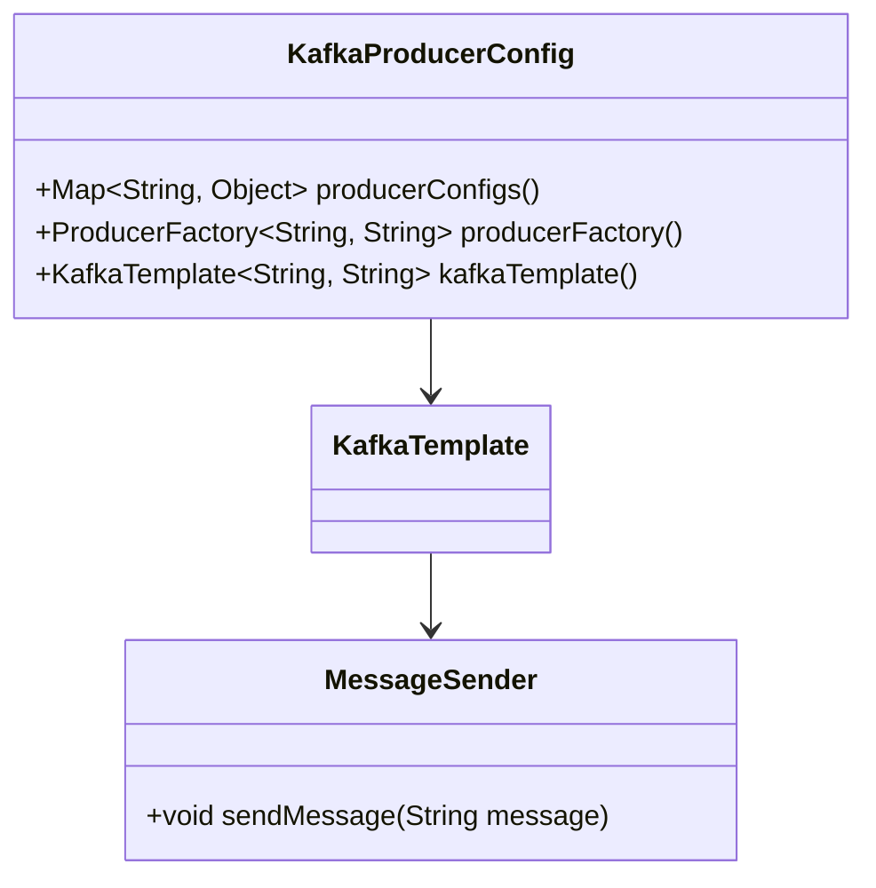
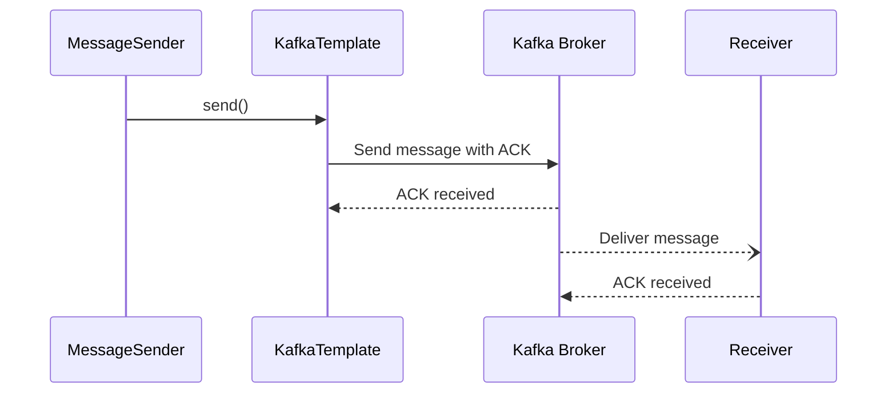

## Guaranteed Delivery

### Definition
The Guaranteed Delivery pattern ensures that a message sent by a system is reliably delivered to the intended recipient, even in the face of failures such as network issues or server crashes.

### Intent
To ensure that a message will eventually reach its destination no matter the failures that may occur in the network or system. It includes mechanisms for message persistence and re-delivery to ensure reliability.

### Also Known As
- Reliable Delivery
- Assured Delivery

### Detailed Explanation
Guaranteed Delivery requires that messages are stored persistently so they are not lost in case of system failure. It often involves acknowledgment mechanisms to confirm receipt of messages, and retry mechanisms to resend messages that were not acknowledged.

### Key Features
- **Persistence**: Messages are stored persistently to ensure no data loss.
- **Acknowledgment**: Recipient systems send back confirmations upon receiving messages.
- **Retry Mechanisms**: System automatically retries sending messages that were not acknowledged.
- **Failover Handling**: Mechanisms to handle system restarts, crashes, and network failures.

### Example Code
#### Java (using Spring Boot with Apache Kafka)

```java
@SpringBootApplication
public class GuaranteedDeliveryApplication {

    public static void main(String[] args) {
        SpringApplication.run(GuaranteedDeliveryApplication.class, args);
    }
}

@Configuration
class KafkaProducerConfig {
    @Value("${kafka.bootstrap-servers}")
    private String bootstrapServers;

    @Bean
    public Map<String, Object> producerConfigs() {
        Map<String, Object> props = new HashMap<>();
        props.put(ProducerConfig.BOOTSTRAP_SERVERS_CONFIG, bootstrapServers);
        props.put(ProducerConfig.KEY_SERIALIZER_CLASS_CONFIG, StringSerializer.class);
        props.put(ProducerConfig.VALUE_SERIALIZER_CLASS_CONFIG, StringSerializer.class);
        props.put(ProducerConfig.ACKS_CONFIG, "all"); // Ensure message is acknowledged by all in-sync replicas
        props.put(ProducerConfig.RETRIES_CONFIG, Integer.MAX_VALUE); // Retry if message sending fails
        return props;
    }

    @Bean
    public ProducerFactory<String, String> producerFactory() {
        return new DefaultKafkaProducerFactory<>(producerConfigs());
    }

    @Bean
    public KafkaTemplate<String, String> kafkaTemplate() {
        return new KafkaTemplate<>(producerFactory());
    }
}

@RestController
@RequestMapping("/messages")
class MessageController {

    @Autowired
    private KafkaTemplate<String, String> kafkaTemplate;

    @PostMapping
    public ResponseEntity<String> sendMessage(@RequestBody String message) {
        kafkaTemplate.send("my-topic", message);
        return ResponseEntity.ok("Message sent");
    }
}
```

#### Scala (using Apache Kafka and Akka)

```scala
import akka.actor.{Actor, ActorSystem, Props}
import com.typesafe.config.ConfigFactory
import kafka.producer.{KeyedMessage, ProducerConfig}

class MessageSender(producer: kafka.javaapi.producer.Producer[String, String]) extends Actor {
  override def receive: Receive = {
    case message: String =>
      producer.send(new KeyedMessage[String, String]("my-topic", message))
  }
}

object GuaranteedDeliveryApp extends App {
  val config = ConfigFactory.load()
  val actorSystem = ActorSystem("GuaranteedDeliverySystem")

  val kafkaProps = new java.util.Properties()
  kafkaProps.put("metadata.broker.list", config.getString("kafka.broker.list"))
  kafkaProps.put("serializer.class", "kafka.serializer.StringEncoder")
  kafkaProps.put("request.required.acks", "1")

  val producerConfig = new ProducerConfig(kafkaProps)
  val kafkaProducer = new kafka.javaapi.producer.Producer[String, String](producerConfig)

  val sender = actorSystem.actorOf(Props(new MessageSender(kafkaProducer)), "sender")
  sender ! "Test message"
}
```

### Example Class Diagram



### Example Sequence Diagram



### Benefits
- **Reliability**: Ensures that messages are delivered even in case of failures.
- **Resilience**: Faults in network or system do not result in message loss.
- **Persistence**: Ensures data persistence.

### Trade-offs
- **Complexity**: Adds complexity to system architecture with acknowledgment and retry mechanisms.
- **Latency**: Could introduce latency due to retry and acknowledgment processes.
- **Resource Consumption**: Requires more system resources for persistence and retry operations.

### When to Use
- When it is critical that no messages be lost between sender and receiver.
- In financial transactions, order processing systems, and logging systems where message integrity and completeness are crucial.

### Example Use Cases
- **Financial Systems**: Ensuring transaction messages are not lost.
- **Order Processing**: Reliable delivery of order details to fulfillment systems.
- **Distributed Logging**: Ensuring logs are not lost in transit for compliance and auditing.

### When Not to Use and Anti-patterns
- **Low Importance Messages**: If messages are not critical, added complexity may not justify.
- **Real-time Systems**: Where latency is a critical factor and retries/acknowledgments introduce unacceptable delays.

### Related Design Patterns
- **Message Acknowledgment Pattern**: Explicit acknowledgment of received messages.
- **Message Store Pattern**: Persisting messages to avoid loss.

### References
- [Enterprise Integration Patterns by Gregor Hohpe and Bobby Woolf](https://www.enterpriseintegrationpatterns.com/)
- [Kafka](https://kafka.apache.org/)
- [Akka Documentation](https://doc.akka.io/docs/akka/current/)

### Open Source Frameworks and Tools
- **Apache Kafka**: Distributed streaming platform that supports fault-tolerant message delivery.
- **Spring Boot**: Framework for building Java applications with Kafka integration.
- **Akka**: Toolkit for building reliable, resilient applications with Scala.

### Cloud Computing Providers
- **Amazon Web Services (AWS)**: Amazon Kinesis for real-time processing of streaming data.
- **Google Cloud Platform (GCP)**: Google Pub/Sub for reliable, asynchronous messaging.

### Suggested Books for Further Studies
- [Building Microservices: Designing Fine-Grained Systems](https://amzn.to/3RYRz96) by Sam Newman
- [Enterprise Integration Patterns: Designing, Building, and Deploying Messaging Solutions](https://amzn.to/3XXncn8) by Gregor Hohpe and Bobby Woolf

By adhering to the Guaranteed Delivery pattern, enterprises can ensure reliable and fault-tolerant communication across distributed systems, maintaining data integrity and providing a resilient system design.
