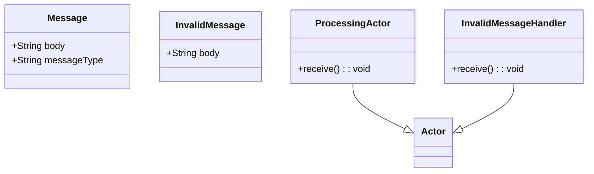
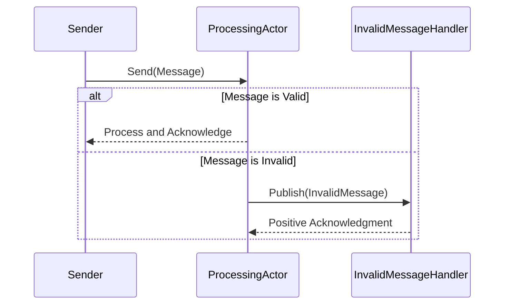
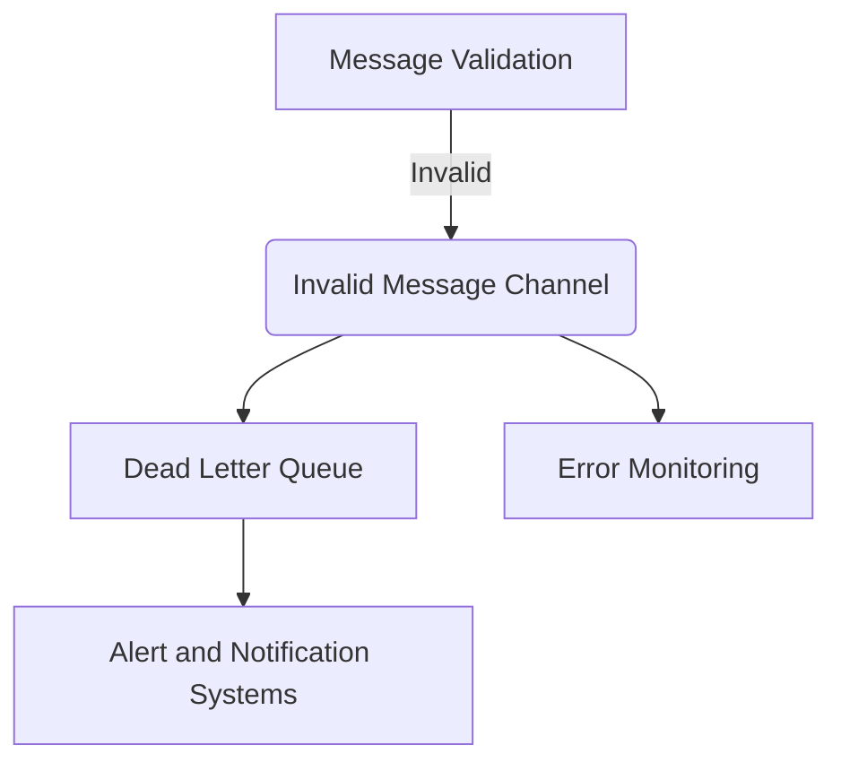

## Invalid Message Channel

### Definition
The Invalid Message Channel pattern provides a way to gracefully handle messages that cannot be processed by routing them to a dedicated channel for further analysis or remediation.

### Intent
The main intent of this pattern is to ensure that unprocessable or faulty messages do not disrupt the main message flow and can be handled separately.

### Also Known As
- Dead Letter Channel
- Error Channel
- Dead Letter Queue

### Detailed Definitions and Explanations
An Invalid Message Channel essentially acts as a quarantined area for faulty messages. This allows the system to identify and fix issues without impacting the main flow of valid messages.

### Key Features
- Isolation of invalid messages to a dedicated channel.
- Facilitation of testing and debugging of problematic messages.
- Ensuring the robustness of the main message processing pipeline.

### Code Examples

#### Java Example with Apache Camel
```java
import org.apache.camel.builder.RouteBuilder;
import org.apache.camel.impl.DefaultCamelContext;

public class InvalidMessageChannelExample {
    public static void main(String[] args) throws Exception {
        DefaultCamelContext context = new DefaultCamelContext();
        context.addRoutes(new RouteBuilder() {
            @Override
            public void configure() throws Exception {
                errorHandler(deadLetterChannel("jms:queue:invalid-message-queue"));

                from("jms:queue:input-queue")
                    .choice()
                        .when(body().isNotNull().and(header("MessageType").isEqualTo("Valid")))
                            .to("jms:queue:output-queue")
                        .otherwise()
                            .throwException(new IllegalArgumentException("Invalid message"));
            }
        });
        context.start();
        Thread.sleep(5000);
        context.stop();
    }
}
```

#### Scala Example with Akka
```scala
import akka.actor.{Actor, ActorSystem, Props}
import akka.routing.{ActorRefRoutee, Router, RoundRobinRoutingLogic}

object InvalidMessageChannelExample extends App {
  case class Message(body: String, messageType: String)
  case class InvalidMessage(body: String)

  class ProcessingActor extends Actor {
    def receive: Receive = {
      case Message(body, "Valid") => println(s"Processing valid message: $body")
      case Message(body, _)       => context.system.eventStream.publish(InvalidMessage(body))
    }
  }

  class InvalidMessageHandlerActor extends Actor {
    def receive: Receive = {
      case InvalidMessage(body) => println(s"Handling invalid message: $body")
    }
  }

  val system = ActorSystem("InvalidMessageChannelSystem")
  val processingActor = system.actorOf(Props[ProcessingActor], "processingActor")
  val invalidMessageHandler = system.actorOf(Props[InvalidMessageHandlerActor], "invalidMessageHandler")

  system.eventStream.subscribe(invalidMessageHandler, classOf[InvalidMessage])

  val router = Router(RoundRobinRoutingLogic(), Vector(
    ActorRefRoutee(processingActor)
  ))

  router.route(Message("This is a valid message", "Valid"), Actor.noSender)
  router.route(Message("This is an invalid message", "Invalid"), Actor.noSender)
}
```

### Example Class Diagrams
#### Class Diagram


### Example Sequence Diagrams
#### Sequence Diagram


### Benefits
- Efficient handling of error messages without grappling the entire message pipeline.
- Better logging, monitoring, and debugging via segregated error channels.
- Can be used for alerting and notification of system administrators or automated systems.

### Trade-offs
- Introduces an additional channel which might slightly increase complexity.
- It may require additional resources to store and manage invalid messages.
- Handling invalid messages separately could complicate workflow management.

### When to Use
- When the main message processing flow can't afford to be disrupted by invalid messages.
- In robust systems where error messages need special handling and logging.
- In systems that require detailed audits and monitoring of invalid transactions.

### Example Use Cases
- Financial transactions where invalid transactions are isolated for compliance and review.
- E-commerce orders processing where invalid orders are segregated for further investigation.
- IoT device data streams, where corrupted or anomalous data should be isolated and inspected.

### When Not to Use and Anti-Patterns
- For simple applications with minimal error processing needs.
- When system complexity outweighs the benefits of separate invalid message handling.

### Related Design Patterns
- **Dead Letter Queue:** Well-known alternative name for the Invalid Message Channel pattern.
- **Retry Pattern:** Ensuring failed messages are retried before being designated invalid.
- **Circuit Breaker Pattern:** To stop error propagation and execute fallback logic.

### References and Credits
- *Enterprise Integration Patterns* by Gregor Hohpe and Bobby Woolf.
- [Apache Camel Dead Letter Channel](https://camel.apache.org/manual/latest/dead-letter-channel.html)
- [Akka EventStream Documentation](https://doc.akka.io/docs/akka/current/event-bus.html)

### Open Source Frameworks and Tools
- **Apache Camel:** Routing and mediation engine.
- **Akka:** Toolkit for building concurrent and distributed systems.
- **Spring Integration:** Facilitate message-driven microservices.

### Cloud Computing Implications
- Ensure your PAAS/SAAS provider offers sufficient infrastructure for additional message queues/ channels.
- Evaluate against cloud cost implications if using dedicated error channels across large-scale systems.

### Suggested Books for Further Studies
- [Enterprise Integration Patterns: Designing, Building, and Deploying Messaging Solutions](https://amzn.to/3XXncn8) by Gregor Hohpe and Bobby Woolf.
- [Designing Distributed Systems: Patterns and Paradigms for Scalable, Reliable Services](https://amzn.to/4cwzzLv) by Brendan Burns.

### Group Patterns
#### Error Handling Patterns

### Effective Problem-Solving Guidance
Grouping patterns like Invalid Message Channel with related error handling patterns such as Dead Letter Queue and Error Monitoring ensures a systematic approach to addressing message processing errors. Employ these patterns collectively to create resilient, manageable, and monitored messaging systems.

---

The Invalid Message Channel pattern allows for a structured way to handle messages that cannot be processed, ensuring the robustness and resiliency of your messaging systems by moving non-compliance out of the main flow.

