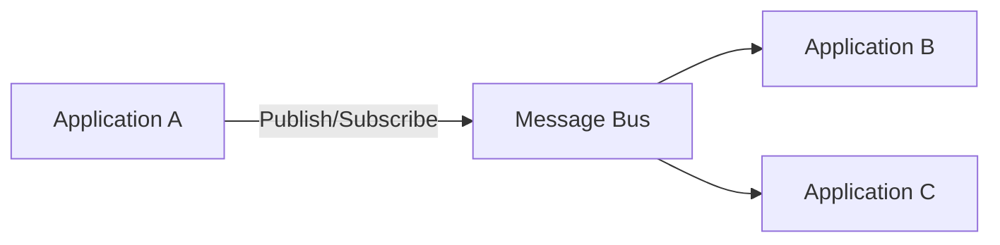
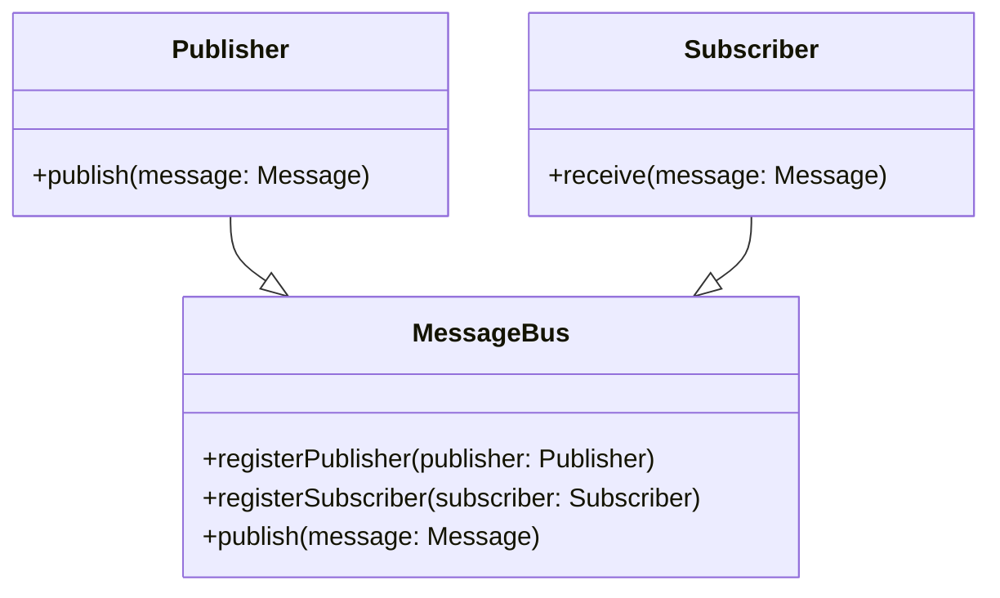
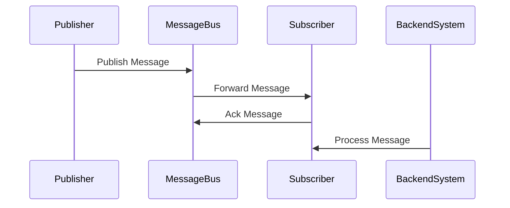
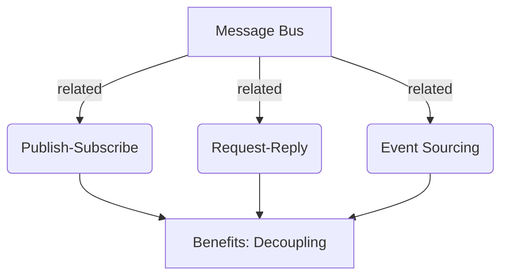

## Definition

A Message Bus is an architectural pattern that allows multiple applications to communicate and work together using messaging protocols. It helps to decouple the applications, making the overall system more flexible and easier to manage.

## Intent

The intent of the Message Bus pattern is to enable separate applications to collaborate in a loosely coupled manner, such that individual applications can be added, removed, or modified without affecting the others.

## Also Known As

- Enterprise Service Bus (ESB)
- Message-Oriented Middleware (MOM)
- Event Bus

## Detailed Explanation

A Message Bus architecture involves a centralized logical channel (the Bus) where different applications publish and subscribe to messages. The bus ensures the routing of messages from producers to consumers based on specific rules.

To illustrate the pattern, consider the following simplified architecture diagram:



### Key Features

- **Decoupling**: Different applications are decoupled from each other. The message bus handles the communication.
- **Scalability**: You can easily add or remove applications without major changes.
- **Flexibility**: Supports various communication patterns like publish/subscribe, request/reply, etc.
- **Fault Tolerance**: Ensures communication continues even if some applications fail.

## Code Examples

### Java with Apache Kafka and Spring Boot

**Producer Example**

```java
@SpringBootApplication
public class ProducerApplication {

    public static void main(String[] args) {
        SpringApplication.run(ProducerApplication.class, args);
    }

    @Bean
    public KafkaTemplate<String, String> kafkaTemplate() {
        return new KafkaTemplate<>(new DefaultKafkaProducerFactory<>(producerConfigs()));
    }

    @Bean
    public Map<String, Object> producerConfigs() {
        Map<String, Object> properties = new HashMap<>();
        properties.put(ProducerConfig.BOOTSTRAP_SERVERS_CONFIG, "localhost:9092");
        properties.put(ProducerConfig.KEY_SERIALIZER_CLASS_CONFIG, StringSerializer.class);
        properties.put(ProducerConfig.VALUE_SERIALIZER_CLASS_CONFIG, StringSerializer.class);
        return properties;
    }

    @Bean
    public CommandLineRunner sendData(KafkaTemplate<String, String> kafkaTemplate) {
        return args -> kafkaTemplate.send("my-topic", "Hello, World!");
    }
}
```

**Consumer Example**

```java
@SpringBootApplication
public class ConsumerApplication {

    public static void main(String[] args) {
        SpringApplication.run(ConsumerApplication.class, args);
    }

    @KafkaListener(topics = "my-topic")
    public void listen(String message) {
        System.out.println("Received message: " + message);
    }
}
```

### Scala with Akka

**Producer Example**

```scala
import akka.actor.ActorSystem
import akka.kafka.ProducerSettings
import akka.kafka.scaladsl.SendProducer
import org.apache.kafka.clients.producer.ProducerRecord
import org.apache.kafka.common.serialization.StringSerializer

object KafkaProducerExample extends App {
  implicit val system: ActorSystem = ActorSystem("kafka-producer-system")

  val producerSettings = ProducerSettings(system, new StringSerializer, new StringSerializer)
      .withBootstrapServers("localhost:9092")

  val producer = SendProducer(producerSettings)

  producer.send(new ProducerRecord[String, String]("my-topic", "Hello, World!"))

  system.terminate()
}
```

**Consumer Example**

```scala
import akka.actor.ActorSystem
import akka.kafka.ConsumerSettings
import akka.kafka.scaladsl.Consumer
import akka.stream.scaladsl.Sink
import org.apache.kafka.clients.consumer.ConsumerConfig
import org.apache.kafka.common.serialization.StringDeserializer

object KafkaConsumerExample extends App {
  implicit val system: ActorSystem = ActorSystem("kafka-consumer-system")

  val consumerSettings = ConsumerSettings(system, new StringDeserializer, new StringDeserializer)
    .withBootstrapServers("localhost:9092")
    .withGroupId("my-group")
    .withProperty(ConsumerConfig.AUTO_OFFSET_RESET_CONFIG, "earliest")

  Consumer
    .plainSource(consumerSettings, Subscriptions.topics("my-topic"))
    .runWith(Sink.foreach(println))

  system.terminate()
}
```

## Diagrams and Explanation

### Class Diagram



In this diagram, the `MessageBus` class interfaces with both `Publisher` and `Subscriber` classes to facilitate communication through messages.

### Sequence Diagram



This sequence diagram depicts a typical message flow in a message bus architecture. A publisher sends a message to the message bus, which then forwards it to the appropriate subscriber.

## Benefits

- **Loose Coupling**: Applications can be independently developed and deployed.
- **Scalability**: Easier to scale as each service can be scaled independently.
- **Adaptability**: Flexibly allows the addition of new applications and services.

## Trade-offs

- **Complexity**: Introduces additional layers and can complicate troubleshooting.
- **Latency**: There might be an increase in message delivery time due to the intermediary bus.
- **Reliability**: Requires robust monitoring and handling mechanisms.

## When to Use

- When you need to decouple systems to allow independent development and scaling.
- When orchestrating tasks across multiple applications.
- In environments with high levels of communication and interaction between various services.

## Example Use Cases

- **Financial Services**: For processing transactions between various systems securely and reliably.
- **E-commerce**: To handle orders, inventory, and customer communications in decoupled ways.
- **Microservices Architectures**: To manage the interactions between different microservices.

## When Not to Use

- In simple applications where direct communication suffices.
- If real-time, low-latency communication is required.

## Anti-patterns

- **Tightly Coupled Systems**: Avoid creating dependencies between services through the message bus.
- **Overuse**: Employ message buses only when the benefits outweigh the complexity.

## Related Design Patterns

- **Publish/Subscribe**: An extension of the message bus where subscribers can dynamically choose topics.
- **Request/Reply**: Message-based communication that includes response mechanisms.

## References

- [Enterprise Integration Patterns: Designing, Building, and Deploying Messaging Solutions](https://amzn.to/3XXncn8) by Gregor Hohpe and Bobby Woolf
- [Microservices Patterns: With examples in Java](https://amzn.to/4cSXzYV) by Chris Richardson
- [Building Microservices: Designing Fine-Grained Systems](https://amzn.to/3RYRz96) by Sam Newman

## Open Source Frameworks

- **Apache Kafka**: A distributed streaming platform.
- **RabbitMQ**: A message broker that implements the Advanced Message Queuing Protocol (AMQP).
- **ActiveMQ**: An open source messaging server.

## Third Party Tools

- **Spring Cloud Stream**: Framework for building message-driven microservices applications.
- **Camel**: A library from Apache for integrating different applications using various transport languages.

## Cloud Computing

### SAAS

- **Google Cloud Pub/Sub**
- **AWS SNS/SQS**

### PAAS

- **Azure Service Bus**

### Suggest Books for Further Studies

- [Enterprise Integration Patterns: Designing, Building, and Deploying Messaging Solutions](https://amzn.to/3XXncn8) by Gregor Hohpe and Bobby Woolf
- [Building Event-Driven Microservices: Leveraging Organizational Data at Scale](https://amzn.to/3XV79pT) by Adam Bellemare
- [Designing Data-Intensive Applications](https://amzn.to/4cuX2Na) by Martin Kleppmann

## Grouping Related Patterns



By organizing these related patterns, it becomes evident that the Message Bus, Publish-Subscribe, Request-Reply, and Event Sourcing help each other in achieving benefits like decoupling and scalable designs.

Use these patterns effectively to design robust, decoupled, and scalable systems.
