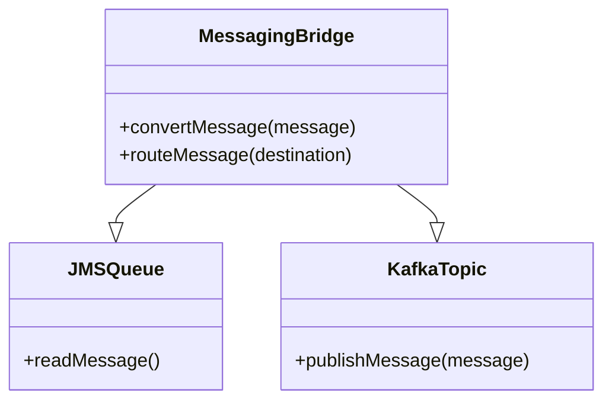
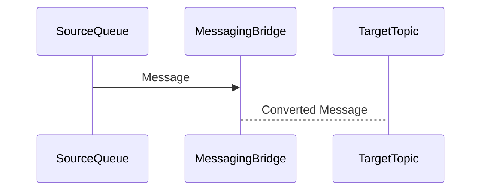
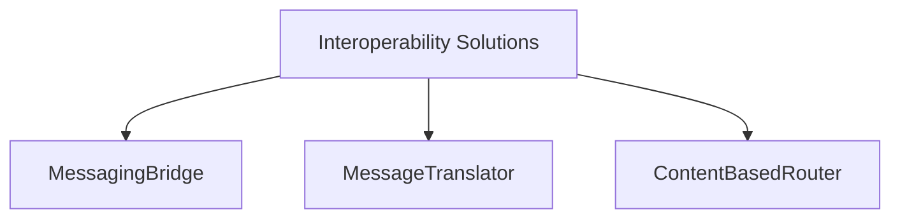

## Messaging Bridge

### Definition
The Messaging Bridge pattern is an architectural design used to connect multiple messaging systems, ensuring that messages published in one system are propagated to other connected systems. This enables seamless communication between distinct message brokers or queues.

### Intent
The primary intent of the Messaging Bridge is to facilitate interoperability between different messaging systems. It ensures that messages are synchronized across diverse platforms, thereby supporting heterogeneity in enterprise systems.

### Also Known As
- Message Pipe
- Queue Mirror

### Detailed Definitions and Explanations

In modern, distributed systems, applications often need to communicate with each other using various messaging protocols and platforms. The Messaging Bridge pattern allows the integration of these heterogeneous systems by bridging messages from one system to another.

### Key Features
- **Protocol Bridging**: Converts and routes messages between different protocols.
- **Message Synchronization**: Ensures messages sent to one system are also available in other systems.
- **Decoupling**: Promotes loose coupling between systems by acting as an intermediary.
- **Scalability**: Improves system scalability by allowing independent scaling of the messaging systems.

### Example Code

#### Java - Apache Camel Example

```java
import org.apache.camel.CamelContext;
import org.apache.camel.builder.RouteBuilder;
import org.apache.camel.impl.DefaultCamelContext;

public class MessagingBridgeExample {
    public static void main(String[] args) throws Exception {
        CamelContext camelContext = new DefaultCamelContext();

        camelContext.addRoutes(new RouteBuilder() {
            @Override
            public void configure() throws Exception {
                from("jms:queue:sourceQueue")
                .to("kafka:targetTopic");
            }
        });

        camelContext.start();
        Thread.sleep(5000);
        camelContext.stop();
    }
}
```

#### Scala - Apache Kafka Example

```scala
import org.apache.kafka.clients.producer.{KafkaProducer, ProducerConfig, ProducerRecord}

import java.util.Properties

object MessagingBridgeExample extends App {
  val props = new Properties()
  props.put(ProducerConfig.BOOTSTRAP_SERVERS_CONFIG, "localhost:9092")
  props.put(ProducerConfig.KEY_SERIALIZER_CLASS_CONFIG, "org.apache.kafka.common.serialization.StringSerializer")
  props.put(ProducerConfig.VALUE_SERIALIZER_CLASS_CONFIG, "org.apache.kafka.common.serialization.StringSerializer")

  val producer = new KafkaProducer[String, String](props)

  val record = new ProducerRecord[String, String]("targetTopic", "key", "message")
  producer.send(record)

  producer.close()
}
```

### Example Class Diagram



### Example Sequence Diagram



### Benefits
- **Interoperability**: Connects systems that use different messaging protocols.
- **Scalability**: Allows individual systems to scale without impacting other systems.
- **Modularity**: Encourages modular architecture and separation of concerns.

### Trade-offs
- **Complexity**: Introduces additional complexity with the bridging logic.
- **Latency**: Potential introduction of latency due to message conversion and routing.
- **Maintenance**: Additional overhead in maintaining the bridge logic.

### When to Use
- When integrating systems that use different messaging protocols.
- When consolidating messages from multiple systems into a central system.
- When a decoupled architecture is required between interacting systems.

### Example Use Cases
- Integrating microservices with legacy systems using different message brokers.
- Synchronizing messages across regional data centers with distinct messaging systems.
- Enabling cross-protocol communication, e.g., JMS to MQTT.

### When Not to Use
- When systems use compatible protocols that can directly communicate.
- When low latency is critical and any added delay is unacceptable.

### Anti-patterns
- **Point-to-Point Integration**: Connecting every system directly with every other system without a bridge.
- **Monolithic Message Broker**: Relying on a single message broker for all communication needs can lead to a single point of failure.

### Related Design Patterns
- **Message Translator**: Converts message formats between systems that use different data formats.
- **Message Channel**: Establishes a dedicated channel for communication between applications.

### References and Credits
- [Enterprise Integration Patterns: Designing, Building, and Deploying Messaging Solutions](https://amzn.to/3XXncn8) by Gregor Hohpe and Bobby Woolf
- [Apache Camel](https://camel.apache.org/)
- [Apache Kafka](https://kafka.apache.org/)

### Open Source Frameworks
- **Apache Camel**: An integration framework for message routing.
- **Apache Kafka**: A distributed streaming platform.

### Cloud Computing Context
- **SaaS**: Allow SaaS applications to exchange messages seamlessly.
- **PaaS**: Offers managed services to implement Messaging Bridge logic.
- **IaaS**: Provides the infrastructure necessary for deploying messaging systems.

### Suggested Books for Further Study
- [Enterprise Integration Patterns: Designing, Building, and Deploying Messaging Solutions](https://amzn.to/3XXncn8) by Gregor Hohpe and Bobby Woolf
- [Designing Data-Intensive Applications](https://amzn.to/4cuX2Na) by Martin Kleppmann

### Related Patterns Organized by Problem Areas

#### Integration Patterns
```mermaid
graph TD
    A[Enterprise Integration Patterns] --> B[Messaging Bridge]
    A --> C[Message Translator]
    A --> D[Content-Based Router]

    B --> E[Enterprise Service Bus (ESB)]
    C --> F[Canonical Data Model]
    D --> G[Dynamic Router]
```

#### Solutions for Interoperability


### Conclusion
The Messaging Bridge is a versatile pattern that facilitates communication and message synchronization between diverse messaging systems, ensuring robust and scalable system integrations.

---
