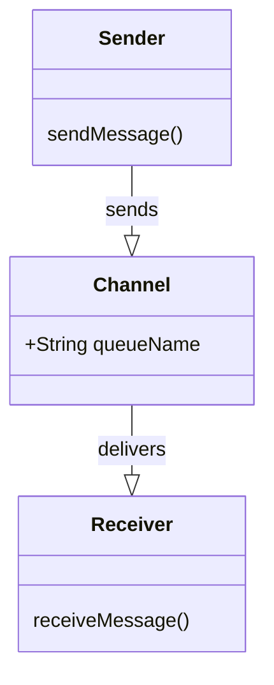
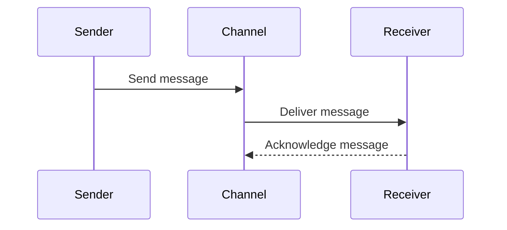

## Point-to-Point Channel

### Definition
The **Point-to-Point Channel** pattern is a messaging pattern used in enterprise integration systems to guarantee that exactly one receiver will process a particular message sent by the sender through the channel.

### Intent
- Ensure that a message is delivered to a single active receiver.
- Provide a reliable and consistent communication mechanism in distributed applications.

### Also Known As
- Direct Message
- Unicast Channel

### Detailed Definition and Explanation
In a Point-to-Point (P2P) channel, the sender sends a message to the channel, and only one consumer receives and processes the message. This is particularly useful in environments where the same message should not be processed multiple times or by multiple consumers.

### Key Features
- **Single Receiver:** Guarantees that only one consumer will receive the message.
- **Load Balancing:** Messages are balanced across multiple consumers.
- **Versatility:** Can be used to decouple various system components effectively.

```java
// Java example using Spring Boot and JMS
import org.springframework.jms.annotation.EnableJms;
import org.springframework.jms.core.JmsTemplate;
import org.springframework.beans.factory.annotation.Autowired;
import org.springframework.jms.annotation.JmsListener;
import org.springframework.stereotype.Component;

@SpringBootApplication
@EnableJms
public class Application {
  
  public static void main(String[] args) {
    SpringApplication.run(Application.class, args);
  }

  @Bean
  public CommandLineRunner sendMessage(JmsTemplate jmsTemplate) {
    return args -> {
      jmsTemplate.convertAndSend("queue.p2p", "Hello, P2P Channel!");
    };
  }
}

@Component
public class MessageReceiver {

  @JmsListener(destination = "queue.p2p")
  public void receiveMessage(String message) {
    System.out.println("Received <" + message + ">");
  }
}
```

```scala
// Scala example using Akka and Akka Streams
import akka.actor.ActorSystem
import akka.stream.{ActorMaterializer, Materializer}
import akka.stream.alpakka.jms.scaladsl.JmsConsumer
import akka.stream.scaladsl.Source
import akka.stream.alpakka.jms.JmsSourceSettings
import javax.jms.ConnectionFactory

object AkkaP2PExample extends App {
  
  implicit val system: ActorSystem = ActorSystem("P2PSystem")
  implicit val materializer: Materializer = ActorMaterializer()

  val connectionFactory: ConnectionFactory = // instantiate your JMS connection factory

  val jmsSourceSettings = JmsSourceSettings(connectionFactory).withQueue("queue.p2p")

  val jmsSource: Source[String, _] = JmsConsumer.textSource(jmsSourceSettings)

  jmsSource.runForeach { msg =>
    println(s"Received: $msg")
  }
}
```

### Example Class Diagram


### Example Sequence Diagram


### Benefits
- **Reliability:** Ensures message delivery even in case of consumer failure.
- **Scalability:** Supports multiple consumers, allowing for load balancing.
- **Decoupling:** Decouples the sending and receiving applications.

### Trade-offs
- **Complexity:** Managing and configuring P2P channels might increase system complexity.
- **Performance:** Potential single point of contention if the channel or JMS broker becomes a bottleneck.
- **Delivery Guarantee:** Typically uses "at least once" delivery semantics, not "exactly once".

### When to Use
- When you need to ensure a message is processed by only one receiver.
- Useful in task queue implementations where tasks should not be duplicated.
- Ideal for synchronous request-response communication patterns.

### Example Use Cases
- **Task Scheduling:** Ensuring tasks are processed once in a distributed system.
- **Order Processing:** Routing orders to a single fulfillment service instance.
- **Aggregation Service:** Aggregating data updates from different sources.

### When Not to Use
- When you need multiple receivers to process the same message (use Publish-Subscribe Channel instead).
- For broadcasting messages where more than one receiver is intended to handle the message.

### Anti-patterns
- **Overloading:** Avoid overloading a single P2P channel with multiple roles or services to prevent bottlenecks.
- **Tightly Coupled Consumers:** Do not tie consumers too closely; maintain independence to preserve benefits of decoupling.

### Related Design Patterns
- **Publish-Subscribe Channel:** For scenarios requiring multiple consumers to receive the same message.
- **Routing Slip:** When you need to route messages based on dynamic logic.
- **Message Broker:** To manage and load balance between multiple point-to-point channels.

### References and Further Reading
- **Books:** [Enterprise Integration Patterns: Designing, Building, and Deploying Messaging Solutions](https://amzn.to/3XXncn8) by Gregor Hohpe and Bobby Woolf.
- **Websites:** [Apache Camel](https://camel.apache.org/), [Spring Boot](https://spring.io/projects/spring-boot), [Akka](https://akka.io/), [Apache Kafka](https://kafka.apache.org/).

### Open Source Frameworks and Third-Party Tools
- **Apache Camel:** Provides components for creating Point-to-Point channels.
- **Spring Boot:** Supports JMS-based Point-to-Point channels.
- **Akka Streams & Alpakka:** Implements P2P channels using Akka.

### Cloud Computing Integration
- **SAAS:** Solutions such as Amazon SQS and Google Cloud Pub/Sub can implement Point-to-Point Channels.
- **PAAS:** Managed messaging services like Azure Service Bus can also provide P2P capabilities.

By grouping similar patterns under messaging, we can visualize how different types of channels interact in a system:

```mermaid
classDiagram
    class MessagingPatterns {
        +PointToPointChannel()
        +PublishSubscribeChannel()
        +MessageBroker()
        +RoutingSlip()
    }

    MessagingPatterns : +List<Pattern> patterns
    class PointToPointChannel
    class PublishSubscribeChannel
    class MessageBroker
    class RoutingSlip

    MessagingPatterns -.-> PointToPointChannel : includes
    MessagingPatterns -.-> PublishSubscribeChannel : includes
    MessagingPatterns -.-> MessageBroker : includes
    MessagingPatterns -.-> RoutingSlip : includes
```

In summary, the Point-to-Point Channel is a fundamental enterprise integration pattern to ensure that a message is processed exactly once by one receiver. By implementing this pattern using frameworks like Apache Camel, Spring Boot, and Akka, developers can create reliable, decoupled systems that handle critical communication between components. The benefits include reliability, load balancing, and scalability, though the pattern must be appropriately used to avoid common pitfalls such as bottlenecks and increased complexity. 

Would you like specifics on any other patterns, or a deeper dive into a particular framework's implementation?
