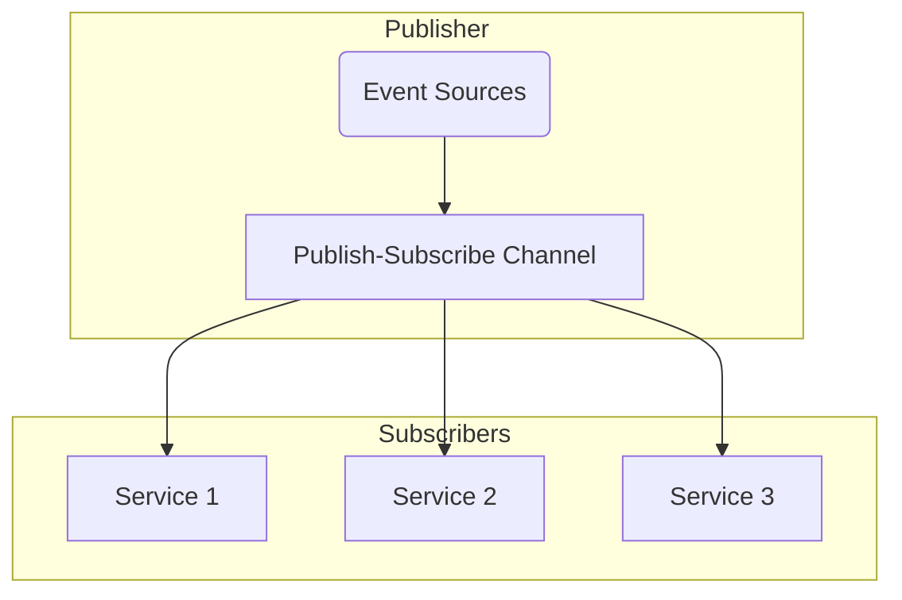
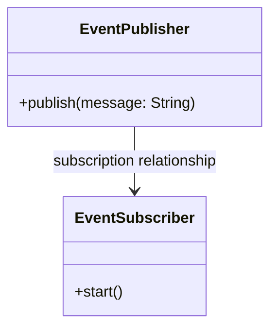
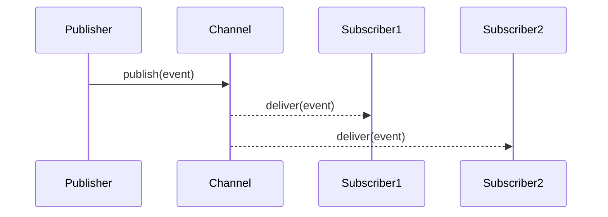

## Publish-Subscribe Channel

### Definition

The Publish-Subscribe Channel pattern is used in distributed systems to enable the broadcasting of events from a sender to multiple receivers. Each receiver potentially listening to different types of events on the same channel.

### Intent

To decouple event producers and consumers. The sender of a message (publisher) sends it to a Pub-Sub channel, but it doesn't need to know which receivers (subscribers) will pick it up.

### Also Known As

- Pub-Sub
- Event Broadcasting
- Topic-based Messaging

### Detailed Definition and Explanation

In a Publish-Subscribe Channel, events are sent to a channel, and any number of subscribers can express interest in messages without the sender needing to know who they are. This provides flexibility and scalability in a distributed system.

#### Diagram



### Key Features

1. **Decoupling**: Publishers and subscribers are independent of each other.
2. **Scalability**: Easily add more subscribers without modifying the publishers.
3. **Flexibility**: Support for multiple subscribers listening for different topics.

### Code Examples

#### Java using Apache Kafka

##### Producer

```java
import org.apache.kafka.clients.producer.KafkaProducer;
import org.apache.kafka.clients.producer.ProducerRecord;

import java.util.Properties;

public class KafkaEventPublisher {
    private final KafkaProducer<String, String> producer;

    public KafkaEventPublisher(String brokers) {
        Properties props = new Properties();
        props.put("bootstrap.servers", brokers);
        props.put("key.serializer", "org.apache.kafka.common.serialization.StringSerializer");
        props.put("value.serializer", "org.apache.kafka.common.serialization.StringSerializer");
        this.producer = new KafkaProducer<>(props);
    }

    public void publish(String topic, String message) {
        producer.send(new ProducerRecord<>(topic, message));
    }
    
    public void close() {
        producer.close();
    }
}
```

##### Consumer

```java
import org.apache.kafka.clients.consumer.ConsumerRecord;
import org.apache.kafka.clients.consumer.ConsumerRecords;
import org.apache.kafka.clients.consumer.KafkaConsumer;

import java.util.Collections;
import java.util.Properties;

public class KafkaEventSubscriber {
    private final KafkaConsumer<String, String> consumer;

    public KafkaEventSubscriber(String brokers, String groupId, String topic) {
        Properties props = new Properties();
        props.put("bootstrap.servers", brokers);
        props.put("group.id", groupId);
        props.put("key.deserializer", "org.apache.kafka.common.serialization.StringDeserializer");
        props.put("value.deserializer", "org.apache.kafka.common.serialization.StringDeserializer");
        this.consumer = new KafkaConsumer<>(props);
        consumer.subscribe(Collections.singletonList(topic));
    }

    public void start() {
        while (true) {
            ConsumerRecords<String, String> records = consumer.poll(100);
            for (ConsumerRecord<String, String> record : records) {
                System.out.printf("Received message: %s%n", record.value());
            }
        }
    }
}
```

#### Scala using Akka

```scala
import akka.actor.{Actor, ActorSystem, Props}
import akka.event.{ActorEventBus, LookupClassification}

case class Event(message: String)

class EventPublisher extends Actor {
  override def receive: Receive = {
    case event: Event => 
      println(s"Publishing event: $event")
      context.system.eventStream.publish(event)
  }
}

class EventSubscriber extends Actor {
  override def preStart(): Unit = {
    context.system.eventStream.subscribe(self, classOf[Event])
  }
  
  override def receive: Receive = {
    case event: Event => 
      println(s"Received event: $event")
  }
}

object PubSubExample extends App {
  val system = ActorSystem("PubSubSystem")

  val publisher = system.actorOf(Props[EventPublisher], "publisher")
  val subscriber1 = system.actorOf(Props[EventSubscriber], "subscriber1")
  val subscriber2 = system.actorOf(Props[EventSubscriber], "subscriber2")

  publisher ! Event("Hello World")
}
```

### Example Class Diagram



### Example Sequence Diagram



### Benefits

- **Loose Coupling**: Publishers and subscribers are decoupled.
- **Scalability**: Easily add more subscribers or publishers.
- **Flexibility**: Subscribers can dynamically join and leave the system.

### Trade-offs

- **Complexity**: Increased system complexity due to indirection.
- **Message Delivery**: Need to handle message delivery guarantees (e.g., at-least-once, at-most-once, exactly-once).
- **Configuration**: Topics and subscriber management need to be properly configured.

### When to Use

- When different components of the system need to react to or process certain events.
- When building an event-driven or reactive system.
- To decouple event publishers from subscribers, enhancing modifiability and maintainability.

### Example Use Cases

- Event notification systems.
- Messaging systems for IoT devices.
- Systems requiring data synchronization between distributed services.

### When Not to Use and Anti-patterns

- Not suitable for direct communication where latency and immediate response are critical.
- Avoid using it for simple request-response interactions.

### Related Design Patterns

- **Message Channel**: Provides an explicit pathway for messages to travel.
- **Event-Driven Architecture**: Uses events to trigger behavior within and between services.
- **Observer Pattern**: Similar intent to Pub-Sub but typically used within a single application rather than across a distributed system.

### References and Credits

- [Enterprise Integration Patterns: Designing, Building, and Deploying Messaging Solutions](https://amzn.to/3XXncn8) by Gregor Hohpe and Bobby Woolf.
- Apache Kafka documentation
- Akka documentation

### Open Source Frameworks and Tools

- **Apache Kafka**: Distributed streaming platform.
- **RabbitMQ**: Messaging broker.
- **Apollo**: Messaging server based on ActiveMQ.
- **Akka**: Actor-based framework for handling distributed events.

### Cloud Computing

- **AWS SNS/SQS**: Managed services for message queuing and notification.

### Suggested Books for Further Studies

1. [Designing Data-Intensive Applications](https://amzn.to/4cuX2Na) by Martin Kleppmann
2. "Reactive Messaging Patterns with the Actor Model" by Vaughn Vernon
3. [Building Microservices: Designing Fine-Grained Systems](https://amzn.to/3RYRz96) by Sam Newman

### Problem Area Grouping

#### Event Driven Messaging

```mermaid
graph TP
    EventDrivenMessaging[Event-Driven Messaging] --> PubSubChannel
    EventDrivenMessaging --> MessageChannel
    EventDrivenMessaging --> EventDrivenArch
    EventDrivenMessaging --> ObserverPattern
```

- **Event-Driven Messaging**: Encompasses patterns that use events to trigger behavior.
  - **Pub-Sub Channel**: Broadcasting events to multiple receivers.
  - **Message Channel**: Pathway for messages.
  - **Event-Driven Architecture**: Architectural style where events drive behavior.
  - **Observer Pattern**: Typically used within a single application for notifying object state changes.

By using these related patterns together, you can effectively build and manage a robust event-driven messaging system.

---
