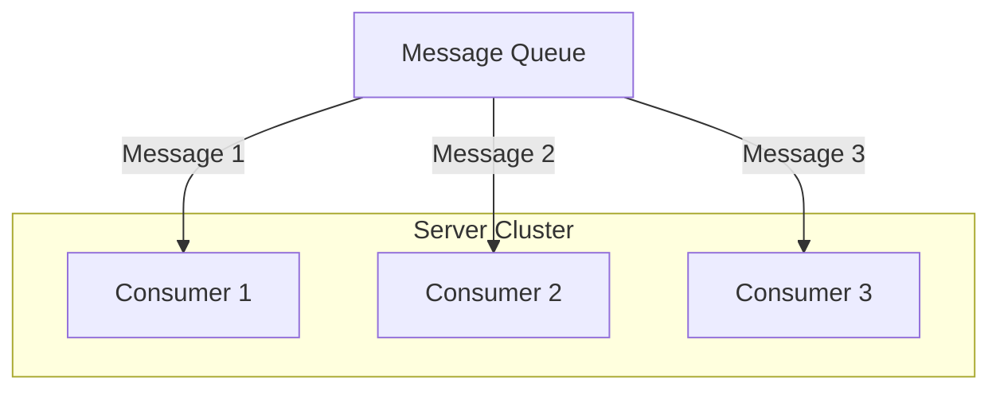
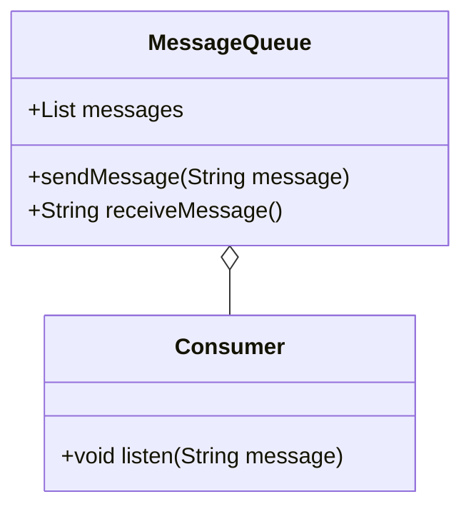
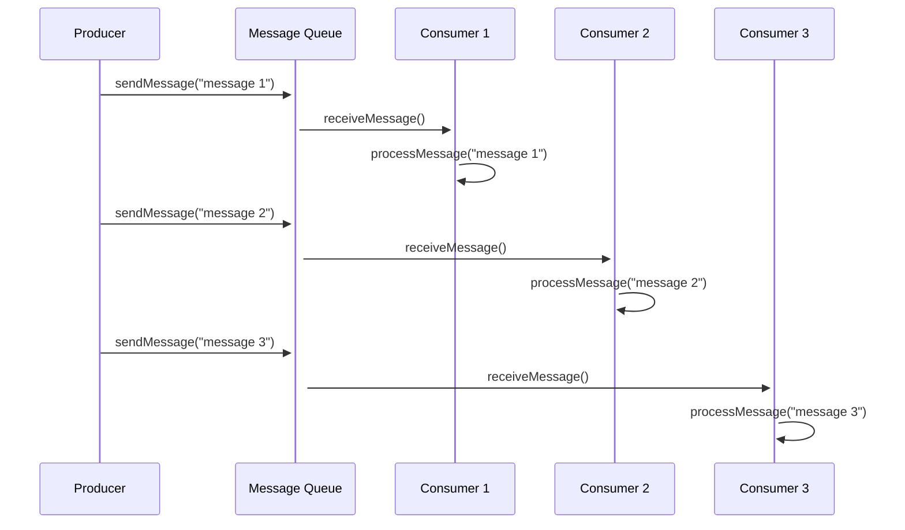
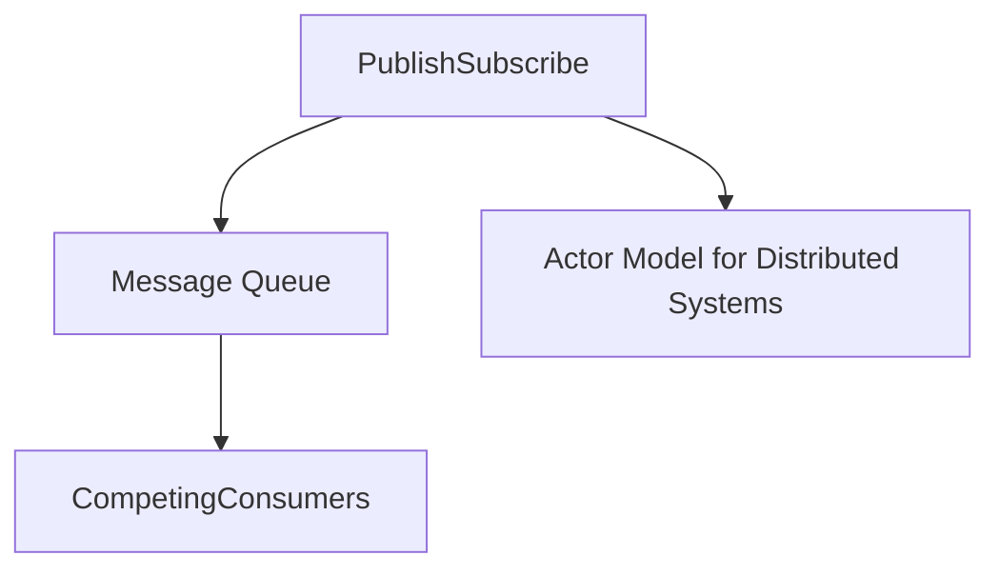

## Definition
The Competing Consumers pattern enables multiple consumers to concurrently process messages from the same message queue, thereby sharing the load and increasing throughput.

## Intent
The primary goal is to improve scalability and ensure that messages are processed efficiently by distributing them among a set of consumers.

## Also Known As
- Concurrent Consumers

## Detailed Definitions and Explanations
In the Competing Consumers pattern, multiple instances of a consumer application retrieve and process messages from a single message queue. The messages are distributed among these consumer instances, which process the messages concurrently, enhancing scalability.



## Key Features
- **Load Balancing:** Distributes workload efficiently among available consumer instances.
- **Fault Tolerance:** If one consumer fails, messages can still be processed by other consumers.
- **Scalability:** Increases processing throughput by adding more consumer instances.

## Code Examples

### Java using Spring Boot and Apache Kafka
```java
import org.springframework.kafka.annotation.KafkaListener;
import org.springframework.stereotype.Service;

@Service
public class MessageConsumer {

    @KafkaListener(topics = "my-topic", groupId = "my-group")
    public void listen(String message) {
        System.out.println("Consumed message: " + message);
        // Process the message
    }
}
```

### Scala using Akka Streams and Apache Kafka
```scala
import akka.actor.ActorSystem
import akka.kafka.ConsumerSettings
import akka.kafka.scaladsl.Consumer
import akka.stream.ActorMaterializer
import org.apache.kafka.common.serialization.StringDeserializer

implicit val system: ActorSystem = ActorSystem("example")
implicit val materializer: ActorMaterializer = ActorMaterializer()

val consumerSettings = ConsumerSettings(system, new StringDeserializer, new StringDeserializer)
  .withBootstrapServers("localhost:9092")
  .withGroupId("my-group")

val source = Consumer.plainSource(consumerSettings, Subscriptions.topics("my-topic"))

source.runForeach { record => 
  println(s"Consumed message: ${record.value}")
  // Process the message
}
```

## Example Class Diagram


## Example Sequence Diagram


## Benefits
- **Improved Throughput:** More messages can be processed in parallel.
- **Resilience:** System continues functioning even if some consumers fail.
- **Scalability:** Easily scaled by adding more consumers.

## Trade-offs
- **Consistency Issues:** Could lead to processing races or out-of-order messages.
- **Higher Complexity:** Requires managing and orchestrating multiple consumers.

## When to Use
- When processing a high volume of messages needing concurrent processing.
- When system throughput needs to be increased without deploying more producers.

## Example Use Cases
- Microservices architectures for processing distributed messages.
- Log processing systems where logs must be processed in real-time.

## When Not to Use and Anti-patterns
- When strict message ordering is required, as consumers process messages out of order.
- When the overhead of managing multiple consumers outweighs the benefits.

## Related Design Patterns
### Message Queue
Manages the delivery of messages and ensures they reach the consumer correctly.

### Publish/Subscribe
Consumers subscribe to messages and are notified when messages are available, but they do not compete for messages.

## References and Credits
- **Books:** [Enterprise Integration Patterns: Designing, Building, and Deploying Messaging Solutions](https://amzn.to/3XXncn8) by Gregor Hohpe and Bobby Woolf.
- **Open Source Frameworks and Tools:** Apache Kafka, RabbitMQ, ActiveMQ, Akka Streams, Spring Boot.

## Related Patterns for Problem-Solving


### Guidance:
To address high-throughput processing, combining the *Message Queue* pattern with *Competing Consumers* and possibly a *Publish/Subscribe* model offers a robust solution. Utilizing frameworks like **Apache Kafka** can assist in implementing these patterns effectively.

---

Ready to scale your message processing? Dive into the *Competing Consumers* pattern and unleash the full potential of your distributed system!

