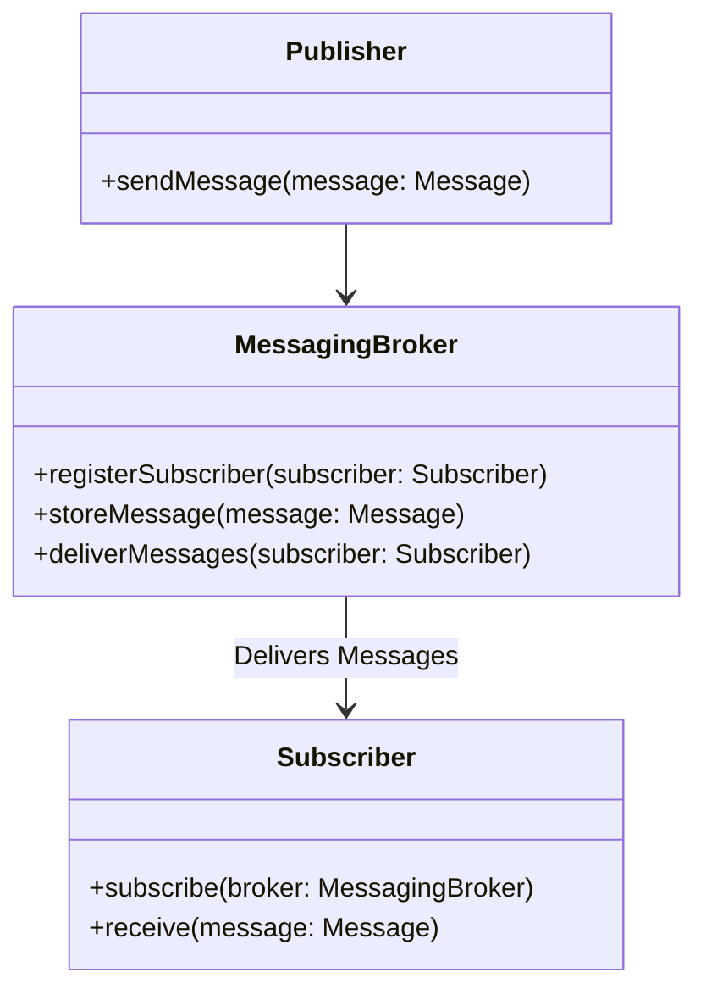
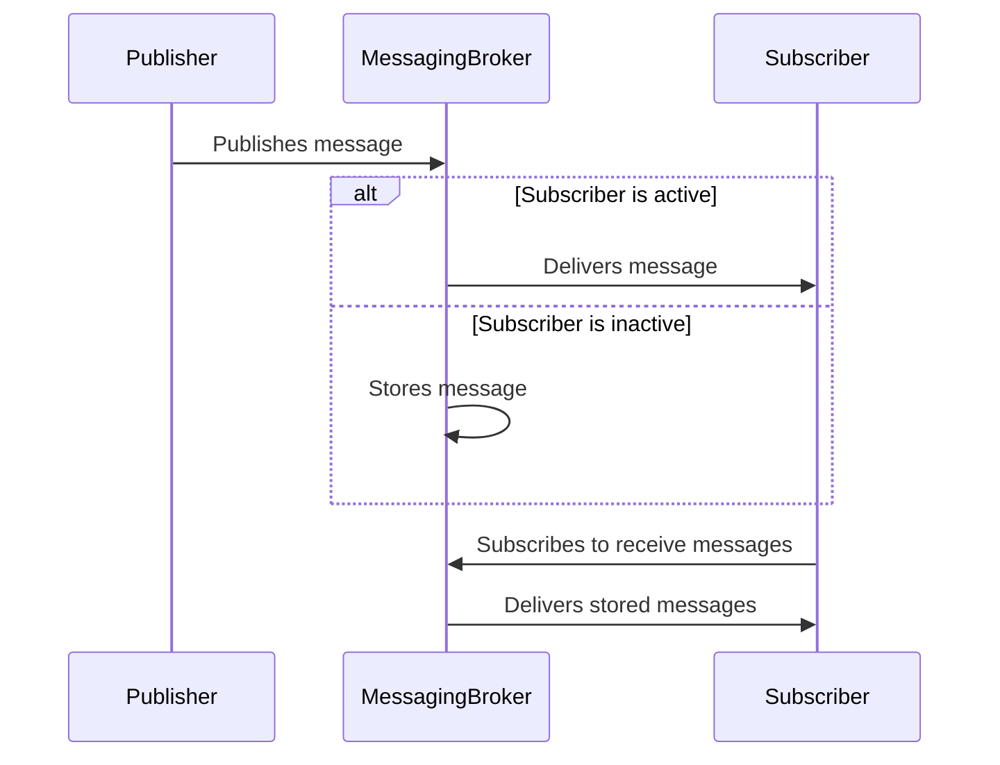

## Definition

A **Durable Subscriber** is a type of message consumer that keeps track of messages published while the subscriber is inactive. Once the subscriber reconnects, it receives all missed messages, ensuring no data loss.

## Intent

The primary intent of the **Durable Subscriber** pattern is to provide reliability and guarantee message delivery to subscribers even if they are temporarily unavailable.

## Also Known As

- Persistent Subscriber
- Reliable Subscriber

## Detailed Explanation

### Key Features

- **Message Persistence**: Messages are stored and not discarded until they are consumed.
- **Guaranteed Delivery**: Ensures no messages are missed.
- **Resilience**: Supports fault tolerance by allowing subscribers to recover from downtime.

### Class Diagram


**Explanation**: The diagram represents the flow where the Publisher sends messages to the MessagingBroker, which then stores and delivers messages to the Subscriber.

### Sequence Diagram



**Explanation**: The sequence shows how the broker handles message delivery differently based on the subscriber's availability.

### Code Example in Java

```java
import org.apache.activemq.ActiveMQConnectionFactory;
import javax.jms.*;

public class DurableSubscriberExample {

    public static void main(String[] args) throws JMSException {
        String url = "tcp://localhost:61616";
        ActiveMQConnectionFactory connectionFactory = new ActiveMQConnectionFactory(url);
        Connection connection = connectionFactory.createConnection();
        connection.setClientID("durable_subscriber");
        Session session = connection.createSession(false, Session.AUTO_ACKNOWLEDGE);
        Topic topic = session.createTopic("messageTopic");

        MessageConsumer consumer = session.createDurableSubscriber(topic, "durable_subscriber");
        connection.start();

        while (true) {
            Message message = consumer.receive();
            if (message instanceof TextMessage) {
                TextMessage textMessage = (TextMessage) message;
                System.out.println("Received: " + textMessage.getText());
            }
        }
    }
}
```

### Code Example in Scala

```scala
import akka.actor.ActorSystem
import akka.kafka.{ConsumerSettings, Subscriptions}
import akka.kafka.scaladsl.Consumer
import org.apache.kafka.common.serialization.StringDeserializer
import akka.stream.scaladsl.Sink

object DurableSubscriberExample extends App {
  implicit val system: ActorSystem = ActorSystem("DurableSubscriberExample")

  val consumerSettings = ConsumerSettings(system, new StringDeserializer, new StringDeserializer)
    .withBootstrapServers("localhost:9092")
    .withGroupId("durable_subscriber_group")

  Consumer.plainSource(consumerSettings, Subscriptions.topics("messageTopic"))
    .runWith(Sink.foreach(record => println(s"Received: ${record.value}")))
}
```

### Benefits

- **Reliability**: Ensures no messages are lost due to subscriber downtime.
- **Fault Tolerance**: Supports recovery and continued message processing after failures.
- **Consistency**: Ensures message order and consistency.

### Trade-offs

- **Storage Overhead**: Requires additional storage to persist messages.
- **Complexity**: More complex implementation compared to non-durable subscribers.
- **Resource Consumption**: Can consume more CPU and memory resources.

### When to Use

- When order and delivery of messages are critical.
- When there is a risk of subscriber downtime.
- In systems where message loss is unacceptable.

### Example Use Cases

- Financial transactions.
- Order processing systems.
- Real-time data feeds (e.g., stock trading).

### When Not to Use and Anti-Patterns

- When the order of messages is non-critical.
- In resource-constrained environments where storage overhead is too high.

## Related Patterns

- **Message Broker**: Brokers help in distributing messages to subscribers.
- **Message Store**: Storage mechanisms for persisting messages.
- **Publisher-Subscriber**: General design pattern for message dissemination.

## References and Credits

- **Books**: [Enterprise Integration Patterns: Designing, Building, and Deploying Messaging Solutions](https://amzn.to/3XXncn8) by Gregor Hohpe and Bobby Woolf.
- **Frameworks**: Apache Camel, Apache ActiveMQ, Spring Boot Messaging, Akka, Apache Kafka.

## Open Source Frameworks

- **Apache Camel**: Flexible integration framework.
- **Akka**: Toolkit for building concurrent applications.
- **Apache Kafka**: Distributed event streaming platform.

## Cloud Computing Context

For a SaaS, PaaS, or DaaS setting:
- **AWS SNS & SQS**: Services that can be used for durable messaging.
- **Google Cloud Pub/Sub**: Pub/Sub system for scalable message delivery.

## Further Studies

- Integration Patterns and Best Practices: Learning synthesized patterns and real-world application.
  
I hope this provides a comprehensive guide to the **Durable Subscriber** pattern along with its practical implications and code examples in Java and Scala.
