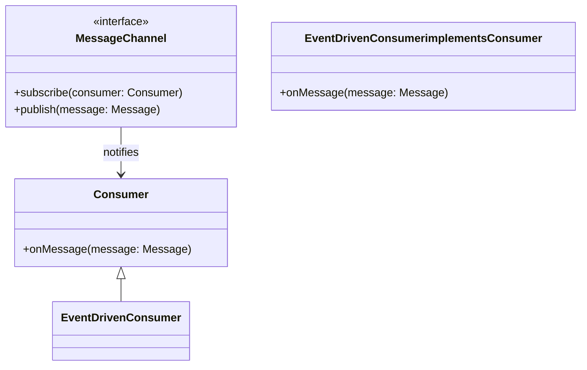
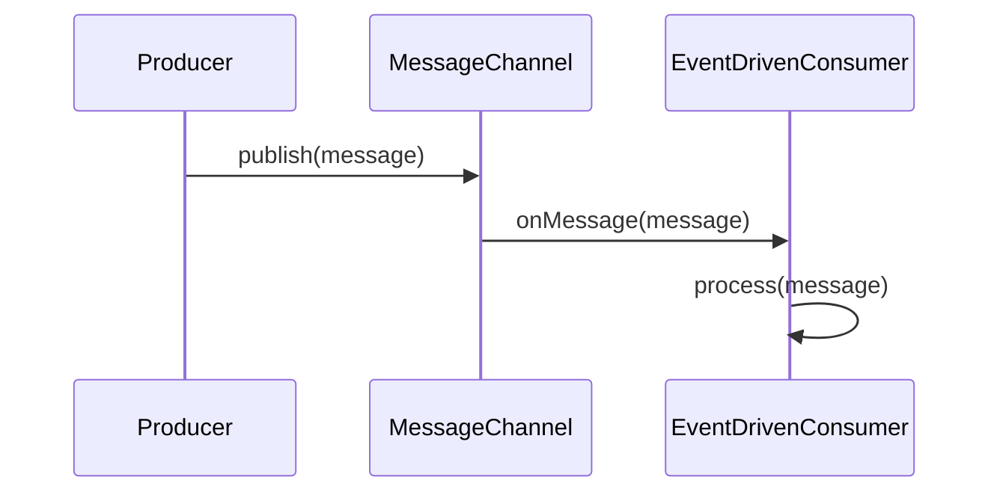

## Event-Driven Consumer

### Definition
The **Event-Driven Consumer** pattern defines a method for application components to automatically consume messages as they become available in a message channel.

### Intent
The intent of the Event-Driven Consumer pattern is to facilitate efficient and timely processing of messages by allowing application components to subscribe to and act upon messages as they are delivered by a message channel.

### Also Known As
- Message Listener

### Detailed Definitions and Explanations
In an event-driven architecture, producers generate events (messages) and send them to a message channel. Consumers subscribe to the channel and handle messages as they arrive. This model promotes loose coupling between components, as consumers do not need to request information directly from producers.

### Key Features
- **Asynchronous Processing:** Consumers handle messages as they arrive, allowing other operations to continue without waiting for message processing.
- **Scalability:** Multiple consumers can be added to handle increased message load.
- **Loose Coupling:** Consumers are independent of producers, leading to decoupled system components.

### Code Examples

#### Java with Apache Camel

```java
import org.apache.camel.builder.RouteBuilder;
import org.apache.camel.main.Main;

public class EventDrivenConsumerExample {
    public static void main(String... args) throws Exception {
        Main main = new Main();
        main.configure().addRoutesBuilder(new RouteBuilder() {
            @Override
            public void configure() {
                from("jms:queue:exampleQueue")
                    .log("Received message: ${body}");
                    .to("bean:messageProcessor");
            }
        });
        main.run(args);
    }
}

public class MessageProcessor {
    public void process(String message) {
        System.out.println("Processing message: " + message);
    }
}
```

#### Scala with Akka Streams

```scala
import akka.actor.ActorSystem
import akka.stream.ActorMaterializer
import akka.stream.scaladsl.{Sink, Source}
import akka.kafka.ConsumerSettings
import akka.kafka.scaladsl.Consumer
import org.apache.kafka.clients.consumer.ConsumerConfig
import org.apache.kafka.common.serialization.StringDeserializer

object EventDrivenConsumerExample extends App {
  implicit val system = ActorSystem("EventDrivenConsumer")
  implicit val materializer = ActorMaterializer()

  val consumerSettings = ConsumerSettings(system, new StringDeserializer, new StringDeserializer)
    .withBootstrapServers("localhost:9092")
    .withGroupId("consumer-group")
    .withProperty(ConsumerConfig.AUTO_OFFSET_RESET_CONFIG, "earliest")

  Consumer
    .plainSource(consumerSettings, Subscriptions.topics("exampleTopic"))
    .runWith(Sink.foreach(record => println(s"Consumed message: ${record.value}")))
}
```

### Example Class Diagrams with Explanation



In this diagram, the `MessageChannel` is an interface that defines methods for subscribing consumers and publishing messages. `Consumer` is an interface defining the `onMessage` method which is implemented by `EventDrivenConsumer`.

### Example Sequence Diagrams with Explanation



In this sequence diagram, a `Producer` sends a message to the `MessageChannel`. The `MessageChannel` then notifies the `EventDrivenConsumer`, which processes the message.

### Benefits
- **Better Resource Utilization:** Consumers can process messages as soon as they arrive, avoiding idle time.
- **Scalable Processing:** New consumers can be added dynamically to handle varying load.
- **Simplified Design:** Decouples the producer and consumer logic, leading to more maintainable code.

### Trade-offs
- **Complexity in Debugging:** Asynchronous processing can make it harder to debug issues because of decoupled message handling.
- **Message Delivery Guarantees:** Ensuring exactly-once delivery may require additional mechanisms, which can complicate the implementation.

### When to Use
- When building systems that require real-time or near-real-time processing.
- When implementing a microservices architecture with decoupled interactions.
- In event-driven and reactive architectures to improve responsiveness.

### Example Use Cases
- Processing financial transactions in real-time.
- Consumer notifications in e-commerce applications.
- IoT data ingestion and processing.

### When Not to Use and Anti-patterns
- For applications where synchronous processing is critical.
- When message order is crucial and must be strictly maintained without extra effort.
- Anti-Pattern: Using event-driven consumers in scenarios requiring heavy state management might lead to complexity.

### Related Design Patterns
- **Pub/Sub (Publish-Subscribe):** Focuses on broadcasting messages to multiple subscribers.
- **Message Filter:** Allows filtering out unwanted messages.
- **Correlation Identifier:** Helps to correlate messages belonging to the same event.
  
### References
- [Enterprise Integration Patterns: Designing, Building, and Deploying Messaging Solutions by Gregor Hohpe and Bobby Woolf](https://www.amazon.com/Enterprise-Integration-Patterns-Designing-Deploying/dp/0321200683)
- [Apache Camel](https://camel.apache.org/)
- [Akka Streams](https://doc.akka.io/docs/akka/current/stream/index.html)

### Open Source Frameworks
- **Apache Camel:** A versatile integration library.
- **Spring Integration:** A framework providing an event-driven messaging architecture.
- **Akka Streams:** A reactive stream processing library.

### Cloud Computing
- **Amazon SQS (Simple Queue Service):** Offers a reliable event-driven consumer implementation for cloud applications.
- **Google Cloud Pub/Sub:** A messaging service that allows event-driven processing.

### Books for Further Studies
- **[Building Microservices: Designing Fine-Grained Systems](https://amzn.to/3RYRz96) by Sam Newman**
- **"Reactive Messaging Patterns with the Actor Model: Applications and Integration in Scala and Akka" by Vaughn Vernon**

By following these guidelines, you can effectively implement and utilize the Event-Driven Consumer pattern to create robust, scalable, and maintainable message-driven applications.
